# Calibration Study Analysis Report

*Generated: 2026-02-18 10:21:04.394056*

---

## Overview

This analysis validates the relationship-seeking multiplier ($\lambda$) using a
calibration study design. Participants rated AI conversations on coherence (off-target)
and relationship-seeking qualities (on-target) across different multiplier levels.

---

## Data Summary

- **Rating observations:** 1188
- **Rating participants:** 297
- **Ranking observations:** 2368
- **Ranking participants:** 296

---

## Rating EDA

### Multiplier Distribution

```

-1.5   -1 -0.5    0  0.5    1  1.5 
 113  148  157  349  139  140  142 
```

### Conversation Modes

```

pre-populated       dynamic 
          891           297 
```

### Trajectories by Multiplier (Means)

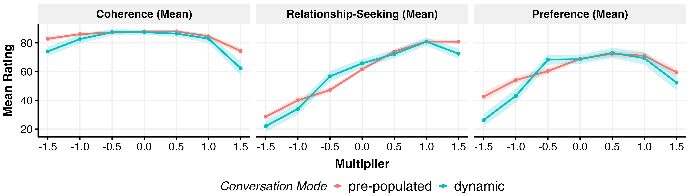

### Distributions (Means)

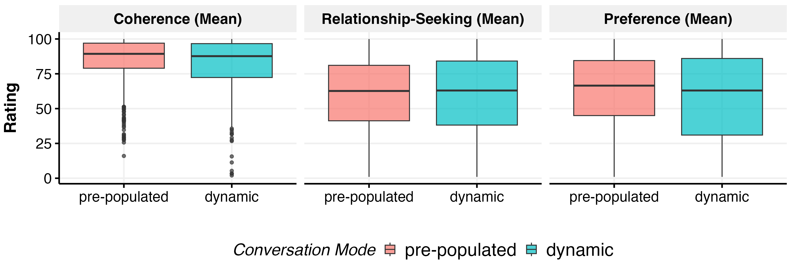

### Coherence Items

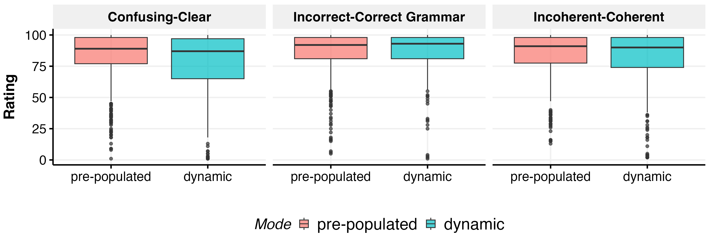

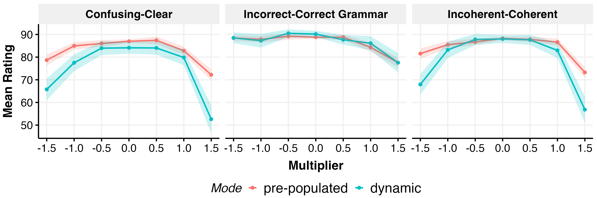

### Relationship-Seeking Items

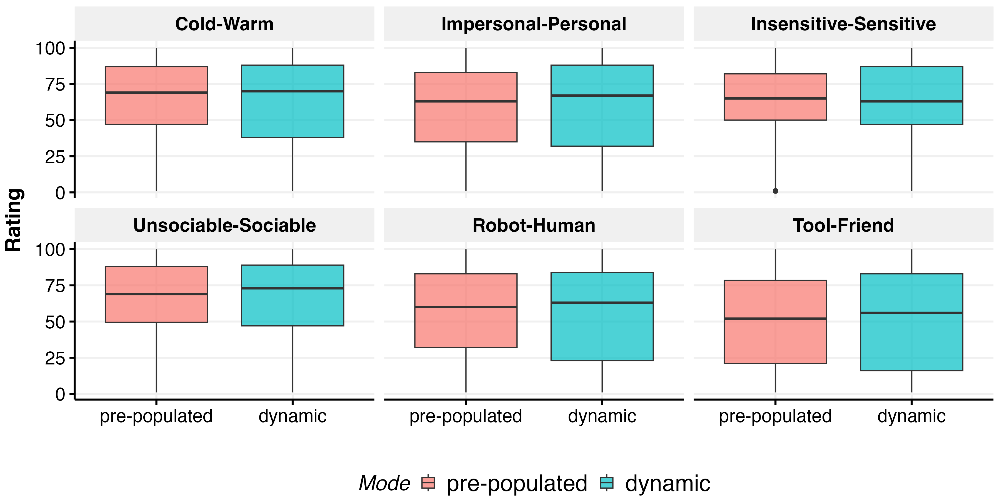

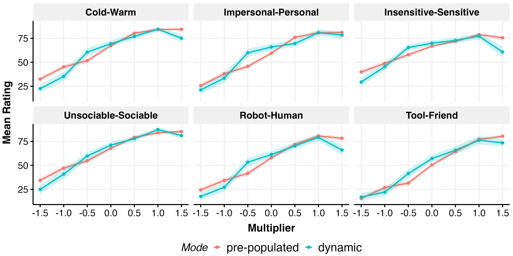

### Preference Items (incl. WTP)

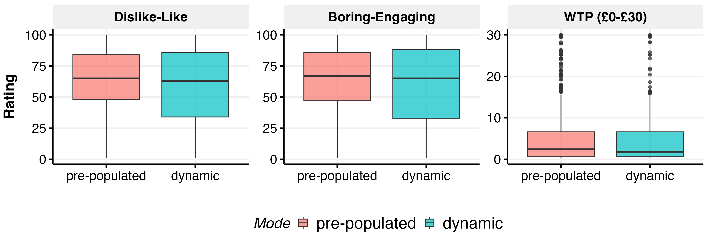


---

## Rating Regression Results

**Model (Truncated Quadratic):**

`outcome ~ conversation_mode + multiplier + I(multiplier^2) + (1 | ppt_id)`

(Truncated = excluding $\lambda = \pm 1.5$)

### Coherence mean

**Model Comparison:**

| Model | AIC | BIC | RMSE | Performance Score |
|-------|-----|-----|------|-------------------|
| Truncated Quadratic | 7318.5 | 7347.6 | 8.72 | 0.998 |
| Truncated Linear | 7334.4 | 7358.6 | 8.84 | 0.002 |
| Non-linear | 9699.5 | 9750.3 | 11.39 | 0.000 |
| Quadratic | 9717.4 | 9747.9 | 11.45 | 0.000 |
| Linear | 9835.1 | 9860.5 | 12.18 | 0.000 |
| Null | 9879.8 | 9895.1 | 12.52 | 0.000 |

**Best model coefficients (Truncated Quadratic):**

| Term | Estimate | SE | t | p |
|------|----------|----|----|---|
| (Intercept) | 88.129 | 0.719 | 122.65 | <0.001 |
| conversation_modedynamic | -0.841 | 0.797 | -1.06 | 0.291 |
| multiplier | -0.455 | 0.556 | -0.82 | 0.413 |
| I(multiplier^2) | -3.422 | 0.842 | -4.07 | <0.001 |

### Relationship seeking mean

**Model Comparison:**

| Model | AIC | BIC | RMSE | Performance Score |
|-------|-----|-----|------|-------------------|
| Truncated Quadratic | 8073.1 | 8102.1 | 13.36 | 0.787 |
| Truncated Linear | 8078.1 | 8102.3 | 13.42 | 0.213 |
| Non-linear | 10283.7 | 10334.5 | 14.53 | 0.000 |
| Quadratic | 10313.3 | 10343.7 | 14.75 | 0.000 |
| Linear | 10360.0 | 10385.4 | 15.11 | 0.000 |
| Null | 11104.6 | 11119.9 | 23.57 | 0.000 |

**Best model coefficients (Truncated Quadratic):**

| Term | Estimate | SE | t | p |
|------|----------|----|----|---|
| (Intercept) | 61.926 | 1.056 | 58.66 | <0.001 |
| conversation_modedynamic | 1.446 | 1.212 | 1.19 | 0.233 |
| multiplier | 22.126 | 0.845 | 26.18 | <0.001 |
| I(multiplier^2) | -2.756 | 1.278 | -2.16 | 0.031 |

### Preference mean

**Model Comparison:**

| Model | AIC | BIC | RMSE | Performance Score |
|-------|-----|-----|------|-------------------|
| Truncated Quadratic | 8447.5 | 8476.5 | 17.42 | 1.000 |
| Truncated Linear | 8472.1 | 8496.3 | 17.73 | 0.000 |
| Non-linear | 10881.2 | 10932.0 | 19.64 | 0.000 |
| Quadratic | 10898.9 | 10929.4 | 19.76 | 0.000 |
| Linear | 11043.0 | 11068.4 | 21.45 | 0.000 |
| Null | 11133.3 | 11148.5 | 22.61 | 0.000 |

**Best model coefficients (Truncated Quadratic):**

| Term | Estimate | SE | t | p |
|------|----------|----|----|---|
| (Intercept) | 69.300 | 1.218 | 56.89 | <0.001 |
| conversation_modedynamic | -0.329 | 1.541 | -0.21 | 0.831 |
| multiplier | 10.116 | 1.071 | 9.45 | <0.001 |
| I(multiplier^2) | -7.940 | 1.615 | -4.92 | <0.001 |

### Rating Model Effects (5 Specifications)

#### Coherence

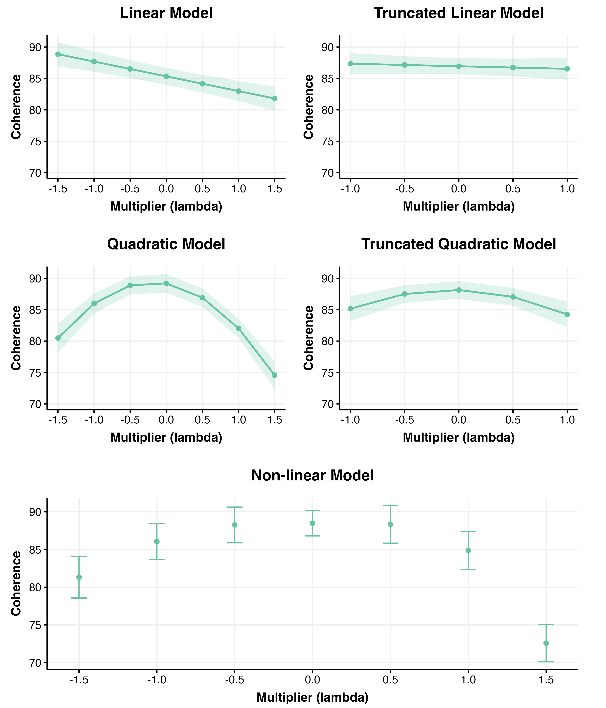

#### Relationship-Seeking

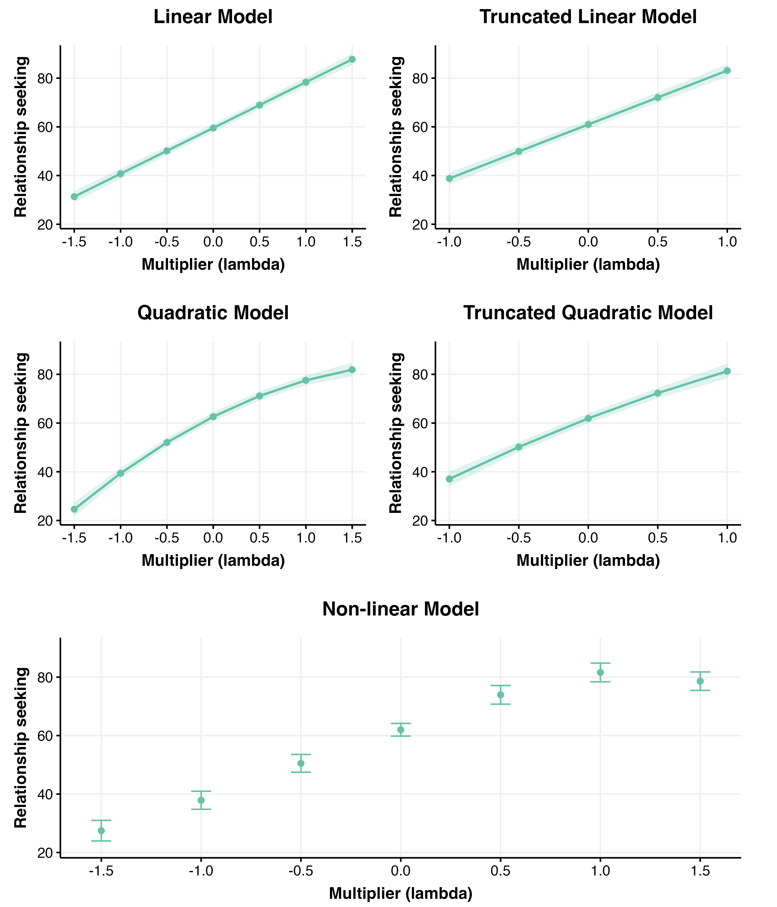

#### Preference

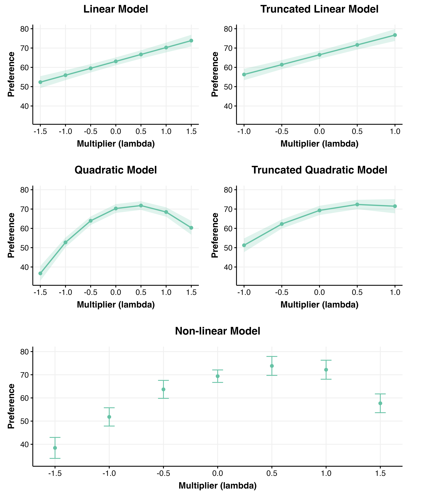

---

## Ranking EDA

### Multiplier Counts (by Subtask)


### Mean Rank by Ranking Type (Multi-chat)

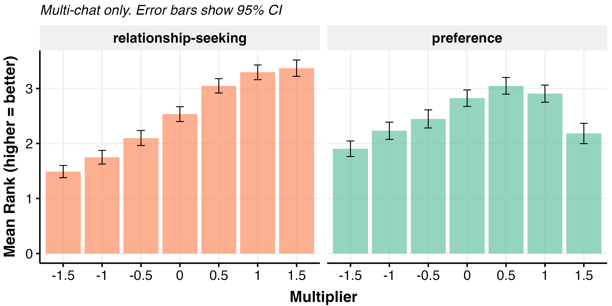

### Mean Rank by Subtask (Relationship-seeking)

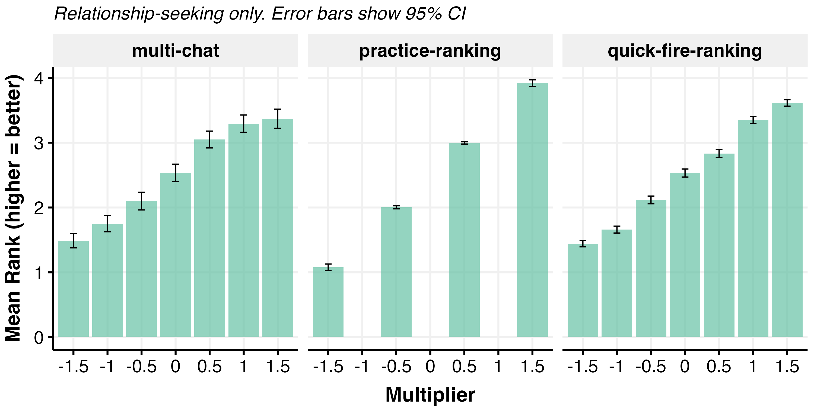

### Rank Distribution Heatmap

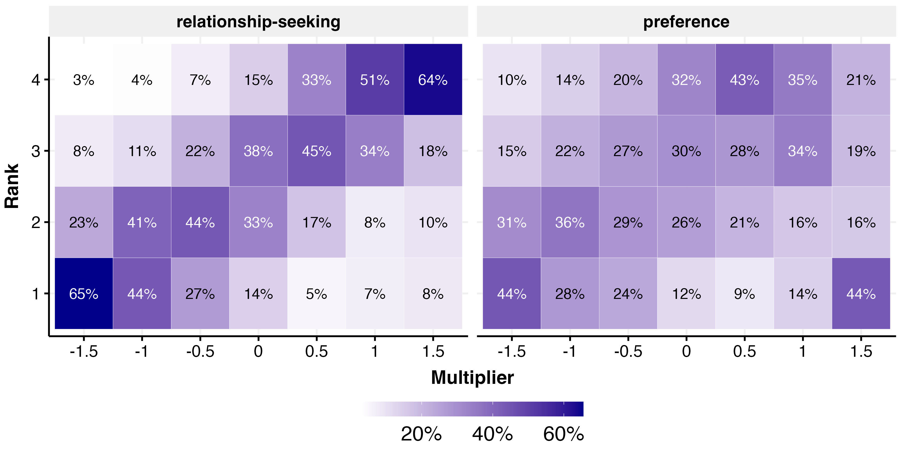

### Correct Ranking Order (Relationship-Seeking)

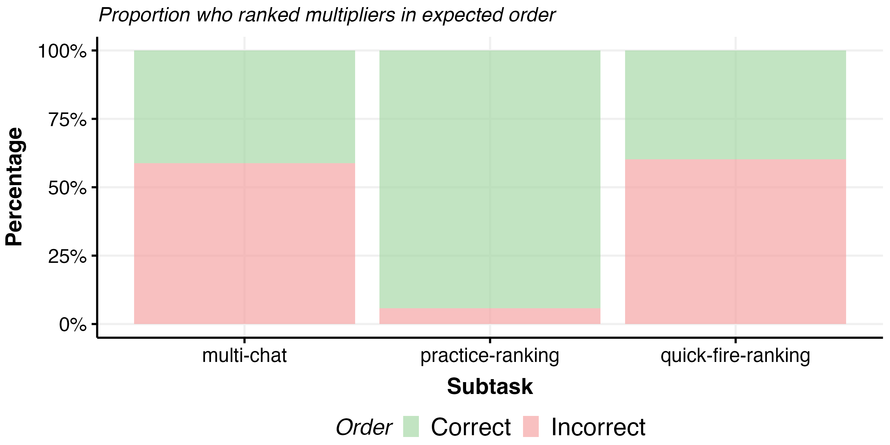

### Winrate Analysis

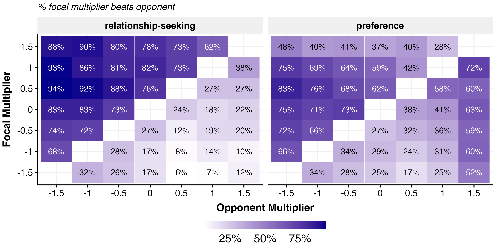

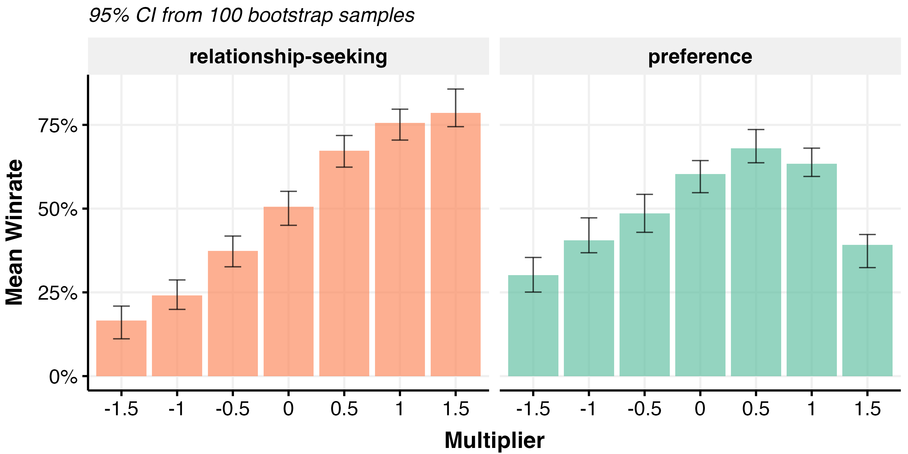

---

## Ranking Regression Results (PlackettLuce)

**Model:** Plackett-Luce model estimating worth parameters for each multiplier level.

(Truncated = excluding $\lambda = \pm 1.5$)

### Preference Rankings

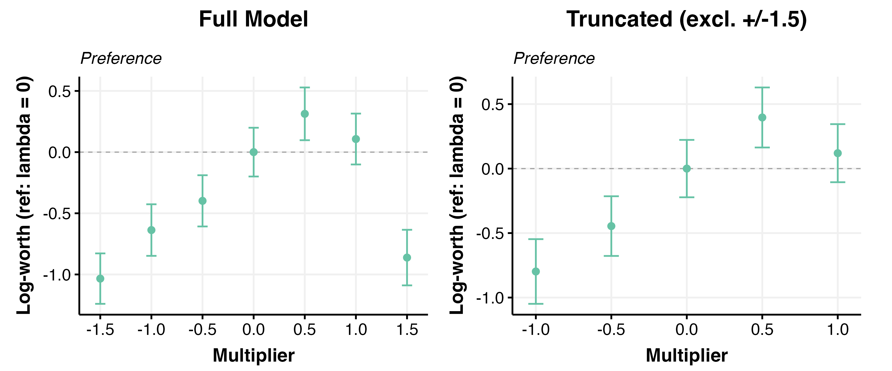

### Relationship-Seeking Rankings

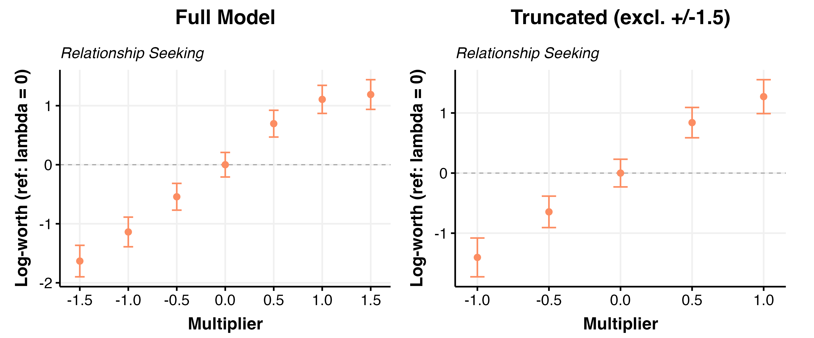

