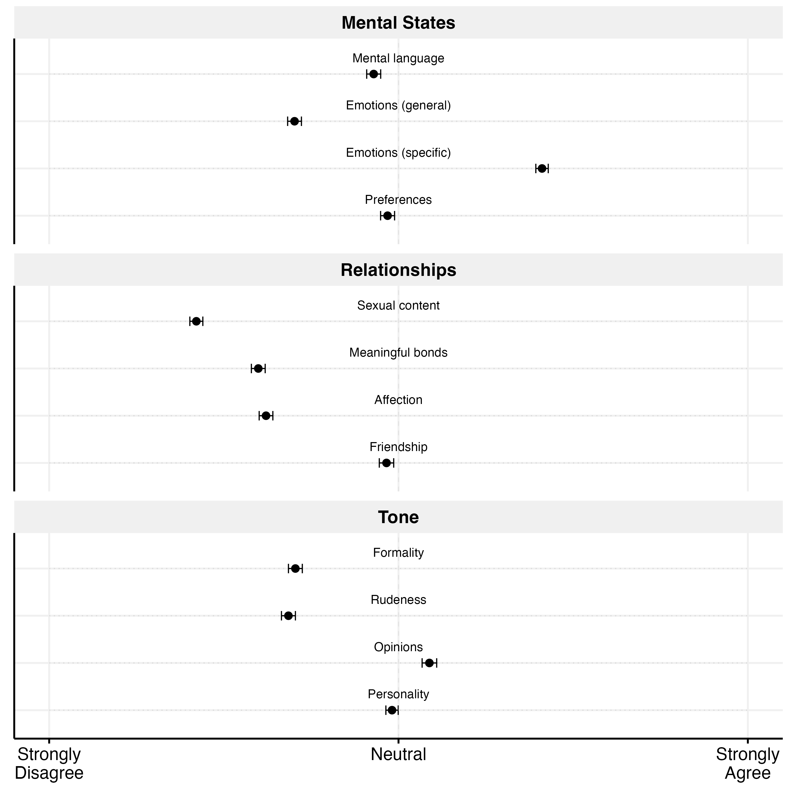
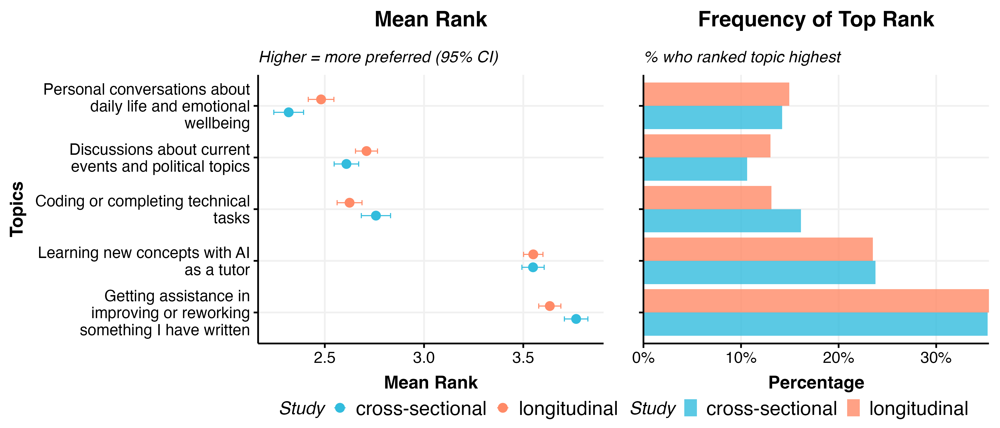
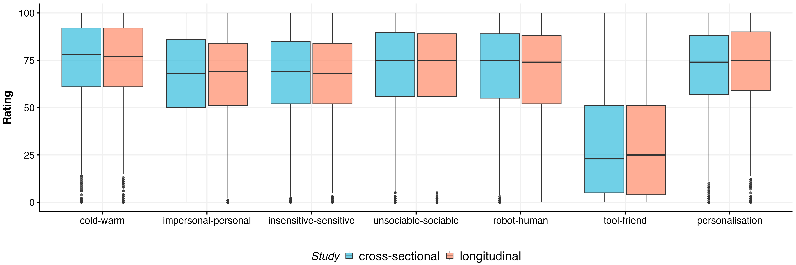
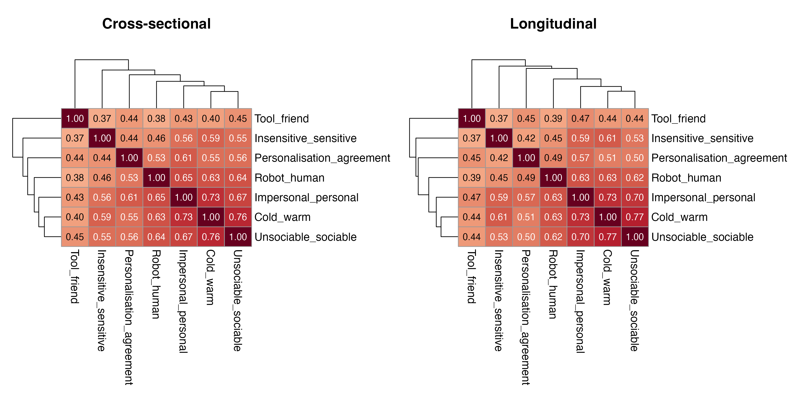

# Pre-Treatment Attitudes

*Generated: 2026-02-18 10:21:22.236969*

## Overview

This analysis explores pre-treatment attitudes across three measures:

1. **Societal Attitudes to Anthropomorphism Survey** - 12 items across 3 categories
2. **Topic Preferences** - Ranking of 5 AI use cases
3. **Stated Preferences** - 7 items on ideal AI characteristics

---

## 1. Societal Attitudes to Anthropomorphism

**N = 3534** participants

### Survey Item Responses

### Summary by Category

| Category | Items | Mean | SD |
|----------|-------|------|-----|
| Mental States | 4 | 50.1 | 32.1 |
| Relationships | 4 | 32.6 | 31.4 |
| Tone | 4 | 43.2 | 31.0 |

---

## 2. Topic Preferences

**N = 3534** participants

Participants ranked 5 AI use cases. Higher rank = more preferred.

### Ranking Summary

### Mean Ranks

| Topic | Mean Rank |
|-------|-----------|
| Getting assistance in improving or reworking something I have written | 3.69 |
| Learning new concepts with AI as a tutor | 3.55 |
| Coding or completing technical tasks | 2.68 |
| Discussions about current events and political topics | 2.67 |
| Personal conversations about daily life and emotional wellbeing | 2.41 |

### Topic Preference Matching

How well did assigned domains match participant preferences?

- **Absolute Match**: % who received their #1 most preferred topic overall
- **Relative Match**: % who preferred their assigned domain over the alternative

| Study | Domain | N | Absolute Match (%) | Relative Match (%) |
|-------|--------|---|--------------------|--------------------|
| cross-sectional | Emotchat | 746 | 13.3 | 36.7 |
| cross-sectional | Polchat | 760 | 10.9 | 63.7 |
| longitudinal | Emotchat | 1012 | 15.5 | 41.2 |
| longitudinal | Polchat | 1016 | 13.7 | 61.2 |

---

## 3. Stated Preferences (Pre-Treatment)

**N = 3534** participants

Pre-treatment ratings of ideal AI characteristics on 7 semantic differential scales.
Higher values indicate preference for warmer, more personal, more human-like AI.

### Distribution by Study

### Correlation Heatmaps

---

### Summary Statistics (Stated Preferences)

| Variable | Study | N | Mean | SD |
|----------|-------|---|------|-----|
| cold-warm | cross-sectional | 1506 | 74.6 | 21.5 |
| cold-warm | longitudinal | 2028 | 74.4 | 20.9 |
| impersonal-personal | cross-sectional | 1506 | 65.9 | 24.7 |
| impersonal-personal | longitudinal | 2028 | 66.3 | 23.9 |
| insensitive-sensitive | cross-sectional | 1506 | 67.7 | 22.4 |
| insensitive-sensitive | longitudinal | 2028 | 67.7 | 21.8 |
| unsociable-sociable | cross-sectional | 1506 | 71.2 | 23.6 |
| unsociable-sociable | longitudinal | 2028 | 71.0 | 23.2 |
| robot-human | cross-sectional | 1506 | 69.5 | 25.4 |
| robot-human | longitudinal | 2028 | 69.3 | 24.4 |
| tool-friend | cross-sectional | 1506 | 31.0 | 29.0 |
| tool-friend | longitudinal | 2028 | 31.8 | 28.7 |
| personalisation | cross-sectional | 1506 | 70.2 | 23.5 |
| personalisation | longitudinal | 2028 | 71.5 | 22.8 |
