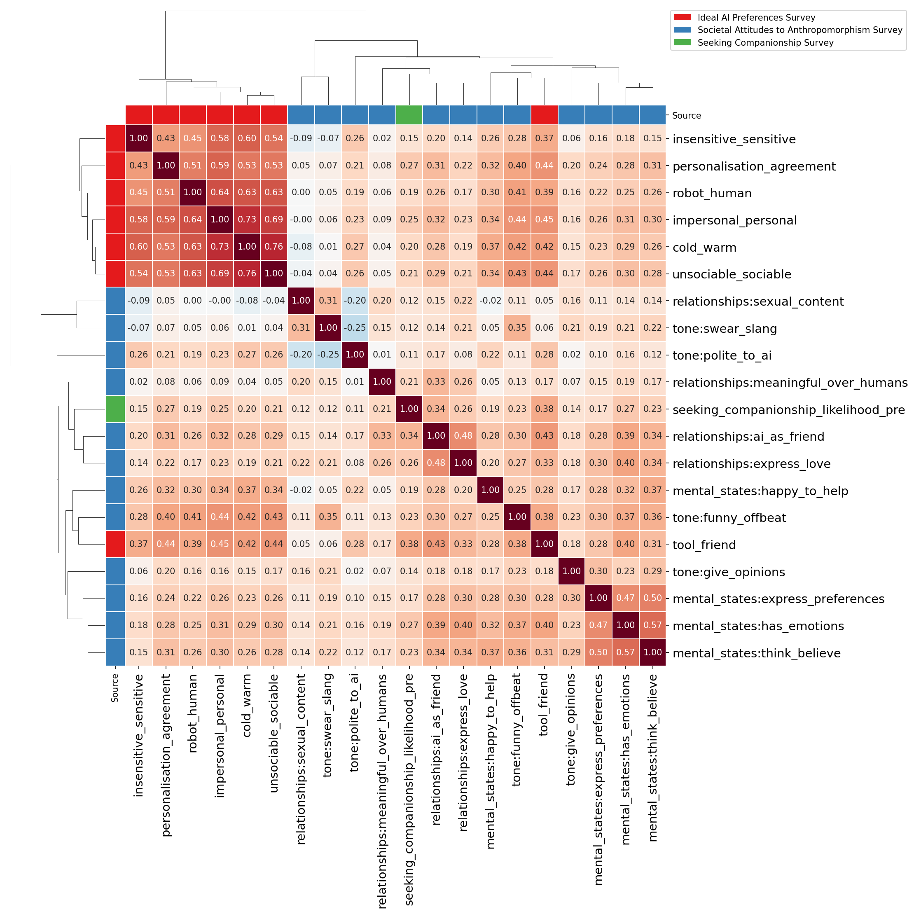
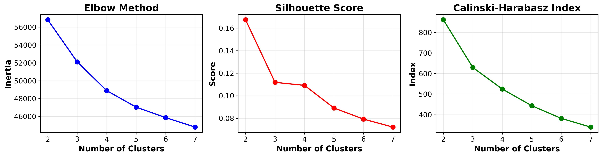
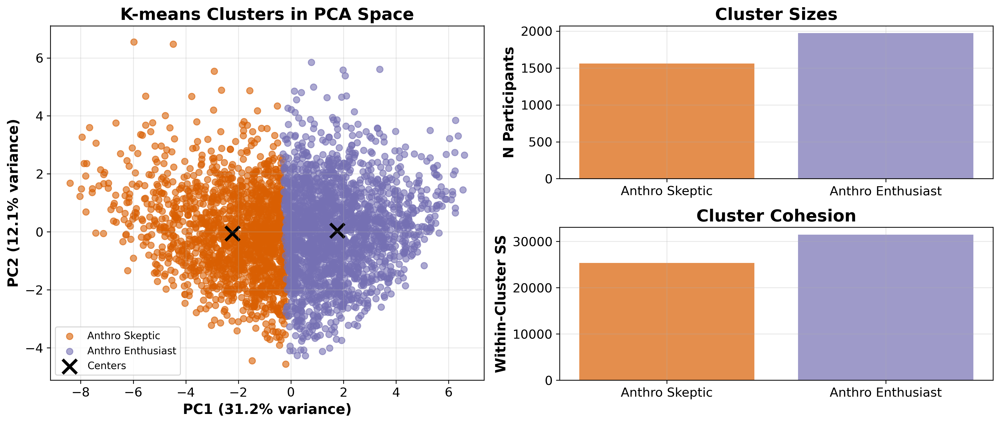
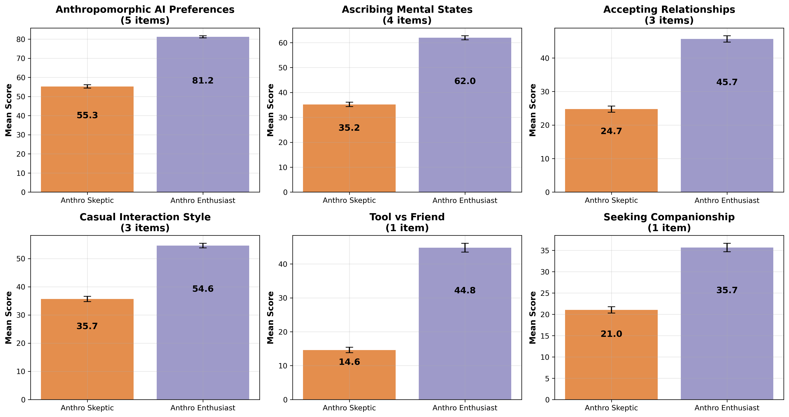
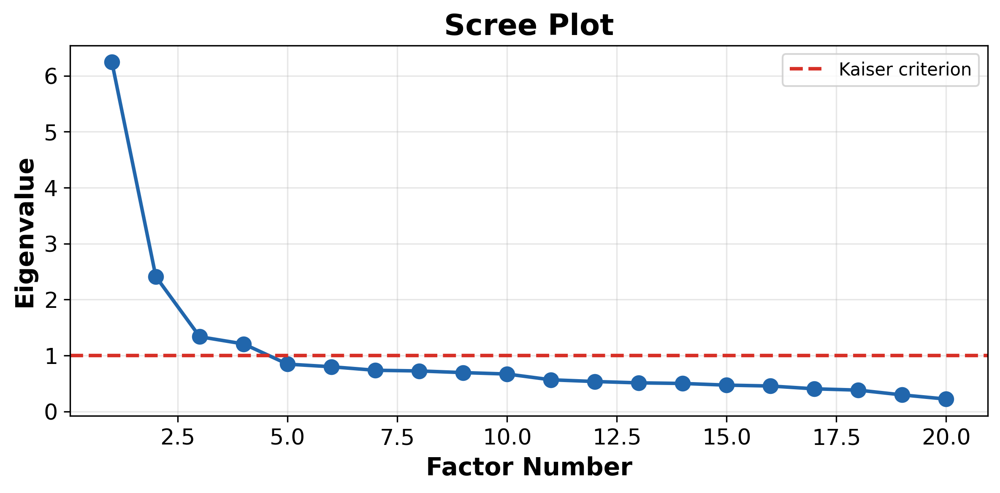
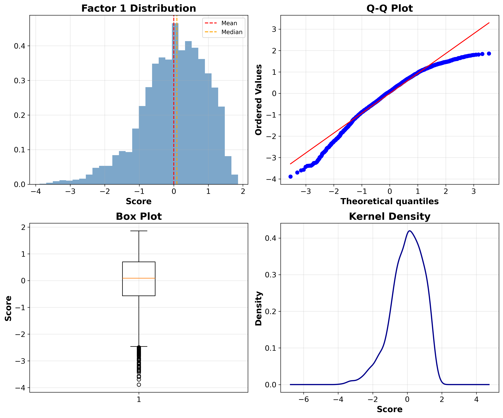

# Pre-Treatment Attitudes: Dimensionality Reduction

*Generated: 2026-02-18 10:21:18*

## Overview

This analysis performs cluster analysis and factor analysis on pre-treatment attitudes
toward anthropomorphic and relationship-seeking AI, combining:

- **Societal attitude to anthropomorphism survey**: 12 items
- **Stated preferences for ideal AI assistant survey**: 7 items
- **Seeking companionship**: 1 item (longitudinal only)

**Total participants**: 3534

---

## Correlation Analysis

---

## Cluster Analysis

K-means clustering with k=2:

- **Anthro Skeptic**: 1561 participants (44.2%)
- **Anthro Enthusiast**: 1973 participants (55.8%)

### Cluster Optimization

| k | Silhouette | Calinski-Harabasz |
|---|------------|-------------------|
| 2 | 0.167 | 861.2 |
| 3 | 0.112 | 629.3 |
| 4 | 0.109 | 524.4 |
| 5 | 0.089 | 443.4 |
| 6 | 0.079 | 381.7 |
| 7 | 0.072 | 339.5 |

### Cluster Visualization

### Cluster Profiles by Category

### ANOVA Results

Significant differences between clusters (FDR-corrected p < 0.05).

| Variable | F-stat | p-value | p-FDR | Sig |
|----------|--------|---------|-------|-----|
| impersonal_personal | 2123.2 | 0.00e+00 | 0.00e+00 | *** |
| unsociable_sociable | 2043.5 | 0.00e+00 | 0.00e+00 | *** |
| cold_warm | 1879.3 | 0.00e+00 | 0.00e+00 | *** |
| personalisation_agreement | 1453.9 | 9.66e-267 | 4.83e-266 | *** |
| robot_human | 1402.3 | 9.18e-259 | 3.67e-258 | *** |
| tone:funny_offbeat | 1311.0 | 2.05e-244 | 6.82e-244 | *** |
| tool_friend | 1307.9 | 6.20e-244 | 1.77e-243 | *** |
| mental_states:has_emotions | 1201.8 | 6.55e-227 | 1.64e-226 | *** |
| mental_states:think_believe | 1020.7 | 5.75e-197 | 1.28e-196 | *** |
| relationships:ai_as_friend | 1000.6 | 1.43e-193 | 2.87e-193 | *** |
| insensitive_sensitive | 853.1 | 3.54e-168 | 6.44e-168 | *** |
| mental_states:express_preferences | 762.1 | 4.50e-152 | 7.50e-152 | *** |
| mental_states:happy_to_help | 694.2 | 7.86e-140 | 1.21e-139 | *** |
| relationships:express_love | 609.4 | 2.87e-124 | 4.09e-124 | *** |
| seeking_companionship_likelihood_pre | 493.3 | 2.05e-102 | 2.73e-102 | *** |
| tone:give_opinions | 280.4 | 1.24e-60 | 1.55e-60 | *** |
| tone:polite_to_ai | 220.2 | 2.25e-48 | 2.64e-48 | *** |
| tone:swear_slang | 133.0 | 3.05e-30 | 3.39e-30 | *** |
| relationships:meaningful_over_humans | 105.2 | 2.39e-24 | 2.52e-24 | *** |
| relationships:sexual_content | 43.6 | 4.58e-11 | 4.58e-11 | *** |

---

## Factor Analysis

Extracted 4 factors using varimax rotation.

### Scree Plot

### Variance Explained

| Factor | Variance | Cumulative |
|--------|----------|------------|
| Factor 1 | 20.6% | 20.6% |
| Factor 2 | 10.6% | 31.1% |
| Factor 3 | 8.8% | 39.9% |
| Factor 4 | 5.2% | 45.1% |

### Factor Loadings (Top 5 per factor)

**Factor_1:**
- cold_warm: 0.846
- impersonal_personal: 0.820
- unsociable_sociable: 0.805
- robot_human: 0.717
- insensitive_sensitive: 0.646

**Factor_2:**
- mental_states:think_believe: 0.729
- mental_states:has_emotions: 0.627
- mental_states:express_preferences: 0.608
- mental_states:happy_to_help: 0.379
- tone:give_opinions: 0.337

**Factor_3:**
- relationships:ai_as_friend: 0.669
- relationships:express_love: 0.520
- tool_friend: 0.454
- relationships:meaningful_over_humans: 0.440
- seeking_companionship_likelihood_pre: 0.432

**Factor_4:**
- tone:swear_slang: 0.646
- tone:polite_to_ai: -0.474
- relationships:sexual_content: 0.439
- tone:funny_offbeat: 0.253
- insensitive_sensitive: -0.187

### Full Factor Loadings Table

| Variable | Factor 1 | Factor 2 | Factor 3 | Factor 4 |
|----------|----------|----------|----------|----------|
| cold_warm | 0.846 | 0.161 | 0.065 | -0.099 |
| impersonal_personal | 0.820 | 0.166 | 0.151 | -0.012 |
| insensitive_sensitive | 0.646 | 0.062 | 0.089 | -0.187 |
| mental_states:express_preferences | 0.155 | 0.608 | 0.166 | 0.064 |
| mental_states:happy_to_help | 0.319 | 0.379 | 0.137 | -0.130 |
| mental_states:has_emotions | 0.182 | 0.627 | 0.330 | 0.025 |
| mental_states:think_believe | 0.166 | 0.729 | 0.199 | 0.064 |
| personalisation_agreement | 0.612 | 0.199 | 0.216 | -0.008 |
| relationships:ai_as_friend | 0.215 | 0.233 | 0.669 | -0.009 |
| relationships:express_love | 0.120 | 0.298 | 0.520 | 0.113 |
| relationships:meaningful_over_humans | -0.004 | 0.075 | 0.440 | 0.130 |
| relationships:sexual_content | -0.073 | 0.087 | 0.256 | 0.439 |
| robot_human | 0.717 | 0.156 | 0.088 | 0.013 |
| seeking_companionship_likelihood_pre | 0.192 | 0.147 | 0.432 | 0.029 |
| tone:funny_offbeat | 0.461 | 0.323 | 0.200 | 0.253 |
| tone:give_opinions | 0.129 | 0.337 | 0.110 | 0.183 |
| tone:polite_to_ai | 0.242 | 0.134 | 0.136 | -0.474 |
| tone:swear_slang | 0.029 | 0.226 | 0.131 | 0.646 |
| tool_friend | 0.439 | 0.238 | 0.454 | -0.110 |
| unsociable_sociable | 0.805 | 0.186 | 0.099 | -0.055 |

### Factor 1 Distribution

- **Mean**: -0.00
- **SD**: 0.94
- **Skewness**: -0.696
- **Kurtosis**: 0.519

---

## Cluster vs Factor Comparison

Factor 1 scores by cluster:

- **Anthro Enthusiast**: M = 0.51, SD = 0.63
- **Anthro Skeptic**: M = -0.65, SD = 0.87
- **T-test**: t = 45.85, p = 0.00e+00

---

## Output Data

- `generated/pre_treatment_preference_types.jsonl` - Participant groupings for downstream analysis saved by ppt_id and study_id