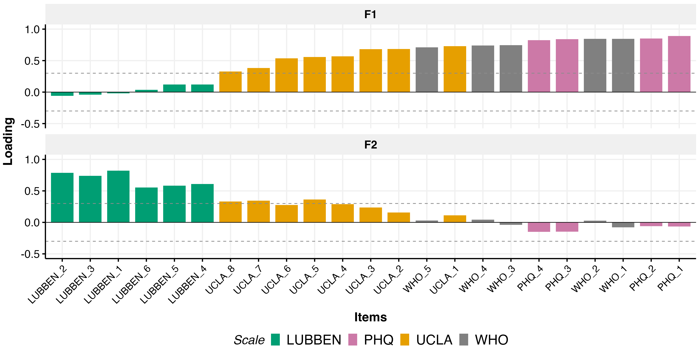
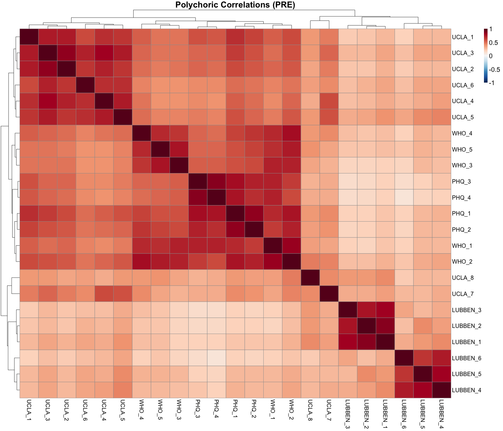

# Psychosocial Dimensionality Reduction

*Generated: 2026-02-18 10:21:24.811742*

---

## Overview

Exploratory Factor Analysis (EFA) of psychosocial wellbeing measures:

- **WHO-5**: Wellbeing (5 items)
- **PHQ-GAD-4**: Anxiety/Depression (4 items)
- **UCLA-8**: Loneliness (8 items)
- **LUBBEN-6**: Social connection (6 items)

All items recoded so **higher = better** before analysis.

---

## Data Summary

- **Total items**: 23
- **PRE observations**: 3534
- **POST observations**: 3123
- **Effective N (PRE)**: 3534

---

## Suitability Tests

- **KMO Overall**: 0.933
- **Bartlett's Test**: chi-sq = 72144.01, df = 253, p < 0.001

---

## Factor Selection Criteria

- **Parallel analysis**: 6 factors
- **VSS complexity 1**: 1 factors
- **VSS complexity 2**: 2 factors

---

## EFA Results (k=2)

### Fit Indices

| Metric | Value |
|--------|-------|
| Factors | 2 |
| RMSR | 0.083 |
| RMSEA | 0.171 |
| TLI | 0.635 |
| BIC | 20099.1 |

### Variance Explained

- **Factor 1**: 38.8%
- **Factor 2**: 16.7%
- **Total**: 55.5%

### Factor Correlation: r = 0.388

### Factor Loadings

### Polychoric Correlation Matrix

---

## Factor Score Summary

| Timepoint | Factor | Mean | SD |
|-----------|--------|------|-----|
| PRE | F1 | -0.000 | 1.000 |
| PRE | F2 | -0.000 | 1.000 |
| POST | F1 | 0.017 | 1.027 |
| POST | F2 | -0.093 | 1.008 |

---

## Output Files

### Tables
- `outputs/tables/main_studies/tex_tables/psychosocial_loadings.tex`
- `outputs/tables/main_studies/tex_tables/psychosocial_cors.tex`

### Generated Data
- `outputs/generated_data_files/psychosocial_factors.jsonl`

### Figures
- `outputs/figures/main_studies/pdf/psychosocial_loadings.pdf`
- `outputs/figures/main_studies/pdf/psychosocial_polychoric_heatmap.pdf`

