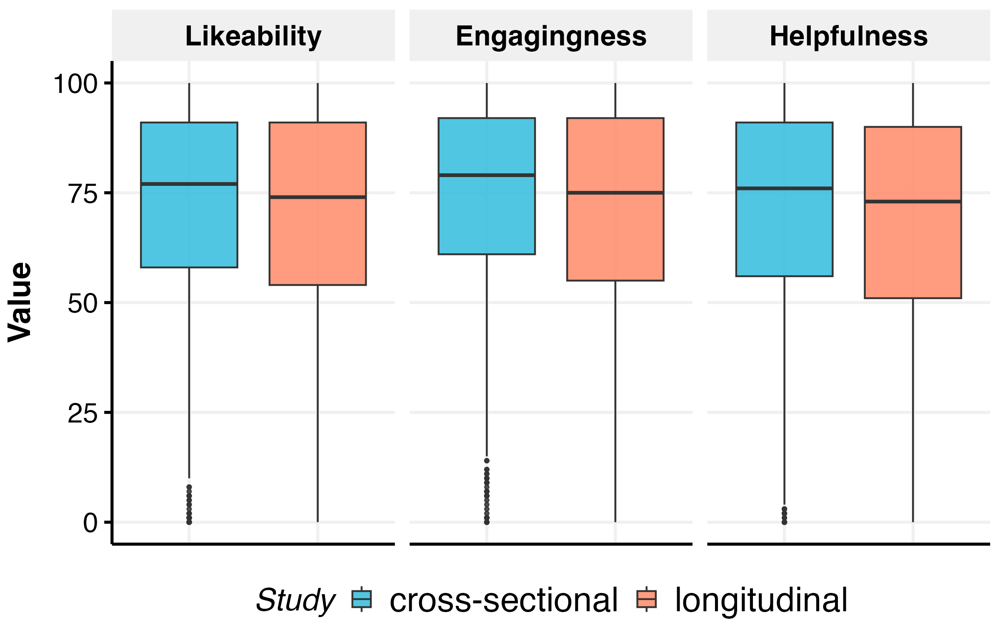
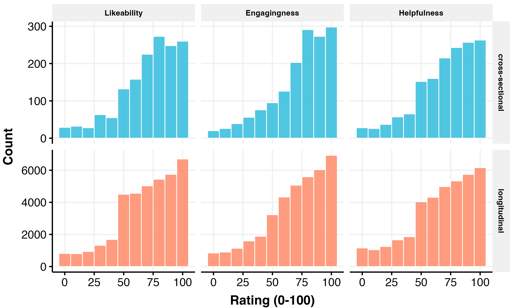
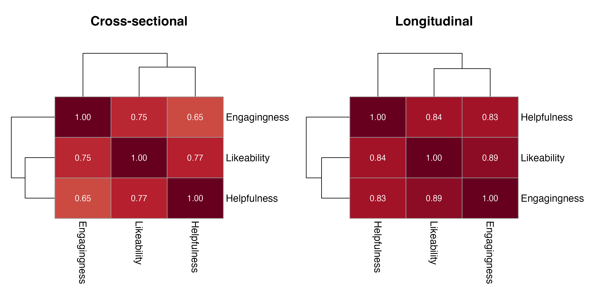
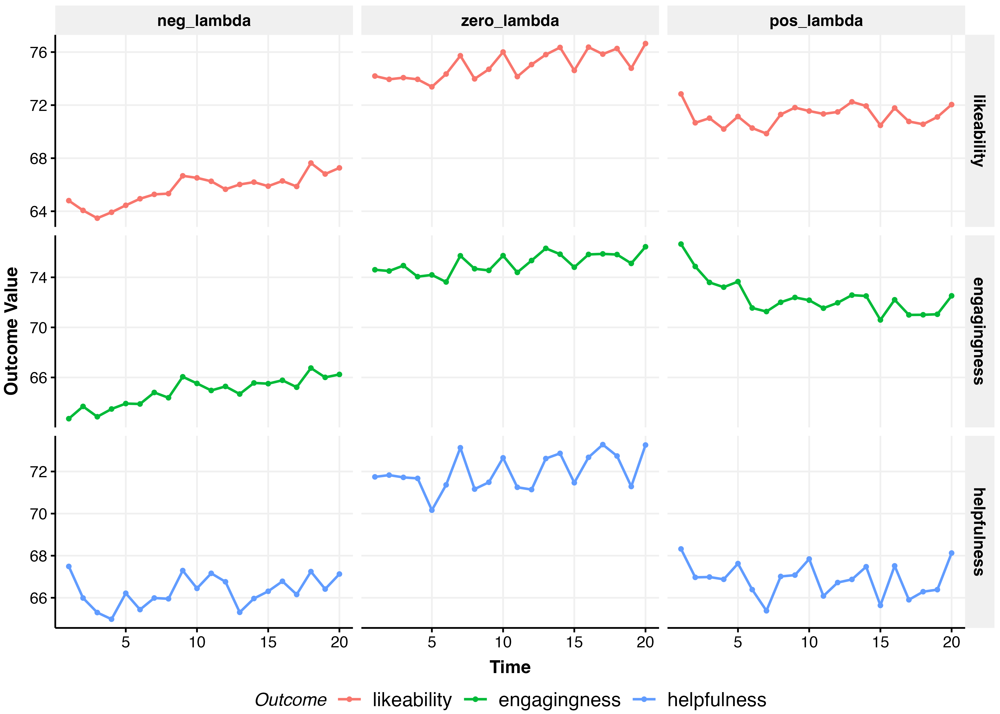
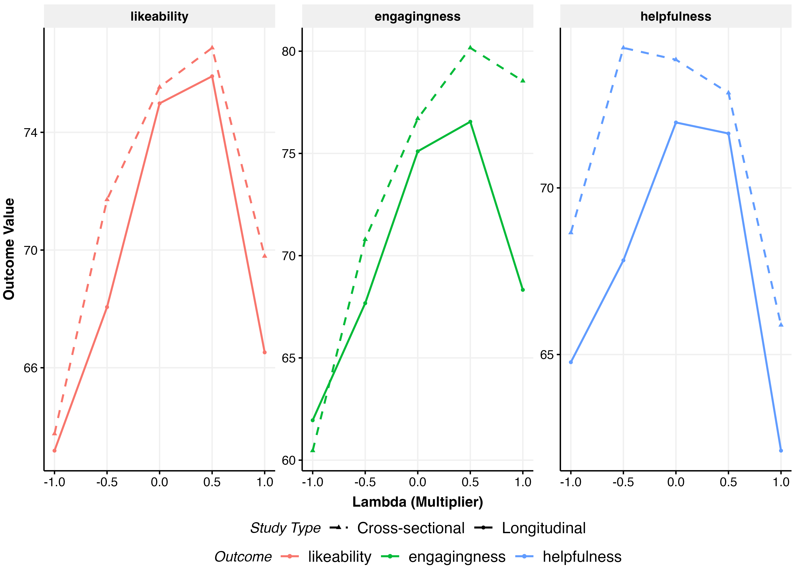
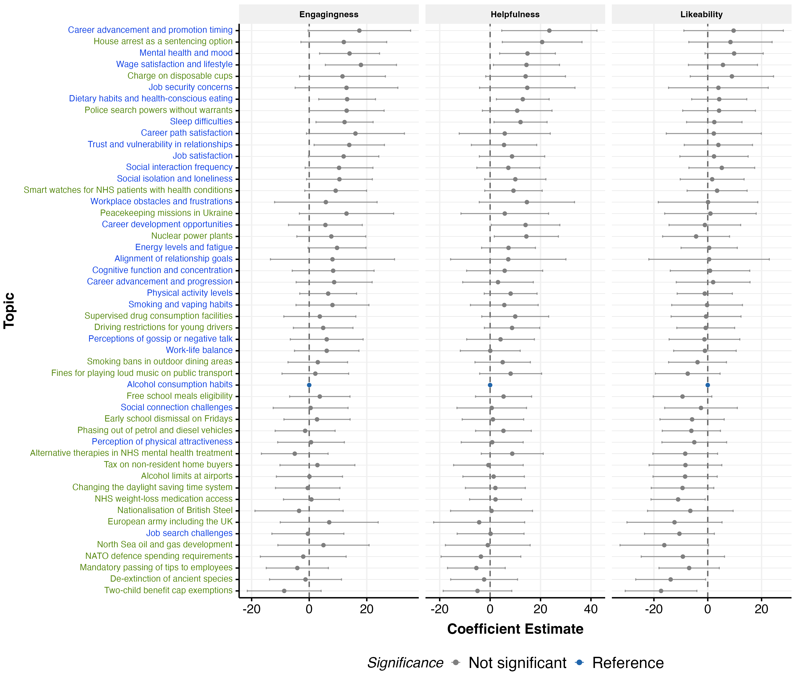
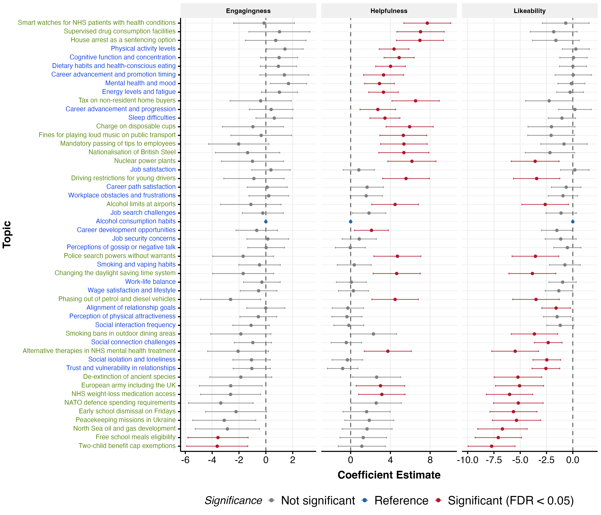

# Preferences Analysis

*Generated: 2026-02-18 10:24:08.653627*

## Overview

This analysis examines effects on user preference ratings.

**Outcomes:** Likeability, Engagingness, Helpfulness

**Treatment Arms:**
- **$\lambda$**: Relationship-seeking intensity (-1 to +1)
- **Domain**: polchat vs emotchat
- **Personalisation**: personalised vs non-personalised

---

## Data Summary

### Likeability

- **Cross-sectional**: 1503 obs / 1503 participants
- **Longitudinal**: 37536 obs / 1996 participants

### Engagingness

- **Cross-sectional**: 1503 obs / 1503 participants
- **Longitudinal**: 37535 obs / 1996 participants

### Helpfulness

- **Cross-sectional**: 1503 obs / 1503 participants
- **Longitudinal**: 37534 obs / 1996 participants

---

## Exploratory Data Analysis

---

## Functional Form Comparison

Best specification (linear, quadratic, cubic) selected by AIC.

### Cross-Sectional

| Outcome | Best Spec |
|---------|-----------|
| likeability | quadratic |
| engagingness | quadratic |
| helpfulness | quadratic |

### Longitudinal

| Outcome | Best Spec |
|---------|-----------|
| likeability | cubic |
| engagingness | cubic |
| helpfulness | cubic |

Full comparison tables (RMSE, AIC weights, BIC weights,
Performance Score) exported to LaTeX.

---

## Full-Model Specification Comparison

Performance comparison across the three full interaction
specifications (continuous, coarsened, factor $\lambda$).

### Cross-Sectional

| Outcome | Model | RMSE | AIC wt | AICc wt | BIC wt | Perf. Score |
|---------|-------|------|--------|---------|--------|-------------|
| Likeability | full_continuous | 23.293 | 0.971 | 0.974 | 1.000 | 0.938 |
|  | full_5level | 23.223 | 0.029 | 0.026 | 0.000 | 0.264 |
|  | full_coarsened | 23.503 | 0.000 | 0.000 | 0.000 | 0.000 |
| Engagingness | full_continuous | 22.402 | 0.742 | 0.767 | 1.000 | 0.928 |
|  | full_5level | 22.299 | 0.258 | 0.233 | 0.000 | 0.413 |
|  | full_coarsened | 22.658 | 0.000 | 0.000 | 0.000 | 0.000 |
| Helpfulness | full_continuous | 24.012 | 0.959 | 0.964 | 1.000 | 0.906 |
|  | full_5level | 23.934 | 0.040 | 0.036 | 0.000 | 0.270 |
|  | full_coarsened | 24.139 | 0.000 | 0.000 | 0.000 | 0.000 |

### Longitudinal

| Outcome | Model | RMSE | AIC wt | AICc wt | BIC wt | Perf. Score |
|---------|-------|------|--------|---------|--------|-------------|
| Likeability | full_continuous | 12.524 | 0.999 | 0.999 | 1.000 | 0.750 |
|  | full_coarsened | 12.524 | 0.000 | 0.000 | 0.000 | 0.250 |
|  | full_5level | 12.524 | 0.001 | 0.001 | 0.000 | 0.176 |
| Engagingness | full_continuous | 13.155 | 0.993 | 0.994 | 1.000 | 0.750 |
|  | full_coarsened | 13.154 | 0.000 | 0.000 | 0.000 | 0.250 |
|  | full_5level | 13.155 | 0.007 | 0.006 | 0.000 | 0.091 |
| Helpfulness | full_continuous | 14.654 | 0.997 | 0.997 | 1.000 | 0.750 |
|  | full_5level | 14.653 | 0.003 | 0.003 | 0.000 | 0.252 |
|  | full_coarsened | 14.654 | 0.000 | 0.000 | 0.000 | 0.198 |

Full comparison tables exported to LaTeX.

---

## Model Coefficients

Fixed effects from fitted models. Binary outcomes show odds ratios.

### Likeability

#### Additive (lambda_3 Coarsened)

**Cross-Sectional Model:**
`likeability ~ relationship_seeking_category + personalisation +      domain`

|Parameter    | Coefficient |     95% CI     | P-value |
|:------------|:-----------:|:--------------:|:-------:|
|(Intercept)  |  63.70***   | [61.15, 66.25] | p<0.001 |
|lambda=0     |   7.99***   | [4.73, 11.26]  | p<0.001 |
|lambda>0     |   5.69***   |  [3.02, 8.35]  | p<0.001 |
|personalised |    0.45     | [-1.94, 2.84]  | p=0.711 |
|emotchat     |   7.50***   |  [5.11, 9.89]  | p<0.001 |

**Longitudinal Model:**
`likeability ~ relationship_seeking_category + personalisation +      domain + session_numeric + (1 + session_numeric | ppt_id)`

|Parameter    | Coefficient |     95% CI     | P-value |
|:------------|:-----------:|:--------------:|:-------:|
|(Intercept)  |  62.31***   | [60.41, 64.21] | p<0.001 |
|lambda=0     |   9.41***   | [6.96, 11.86]  | p<0.001 |
|lambda>0     |   6.22***   |  [4.22, 8.23]  | p<0.001 |
|personalised |    1.22     | [-0.57, 3.01]  | p=0.182 |
|emotchat     |   2.97**    |  [1.18, 4.76]  | p=0.001 |
|session      |   0.09***   |  [0.05, 0.13]  | p<0.001 |

#### Additive (lambda Continuous)

**Cross-Sectional Model:**
`likeability ~ lambda + I(lambda^2) + personalisation + domain`

|Parameter    | Coefficient |     95% CI      | P-value |
|:------------|:-----------:|:---------------:|:-------:|
|(Intercept)  |  72.15***   | [69.62, 74.68]  | p<0.001 |
|lambda       |   3.47***   |  [1.81, 5.14]   | p<0.001 |
|lambda^2     |  -9.03***   | [-11.85, -6.21] | p<0.001 |
|personalised |    0.65     |  [-1.72, 3.02]  | p=0.592 |
|emotchat     |   7.21***   |  [4.84, 9.58]   | p<0.001 |

**Longitudinal Model:**
`likeability ~ lambda + I(lambda^2) + I(lambda^3) + personalisation +      domain + session_numeric + (1 + session_numeric | ppt_id)`

|Parameter    | Coefficient |     95% CI      | P-value |
|:------------|:-----------:|:---------------:|:-------:|
|(Intercept)  |  71.51***   | [69.65, 73.36]  | p<0.001 |
|lambda       |  10.28***   |  [6.54, 14.03]  | p<0.001 |
|lambda^2     |  -9.88***   | [-11.99, -7.77] | p<0.001 |
|lambda^3     |  -8.17***   | [-12.32, -4.01] | p<0.001 |
|personalised |    1.30     |  [-0.47, 3.07]  | p=0.149 |
|emotchat     |   3.09***   |  [1.32, 4.85]   | p<0.001 |
|session      |   0.09***   |  [0.05, 0.13]   | p<0.001 |

#### Full/Interaction (lambda_3 Coarsened)

**Cross-Sectional Model:**
`likeability ~ relationship_seeking_category + personalisation +      domain + relationship_seeking_category:personalisation +      relationship_seeking_category:domain`

|Parameter             | Coefficient |     95% CI     | P-value |
|:---------------------|:-----------:|:--------------:|:-------:|
|(Intercept)           |  63.63***   | [60.28, 66.97] | p<0.001 |
|lambda=0              |   9.37**    | [3.55, 15.19]  | p=0.002 |
|lambda>0              |    5.20*    |  [0.50, 9.90]  | p=0.030 |
|personalised          |    -0.37    | [-4.16, 3.42]  | p=0.849 |
|emotchat              |   8.44***   | [4.65, 12.23]  | p<0.001 |
|lambda=0:personalised |    -1.37    | [-7.93, 5.20]  | p=0.683 |
|lambda>0:personalised |    2.78     | [-2.57, 8.13]  | p=0.308 |
|lambda=0:emotchat     |    -1.33    | [-7.90, 5.23]  | p=0.690 |
|lambda>0:emotchat     |    -1.82    | [-7.17, 3.52]  | p=0.504 |

**Longitudinal Model:**
`likeability ~ relationship_seeking_category + personalisation +      domain + relationship_seeking_category:personalisation +      relationship_seeking_category:domain + session_numeric +      relationship_seeking_category:session_numeric + personalisation:session_numeric +      domain:session_numeric + (1 + session_numeric | ppt_id)`

|Parameter             | Coefficient |     95% CI     | P-value |
|:---------------------|:-----------:|:--------------:|:-------:|
|(Intercept)           |  62.27***   | [59.80, 64.73] | p<0.001 |
|lambda=0              |   6.92**    | [2.71, 11.13]  | p=0.001 |
|lambda>0              |   6.52***   | [3.02, 10.03]  | p<0.001 |
|personalised          |    1.07     | [-1.79, 3.94]  | p=0.463 |
|emotchat              |    2.42     | [-0.44, 5.28]  | p=0.098 |
|session               |   0.26***   |  [0.18, 0.33]  | p<0.001 |
|lambda=0:personalised |    1.27     | [-3.64, 6.18]  | p=0.611 |
|lambda>0:personalised |    -0.63    | [-4.64, 3.38]  | p=0.757 |
|lambda=0:emotchat     |    4.26     | [-0.65, 9.17]  | p=0.089 |
|lambda>0:emotchat     |    1.75     | [-2.25, 5.76]  | p=0.390 |
|lambda=0:session      |    -0.06    | [-0.16, 0.05]  | p=0.274 |
|lambda>0:session      |  -0.16***   | [-0.25, -0.08] | p<0.001 |
|personalised:session  |    0.02     | [-0.05, 0.10]  | p=0.599 |
|emotchat:session      |  -0.20***   | [-0.27, -0.12] | p<0.001 |

#### Full/Interaction (lambda Continuous)

**Cross-Sectional Model:**
`likeability ~ lambda + I(lambda^2) + personalisation + domain +      lambda:personalisation + lambda:domain`

|Parameter           | Coefficient |     95% CI      | P-value |
|:-------------------|:-----------:|:---------------:|:-------:|
|(Intercept)         |  72.15***   | [69.62, 74.68]  | p<0.001 |
|lambda              |    3.56*    |  [0.64, 6.48]   | p=0.017 |
|lambda^2            |  -9.05***   | [-11.88, -6.23] | p<0.001 |
|personalised        |    0.68     |  [-1.69, 3.05]  | p=0.572 |
|emotchat            |   7.18***   |  [4.81, 9.55]   | p<0.001 |
|lambda:personalised |    1.75     |  [-1.59, 5.09]  | p=0.304 |
|lambda:emotchat     |    -2.03    |  [-5.37, 1.31]  | p=0.234 |

**Longitudinal Model:**
`likeability ~ lambda + I(lambda^2) + I(lambda^3) + personalisation +      domain + lambda:personalisation + lambda:domain + session_numeric +      lambda:session_numeric + personalisation:session_numeric +      domain:session_numeric + (1 + session_numeric | ppt_id)`

|Parameter            | Coefficient |     95% CI      | P-value |
|:--------------------|:-----------:|:---------------:|:-------:|
|(Intercept)          |  71.05***   | [69.18, 72.93]  | p<0.001 |
|lambda               |  10.37***   |  [6.24, 14.49]  | p<0.001 |
|lambda^2             |  -9.87***   | [-11.98, -7.76] | p<0.001 |
|lambda^3             |  -8.17***   | [-12.33, -4.01] | p<0.001 |
|personalised         |    1.22     |  [-0.59, 3.03]  | p=0.188 |
|emotchat             |   4.10***   |  [2.29, 5.91]   | p<0.001 |
|session              |   0.18***   |  [0.11, 0.24]   | p<0.001 |
|lambda:personalised  |    -0.57    |  [-3.07, 1.94]  | p=0.657 |
|lambda:emotchat      |    1.48     |  [-1.02, 3.98]  | p=0.246 |
|lambda:session       |  -0.10***   | [-0.16, -0.05]  | p<0.001 |
|personalised:session |    0.02     |  [-0.06, 0.09]  | p=0.631 |
|emotchat:session     |  -0.20***   | [-0.27, -0.12]  | p<0.001 |

---

### Engagingness

#### Additive (lambda_3 Coarsened)

**Cross-Sectional Model:**
`engagingness ~ relationship_seeking_category + personalisation +      domain`

|Parameter    | Coefficient |     95% CI     | P-value |
|:------------|:-----------:|:--------------:|:-------:|
|(Intercept)  |  62.39***   | [59.92, 64.86] | p<0.001 |
|lambda=0     |  11.30***   | [8.14, 14.46]  | p<0.001 |
|lambda>0     |  13.85***   | [11.26, 16.43] | p<0.001 |
|personalised |    -0.69    | [-3.00, 1.63]  | p=0.561 |
|emotchat     |   6.99***   |  [4.68, 9.30]  | p<0.001 |

**Longitudinal Model:**
`engagingness ~ relationship_seeking_category + personalisation +      domain + session_numeric + (1 + session_numeric | ppt_id)`

|Parameter    | Coefficient |     95% CI     | P-value |
|:------------|:-----------:|:--------------:|:-------:|
|(Intercept)  |  62.25***   | [60.36, 64.14] | p<0.001 |
|lambda=0     |  10.67***   | [8.22, 13.12]  | p<0.001 |
|lambda>0     |   9.58***   | [7.58, 11.58]  | p<0.001 |
|personalised |    1.34     | [-0.44, 3.13]  | p=0.141 |
|emotchat     |    1.79*    |  [0.01, 3.58]  | p=0.049 |
|session      |    0.01     | [-0.03, 0.05]  | p=0.647 |

#### Additive (lambda Continuous)

**Cross-Sectional Model:**
`engagingness ~ lambda + I(lambda^2) + personalisation + domain`

|Parameter    | Coefficient |     95% CI     | P-value |
|:------------|:-----------:|:--------------:|:-------:|
|(Intercept)  |  73.85***   | [71.41, 76.30] | p<0.001 |
|lambda       |   9.15***   | [7.53, 10.76]  | p<0.001 |
|lambda^2     |  -7.25***   | [-9.98, -4.51] | p<0.001 |
|personalised |    -0.51    | [-2.80, 1.78]  | p=0.663 |
|emotchat     |   6.77***   |  [4.48, 9.07]  | p<0.001 |

**Longitudinal Model:**
`engagingness ~ lambda + I(lambda^2) + I(lambda^3) + personalisation +      domain + session_numeric + (1 + session_numeric | ppt_id)`

|Parameter    | Coefficient |     95% CI      | P-value |
|:------------|:-----------:|:---------------:|:-------:|
|(Intercept)  |  72.62***   | [70.77, 74.48]  | p<0.001 |
|lambda       |  11.65***   |  [7.90, 15.40]  | p<0.001 |
|lambda^2     |  -9.03***   | [-11.15, -6.91] | p<0.001 |
|lambda^3     |  -7.03***   | [-11.19, -2.86] | p<0.001 |
|personalised |    1.45     |  [-0.32, 3.22]  | p=0.108 |
|emotchat     |    1.87*    |  [0.10, 3.64]   | p=0.038 |
|session      |    0.01     |  [-0.03, 0.05]  | p=0.646 |

#### Full/Interaction (lambda_3 Coarsened)

**Cross-Sectional Model:**
`engagingness ~ relationship_seeking_category + personalisation +      domain + relationship_seeking_category:personalisation +      relationship_seeking_category:domain`

|Parameter             | Coefficient |     95% CI      | P-value |
|:---------------------|:-----------:|:---------------:|:-------:|
|(Intercept)           |  60.61***   | [57.39, 63.84]  | p<0.001 |
|lambda=0              |  13.72***   |  [8.12, 19.33]  | p<0.001 |
|lambda>0              |  16.94***   | [12.41, 21.47]  | p<0.001 |
|personalised          |    -1.48    |  [-5.13, 2.17]  | p=0.427 |
|emotchat              |  11.30***   |  [7.65, 14.95]  | p<0.001 |
|lambda=0:personalised |    -1.50    |  [-7.83, 4.82]  | p=0.641 |
|lambda>0:personalised |    3.08     |  [-2.08, 8.23]  | p=0.242 |
|lambda=0:emotchat     |    -3.22    |  [-9.54, 3.11]  | p=0.319 |
|lambda>0:emotchat     |  -9.30***   | [-14.46, -4.15] | p<0.001 |

**Longitudinal Model:**
`engagingness ~ relationship_seeking_category + personalisation +      domain + relationship_seeking_category:personalisation +      relationship_seeking_category:domain + session_numeric +      relationship_seeking_category:session_numeric + personalisation:session_numeric +      domain:session_numeric + (1 + session_numeric | ppt_id)`

|Parameter             | Coefficient |     95% CI     | P-value |
|:---------------------|:-----------:|:--------------:|:-------:|
|(Intercept)           |  61.32***   | [58.87, 63.78] | p<0.001 |
|lambda=0              |   8.29***   | [4.09, 12.48]  | p<0.001 |
|lambda>0              |  12.01***   | [8.52, 15.51]  | p<0.001 |
|personalised          |    1.26     | [-1.59, 4.12]  | p=0.386 |
|emotchat              |    2.35     | [-0.50, 5.20]  | p=0.106 |
|session               |   0.28***   |  [0.20, 0.37]  | p<0.001 |
|lambda=0:personalised |    2.29     | [-2.61, 7.19]  | p=0.360 |
|lambda>0:personalised |    -1.04    | [-5.04, 2.96]  | p=0.610 |
|lambda=0:emotchat     |    3.27     | [-1.63, 8.17]  | p=0.190 |
|lambda>0:emotchat     |    -0.78    | [-4.78, 3.21]  | p=0.701 |
|lambda=0:session      |    -0.10    | [-0.21, 0.01]  | p=0.086 |
|lambda>0:session      |  -0.35***   | [-0.45, -0.26] | p<0.001 |
|personalised:session  |    -0.00    | [-0.09, 0.08]  | p=0.938 |
|emotchat:session      |  -0.22***   | [-0.30, -0.14] | p<0.001 |

#### Full/Interaction (lambda Continuous)

**Cross-Sectional Model:**
`engagingness ~ lambda + I(lambda^2) + personalisation + domain +      lambda:personalisation + lambda:domain`

|Parameter           | Coefficient |     95% CI      | P-value |
|:-------------------|:-----------:|:---------------:|:-------:|
|(Intercept)         |  73.81***   | [71.38, 76.24]  | p<0.001 |
|lambda              |  11.95***   |  [9.14, 14.76]  | p<0.001 |
|lambda^2            |  -7.31***   | [-10.03, -4.60] | p<0.001 |
|personalised        |    -0.38    |  [-2.66, 1.89]  | p=0.741 |
|emotchat            |   6.74***   |  [4.47, 9.02]   | p<0.001 |
|lambda:personalised |    1.36     |  [-1.85, 4.58]  | p=0.406 |
|lambda:emotchat     |  -7.26***   | [-10.47, -4.04] | p<0.001 |

**Longitudinal Model:**
`engagingness ~ lambda + I(lambda^2) + I(lambda^3) + personalisation +      domain + lambda:personalisation + lambda:domain + session_numeric +      lambda:session_numeric + personalisation:session_numeric +      domain:session_numeric + (1 + session_numeric | ppt_id)`

|Parameter            | Coefficient |     95% CI      | P-value |
|:--------------------|:-----------:|:---------------:|:-------:|
|(Intercept)          |  72.14***   | [70.27, 74.01]  | p<0.001 |
|lambda               |  13.18***   |  [9.05, 17.31]  | p<0.001 |
|lambda^2             |  -9.03***   | [-11.14, -6.91] | p<0.001 |
|lambda^3             |   -6.99**   | [-11.16, -2.83] | p=0.001 |
|personalised         |    1.48     |  [-0.32, 3.29]  | p=0.108 |
|emotchat             |   2.81**    |  [1.01, 4.62]   | p=0.002 |
|session              |   0.12***   |  [0.05, 0.19]   | p<0.001 |
|lambda:personalised  |    -0.85    |  [-3.36, 1.66]  | p=0.505 |
|lambda:emotchat      |    -0.16    |  [-2.67, 2.35]  | p=0.901 |
|lambda:session       |  -0.24***   | [-0.30, -0.18]  | p<0.001 |
|personalised:session |    -0.01    |  [-0.09, 0.08]  | p=0.883 |
|emotchat:session     |  -0.22***   | [-0.30, -0.14]  | p<0.001 |

---

### Helpfulness

#### Additive (lambda_3 Coarsened)

**Cross-Sectional Model:**
`helpfulness ~ relationship_seeking_category + personalisation +      domain`

|Parameter    | Coefficient |     95% CI     | P-value |
|:------------|:-----------:|:--------------:|:-------:|
|(Intercept)  |  69.66***   | [67.03, 72.28] | p<0.001 |
|lambda=0     |    2.54     | [-0.82, 5.89]  | p=0.138 |
|lambda>0     |    -1.99    | [-4.73, 0.75]  | p=0.154 |
|personalised |    -0.32    | [-2.77, 2.14]  | p=0.800 |
|emotchat     |   3.77**    |  [1.31, 6.22]  | p=0.003 |

**Longitudinal Model:**
`helpfulness ~ relationship_seeking_category + personalisation +      domain + session_numeric + (1 + session_numeric | ppt_id)`

|Parameter    | Coefficient |     95% CI     | P-value |
|:------------|:-----------:|:--------------:|:-------:|
|(Intercept)  |  66.71***   | [64.79, 68.62] | p<0.001 |
|lambda=0     |   5.45***   |  [2.97, 7.92]  | p<0.001 |
|lambda>0     |    0.74     | [-1.29, 2.76]  | p=0.475 |
|personalised |    1.49     | [-0.32, 3.30]  | p=0.108 |
|emotchat     |   -2.71**   | [-4.52, -0.91] | p=0.003 |
|session      |    0.03     | [-0.02, 0.07]  | p=0.229 |

#### Additive (lambda Continuous)

**Cross-Sectional Model:**
`helpfulness ~ lambda + I(lambda^2) + personalisation + domain`

|Parameter    | Coefficient |     95% CI      | P-value |
|:------------|:-----------:|:---------------:|:-------:|
|(Intercept)  |  73.02***   | [70.42, 75.63]  | p<0.001 |
|lambda       |    -1.36    |  [-3.07, 0.36]  | p=0.122 |
|lambda^2     |  -7.19***   | [-10.10, -4.28] | p<0.001 |
|personalised |    -0.19    |  [-2.63, 2.25]  | p=0.881 |
|emotchat     |   3.53**    |  [1.09, 5.97]   | p=0.005 |

**Longitudinal Model:**
`helpfulness ~ lambda + I(lambda^2) + I(lambda^3) + personalisation +      domain + session_numeric + (1 + session_numeric | ppt_id)`

|Parameter    | Coefficient |     95% CI      | P-value |
|:------------|:-----------:|:---------------:|:-------:|
|(Intercept)  |  72.08***   | [70.20, 73.95]  | p<0.001 |
|lambda       |    4.92*    |  [1.13, 8.72]   | p=0.011 |
|lambda^2     |  -8.12***   | [-10.26, -5.97] | p<0.001 |
|lambda^3     |   -5.92**   | [-10.13, -1.70] | p=0.006 |
|personalised |    1.53     |  [-0.26, 3.32]  | p=0.094 |
|emotchat     |   -2.64**   | [-4.43, -0.85]  | p=0.004 |
|session      |    0.03     |  [-0.02, 0.07]  | p=0.229 |

#### Full/Interaction (lambda_3 Coarsened)

**Cross-Sectional Model:**
`helpfulness ~ relationship_seeking_category + personalisation +      domain + relationship_seeking_category:personalisation +      relationship_seeking_category:domain`

|Parameter             | Coefficient |     95% CI     | P-value |
|:---------------------|:-----------:|:--------------:|:-------:|
|(Intercept)           |  69.90***   | [66.47, 73.34] | p<0.001 |
|lambda=0              |    4.80     | [-1.18, 10.77] | p=0.116 |
|lambda>0              |    -3.62    | [-8.45, 1.20]  | p=0.141 |
|personalised          |    -0.34    | [-4.23, 3.55]  | p=0.866 |
|emotchat              |    3.29     | [-0.60, 7.18]  | p=0.097 |
|lambda=0:personalised |    -3.78    | [-10.52, 2.96] | p=0.271 |
|lambda>0:personalised |    1.86     | [-3.63, 7.35]  | p=0.507 |
|lambda=0:emotchat     |    -0.69    | [-7.43, 6.05]  | p=0.840 |
|lambda>0:emotchat     |    1.38     | [-4.11, 6.87]  | p=0.622 |

**Longitudinal Model:**
`helpfulness ~ relationship_seeking_category + personalisation +      domain + relationship_seeking_category:personalisation +      relationship_seeking_category:domain + session_numeric +      relationship_seeking_category:session_numeric + personalisation:session_numeric +      domain:session_numeric + (1 + session_numeric | ppt_id)`

|Parameter             | Coefficient |     95% CI     | P-value |
|:---------------------|:-----------:|:--------------:|:-------:|
|(Intercept)           |  67.34***   | [64.85, 69.82] | p<0.001 |
|lambda=0              |    2.71     | [-1.53, 6.96]  | p=0.211 |
|lambda>0              |    -0.87    | [-4.40, 2.67]  | p=0.630 |
|personalised          |    1.74     | [-1.15, 4.63]  | p=0.237 |
|emotchat              |   -4.37**   | [-7.25, -1.48] | p=0.003 |
|session               |   0.19***   |  [0.11, 0.28]  | p<0.001 |
|lambda=0:personalised |    0.81     | [-4.15, 5.77]  | p=0.749 |
|lambda>0:personalised |    -0.96    | [-5.01, 3.08]  | p=0.641 |
|lambda=0:emotchat     |    4.29     | [-0.66, 9.25]  | p=0.090 |
|lambda>0:emotchat     |    4.85*    |  [0.81, 8.89]  | p=0.019 |
|lambda=0:session      |    0.03     | [-0.08, 0.15]  | p=0.549 |
|lambda>0:session      |    -0.08    | [-0.17, 0.01]  | p=0.099 |
|personalised:session  |    -0.01    | [-0.09, 0.08]  | p=0.861 |
|emotchat:session      |  -0.28***   | [-0.36, -0.20] | p<0.001 |

#### Full/Interaction (lambda Continuous)

**Cross-Sectional Model:**
`helpfulness ~ lambda + I(lambda^2) + personalisation + domain +      lambda:personalisation + lambda:domain`

|Parameter           | Coefficient |     95% CI      | P-value |
|:-------------------|:-----------:|:---------------:|:-------:|
|(Intercept)         |  73.03***   | [70.42, 75.63]  | p<0.001 |
|lambda              |    -1.79    |  [-4.80, 1.22]  | p=0.244 |
|lambda^2            |  -7.19***   | [-10.10, -4.28] | p<0.001 |
|personalised        |    -0.18    |  [-2.62, 2.26]  | p=0.884 |
|emotchat            |   3.51**    |  [1.07, 5.96]   | p=0.005 |
|lambda:personalised |    1.09     |  [-2.36, 4.53]  | p=0.536 |
|lambda:emotchat     |    -0.25    |  [-3.70, 3.20]  | p=0.887 |

**Longitudinal Model:**
`helpfulness ~ lambda + I(lambda^2) + I(lambda^3) + personalisation +      domain + lambda:personalisation + lambda:domain + session_numeric +      lambda:session_numeric + personalisation:session_numeric +      domain:session_numeric + (1 + session_numeric | ppt_id)`

|Parameter            | Coefficient |     95% CI      | P-value |
|:--------------------|:-----------:|:---------------:|:-------:|
|(Intercept)          |  71.48***   | [69.59, 73.38]  | p<0.001 |
|lambda               |    3.91     |  [-0.27, 8.08]  | p=0.067 |
|lambda^2             |  -8.11***   | [-10.24, -5.97] | p<0.001 |
|lambda^3             |   -5.96**   | [-10.17, -1.75] | p=0.006 |
|personalised         |    1.59     |  [-0.24, 3.41]  | p=0.088 |
|emotchat             |    -1.46    |  [-3.28, 0.36]  | p=0.116 |
|session              |   0.17***   |  [0.10, 0.24]   | p<0.001 |
|lambda:personalised  |    -0.85    |  [-3.39, 1.68]  | p=0.510 |
|lambda:emotchat      |   3.42**    |  [0.88, 5.95]   | p=0.008 |
|lambda:session       |    -0.06    |  [-0.11, 0.00]  | p=0.062 |
|personalised:session |    -0.01    |  [-0.09, 0.08]  | p=0.853 |
|emotchat:session     |  -0.28***   | [-0.36, -0.20]  | p<0.001 |

---

---

## Robustness Checks

Robustness analyses test whether treatment effects hold under
alternative specifications. Cells show coefficient (SE) with
significance: *p<.05, **p<.01, ***p<.001.

**Specifications:**
- **Additive**: Base treatment effects (no interactions)
- **+ Interactions**: Full model with treatment interactions
- **Full + Demos**: Full model + demographic controls
- **Full + Prefs**: Full model + AI pre-treatment pref groups
- **Full + IPW**: Full model with IPW weights (attrition adjustment)

### Cross-Sectional

| Outcome | Predictor | Additive | + Interactions | Full + Demos | Full + Prefs | Full + IPW |
|---|---|---|---|---|---|---|
| likeability | lambda | 3.47 (0.85)*** | 3.56 (1.49)* | 4.17 (1.45)** | 3.76 (1.41)** | --- |
| likeability | I(lambda^2) | -9.03 (1.44)*** | -9.05 (1.44)*** | -9.08 (1.41)*** | -9.71 (1.37)*** | --- |
| likeability | personalisationpersonalised | 0.65 (1.21) | 0.68 (1.21) | 0.44 (1.19) | 0.68 (1.15) | --- |
| likeability | domainemotchat | 7.21 (1.21)*** | 7.18 (1.21)*** | 6.97 (1.18)*** | 6.77 (1.15)*** | --- |
| engagingness | lambda | 9.15 (0.82)*** | 11.95 (1.43)*** | 12.53 (1.41)*** | 12.12 (1.37)*** | --- |
| engagingness | I(lambda^2) | -7.25 (1.39)*** | -7.31 (1.38)*** | -7.47 (1.36)*** | -7.87 (1.33)*** | --- |
| engagingness | personalisationpersonalised | -0.51 (1.17) | -0.38 (1.16) | -0.80 (1.15) | -0.39 (1.11) | --- |
| engagingness | domainemotchat | 6.77 (1.17)*** | 6.74 (1.16)*** | 6.68 (1.14)*** | 6.39 (1.12)*** | --- |
| helpfulness | lambda | -1.36 (0.88) | -1.79 (1.53) | -1.16 (1.50) | -1.60 (1.46) | --- |
| helpfulness | I(lambda^2) | -7.19 (1.48)*** | -7.19 (1.48)*** | -7.31 (1.45)*** | -7.83 (1.42)*** | --- |
| helpfulness | personalisationpersonalised | -0.19 (1.24) | -0.18 (1.24) | -0.33 (1.22) | -0.19 (1.19) | --- |
| helpfulness | domainemotchat | 3.53 (1.24)** | 3.51 (1.25)** | 3.19 (1.22)** | 3.11 (1.19)** | --- |

### Longitudinal

| Outcome | Predictor | Additive | + Interactions | Full + Demos | Full + Prefs | Full + IPW |
|---|---|---|---|---|---|---|
| likeability | lambda | 10.28 (1.91)*** | 10.37 (2.10)*** | 10.75 (2.05)*** | 9.22 (1.99)*** | 10.06 (2.11)*** |
| likeability | I(lambda^2) | -9.88 (1.08)*** | -9.87 (1.08)*** | -10.40 (1.05)*** | -10.06 (1.02)*** | -9.84 (1.08)*** |
| likeability | I(lambda^3) | -8.17 (2.12)*** | -8.17 (2.12)*** | -8.42 (2.06)*** | -7.54 (2.00)*** | -7.90 (2.12)*** |
| likeability | personalisationpersonalised | 1.30 (0.90) | 1.22 (0.92) | 1.04 (0.90) | 1.20 (0.88) | 1.21 (0.93) |
| likeability | domainemotchat | 3.09 (0.90)*** | 4.10 (0.92)*** | 4.33 (0.90)*** | 4.05 (0.88)*** | 4.27 (0.93)*** |
| engagingness | lambda | 11.65 (1.91)*** | 13.18 (2.11)*** | 13.54 (2.05)*** | 12.15 (2.01)*** | 12.92 (2.11)*** |
| engagingness | I(lambda^2) | -9.03 (1.08)*** | -9.03 (1.08)*** | -9.61 (1.05)*** | -9.27 (1.03)*** | -8.96 (1.08)*** |
| engagingness | I(lambda^3) | -7.03 (2.12)*** | -6.99 (2.13)** | -7.27 (2.07)*** | -6.50 (2.03)** | -6.72 (2.13)** |
| engagingness | personalisationpersonalised | 1.45 (0.90) | 1.48 (0.92) | 1.27 (0.90) | 1.47 (0.89) | 1.39 (0.92) |
| engagingness | domainemotchat | 1.87 (0.90)* | 2.81 (0.92)** | 3.04 (0.90)*** | 2.77 (0.89)** | 2.91 (0.92)** |
| helpfulness | lambda | 4.92 (1.94)* | 3.91 (2.13) | 4.30 (2.08)* | 2.79 (2.01) | 3.41 (2.13) |
| helpfulness | I(lambda^2) | -8.12 (1.09)*** | -8.11 (1.09)*** | -8.64 (1.06)*** | -8.34 (1.03)*** | -8.08 (1.09)*** |
| helpfulness | I(lambda^3) | -5.92 (2.15)** | -5.96 (2.15)** | -6.25 (2.10)** | -5.38 (2.02)** | -5.54 (2.15)** |
| helpfulness | personalisationpersonalised | 1.53 (0.91) | 1.59 (0.93) | 1.42 (0.91) | 1.57 (0.88) | 1.52 (0.94) |
| helpfulness | domainemotchat | -2.64 (0.91)** | -1.46 (0.93) | -1.22 (0.91) | -1.51 (0.88) | -1.38 (0.93) |

Full tables: `preferences_robustness_{cs,long}.tex`

---

## Topic Fixed Effects

Analysis of how different conversation topics affect preference outcomes,
with "Alcohol consumption habits" as the reference category.

Forest plots show coefficients for each topic relative to the reference,
with FDR-adjusted significance indicators.
Labels are colored by domain: green = emotchat, grey = polchat.

### Cross-sectional

### Longitudinal

---

## Output Files

All outputs use prefix `preferences_`.

- Figures: `outputs/figures/main_studies/`
- Tables: `outputs/tables/main_studies/`
- Models: `outputs/models/`
