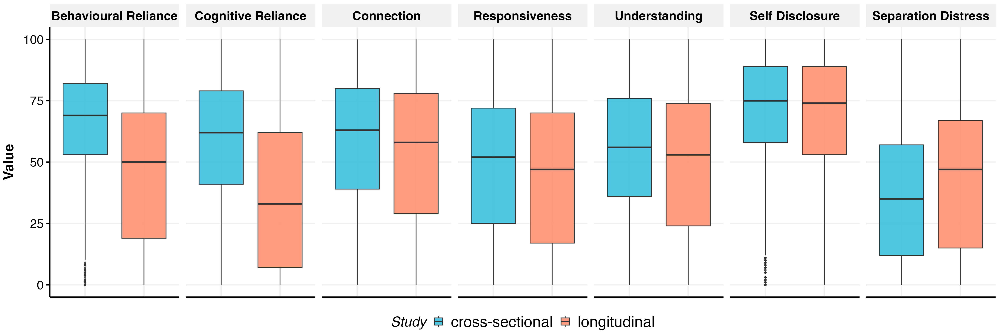
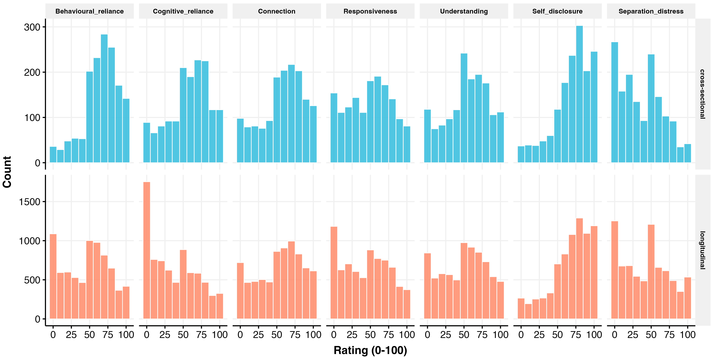
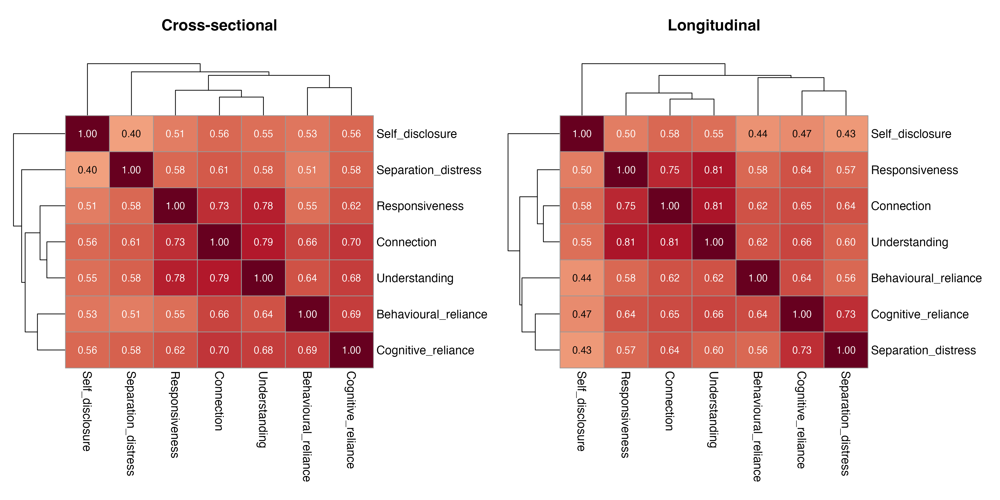
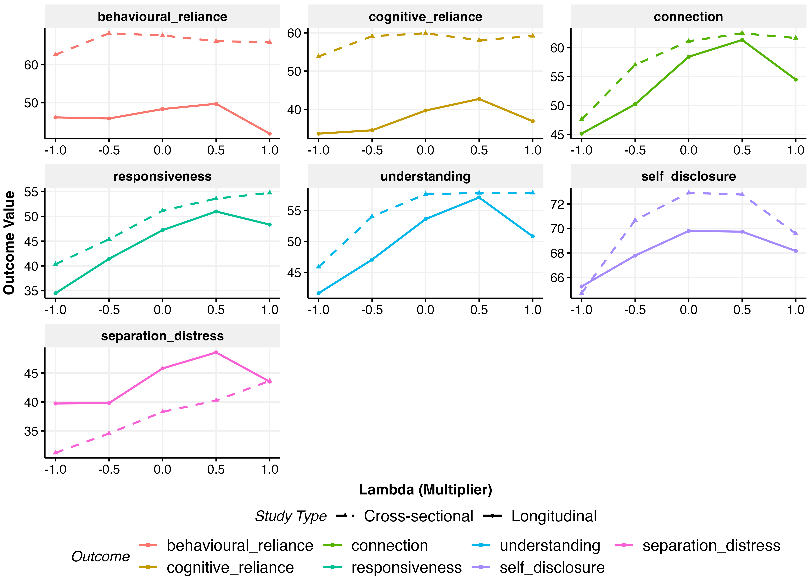

# Attachment Analysis

*Generated: 2026-02-18 10:25:56.799749*

## Overview

This analysis examines effects on attachment outcomes.

**Constructs:** Reliance, Perceived Understanding, Self Disclosure,
Separation Distress

**Treatment Arms:**
- **$\lambda$**: Relationship-seeking intensity (-1 to +1)
- **Domain**: polchat vs emotchat
- **Personalisation**: personalised vs non-personalised

---

## Data Summary

### Reliance

- **Cross-sectional**: 3012 obs / 1506 participants
- **Longitudinal**: 15002 obs / 1939 participants

### Perceived understanding

- **Cross-sectional**: 4518 obs / 1506 participants
- **Longitudinal**: 22503 obs / 1939 participants

### Self disclosure

- **Cross-sectional**: 1506 obs / 1506 participants
- **Longitudinal**: 7501 obs / 1939 participants

### Separation distress

- **Cross-sectional**: 1506 obs / 1506 participants
- **Longitudinal**: 7501 obs / 1939 participants

---

## Exploratory Data Analysis

*Note: Cross-sectional and longitudinal values are not directly comparable. Cross-sectional items measure overall expectations of the relationship, while longitudinal items are context-specific to each week. Only the shape of the relationship with lambda, not the absolute values, should be compared across studies.*

---

## Heterogeneity Tests

Tests whether outcomes within pooled constructs show different
treatment effects. A significant test suggests heterogeneity.

| Construct | Study Type | p-value | Result |
|-----------|------------|---------|--------|
| reliance | Cross-Sectional | 0.5603 | HOMOGENEOUS |
| reliance | Longitudinal | 0.0000 | HETEROGENEOUS |
| perceived_understanding | Cross-Sectional | 0.0834 | HOMOGENEOUS |
| perceived_understanding | Longitudinal | 0.0000 | HETEROGENEOUS |

---

## Functional Form Comparison

Best specification (linear, quadratic, cubic) selected by AIC.

### Cross-Sectional

| Outcome | Best Spec |
|---------|-----------|
| reliance | linear |
| perceived_understanding | quadratic |
| self_disclosure | quadratic |
| separation_distress | linear |

### Longitudinal

| Outcome | Best Spec |
|---------|-----------|
| reliance | cubic |
| perceived_understanding | cubic |
| self_disclosure | quadratic |
| separation_distress | cubic |

Full comparison tables (RMSE, AIC weights, BIC weights,
Performance Score) exported to LaTeX.

---

## Full-Model Specification Comparison

Performance comparison across the three full interaction
specifications (continuous, coarsened, factor $\lambda$).

### Cross-Sectional

| Outcome | Model | RMSE | AIC wt | AICc wt | BIC wt | Perf. Score |
|---------|-------|------|--------|---------|--------|-------------|
| Reliance | full_continuous | 11.064 | 0.785 | 0.794 | 1.000 | 0.750 |
|  | full_coarsened | 11.061 | 0.104 | 0.103 | 0.000 | 0.250 |
|  | full_5level | 11.061 | 0.111 | 0.104 | 0.000 | 0.249 |
| Perceived understanding | full_continuous | 11.527 | 0.997 | 0.997 | 1.000 | 0.750 |
|  | full_coarsened | 11.525 | 0.001 | 0.001 | 0.000 | 0.250 |
|  | full_5level | 11.525 | 0.003 | 0.002 | 0.000 | 0.208 |
| Self disclosure | full_continuous | 24.448 | 0.998 | 0.998 | 1.000 | 0.950 |
|  | full_5level | 24.428 | 0.001 | 0.001 | 0.000 | 0.250 |
|  | full_coarsened | 24.528 | 0.001 | 0.001 | 0.000 | 0.000 |
| Separation distress | full_continuous | 27.622 | 0.981 | 0.982 | 1.000 | 0.814 |
|  | full_5level | 27.546 | 0.008 | 0.007 | 0.000 | 0.250 |
|  | full_coarsened | 27.649 | 0.012 | 0.011 | 0.000 | 0.002 |

### Longitudinal

| Outcome | Model | RMSE | AIC wt | AICc wt | BIC wt | Perf. Score |
|---------|-------|------|--------|---------|--------|-------------|
| Reliance | full_continuous | 15.770 | 0.999 | 1.000 | 1.000 | 1.000 |
|  | full_5level | 15.770 | 0.000 | 0.000 | 0.000 | 0.248 |
|  | full_coarsened | 15.775 | 0.000 | 0.000 | 0.000 | 0.000 |
| Perceived understanding | full_5level | 13.568 | 1.000 | 1.000 | 0.000 | 0.750 |
|  | full_continuous | 13.584 | 0.000 | 0.000 | 1.000 | 0.250 |
|  | full_coarsened | 13.583 | 0.000 | 0.000 | 0.000 | 0.009 |
| Self disclosure | full_continuous | 11.608 | 0.966 | 0.966 | 1.000 | 0.750 |
|  | full_5level | 11.602 | 0.000 | 0.000 | 0.000 | 0.250 |
|  | full_coarsened | 11.607 | 0.034 | 0.034 | 0.000 | 0.044 |
| Separation distress | full_continuous | 12.338 | 0.965 | 0.966 | 1.000 | 0.767 |
|  | full_5level | 12.337 | 0.005 | 0.005 | 0.000 | 0.250 |
|  | full_coarsened | 12.338 | 0.030 | 0.029 | 0.000 | 0.013 |

Full comparison tables exported to LaTeX.

---

## Model Coefficients

Fixed effects from fitted models. Binary outcomes show odds ratios.

### Reliance

#### Additive (lambda_3 Coarsened)

**Cross-Sectional Model:**
`outcome_value ~ relationship_seeking_category + personalisation +      outcome_measure + domain + (1 | ppt_id)`

|Parameter          | Coefficient |     95% CI     | P-value |
|:------------------|:-----------:|:--------------:|:-------:|
|(Intercept)        |  63.68***   | [61.13, 66.23] | p<0.001 |
|lambda=0           |    2.91     | [-0.29, 6.11]  | p=0.075 |
|lambda>0           |    1.41     | [-1.20, 4.03]  | p=0.290 |
|personalised       |    -0.31    | [-2.65, 2.03]  | p=0.794 |
|cognitive_reliance |  -8.11***   | [-9.14, -7.09] | p<0.001 |
|emotchat           |    2.95*    |  [0.61, 5.29]  | p=0.014 |

**Longitudinal Model:**
`outcome_value ~ relationship_seeking_category + personalisation +      outcome_measure + domain + relationship_seeking_category:outcome_measure +      personalisation:outcome_measure + domain:outcome_measure +      week_numeric + week_numeric:outcome_measure + (1 + week_numeric |      ppt_id)`

|Parameter                       | Coefficient |     95% CI      | P-value |
|:-------------------------------|:-----------:|:---------------:|:-------:|
|(Intercept)                     |  40.65***   | [38.15, 43.15]  | p<0.001 |
|lambda=0                        |    2.14     |  [-0.96, 5.24]  | p=0.176 |
|lambda>0                        |    -0.13    |  [-2.67, 2.40]  | p=0.917 |
|personalised                    |    1.49     |  [-0.77, 3.76]  | p=0.196 |
|cognitive_reliance              |  -8.79***   | [-10.45, -7.12] | p<0.001 |
|emotchat                        |  10.36***   |  [8.09, 12.62]  | p<0.001 |
|week                            |    -0.23    |  [-0.60, 0.14]  | p=0.226 |
|lambda=0:cognitive_reliance     |   3.31***   |  [1.81, 4.81]   | p<0.001 |
|lambda>0:cognitive_reliance     |   5.86***   |  [4.63, 7.08]   | p<0.001 |
|personalised:cognitive_reliance |  -2.07***   | [-3.17, -0.98]  | p<0.001 |
|cognitive_reliance:emotchat     |  -5.39***   | [-6.48, -4.29]  | p<0.001 |
|cognitive_reliance:week         |    0.26     |  [-0.23, 0.75]  | p=0.295 |

#### Additive (lambda Continuous)

**Cross-Sectional Model:**
`outcome_value ~ lambda + personalisation + outcome_measure +      domain + (1 | ppt_id)`

|Parameter          | Coefficient |     95% CI     | P-value |
|:------------------|:-----------:|:--------------:|:-------:|
|(Intercept)        |  64.83***   | [62.70, 66.95] | p<0.001 |
|lambda             |    1.44     | [-0.21, 3.09]  | p=0.087 |
|personalised       |    -0.30    | [-2.64, 2.04]  | p=0.801 |
|cognitive_reliance |  -8.11***   | [-9.14, -7.09] | p<0.001 |
|emotchat           |    2.93*    |  [0.59, 5.27]  | p=0.014 |

**Longitudinal Model:**
`outcome_value ~ lambda + I(lambda^2) + I(lambda^3) + personalisation +      outcome_measure + domain + lambda:outcome_measure + personalisation:outcome_measure +      domain:outcome_measure + week_numeric + week_numeric:outcome_measure +      (1 + week_numeric | ppt_id)`

|Parameter                       | Coefficient |     95% CI      | P-value |
|:-------------------------------|:-----------:|:---------------:|:-------:|
|(Intercept)                     |  43.08***   | [40.63, 45.54]  | p<0.001 |
|lambda                          |    5.21*    |  [0.55, 9.87]   | p=0.028 |
|lambda^2                        |   -4.17**   | [-6.79, -1.54]  | p=0.002 |
|lambda^3                        |   -7.02**   | [-12.18, -1.87] | p=0.008 |
|personalised                    |    1.47     |  [-0.79, 3.73]  | p=0.204 |
|cognitive_reliance              |  -5.81***   | [-7.34, -4.28]  | p<0.001 |
|emotchat                        |  10.43***   |  [8.17, 12.69]  | p<0.001 |
|week                            |    -0.23    |  [-0.60, 0.14]  | p=0.224 |
|lambda:cognitive_reliance       |   3.84***   |  [3.06, 4.61]   | p<0.001 |
|personalised:cognitive_reliance |  -2.02***   | [-3.11, -0.93]  | p<0.001 |
|cognitive_reliance:emotchat     |  -5.40***   | [-6.50, -4.31]  | p<0.001 |
|cognitive_reliance:week         |    0.26     |  [-0.23, 0.75]  | p=0.292 |

#### Full/Interaction (lambda_3 Coarsened)

**Cross-Sectional Model:**
`outcome_value ~ relationship_seeking_category + personalisation +      outcome_measure + domain + relationship_seeking_category:personalisation +      relationship_seeking_category:domain + (1 | ppt_id)`

|Parameter             | Coefficient |     95% CI     | P-value |
|:---------------------|:-----------:|:--------------:|:-------:|
|(Intercept)           |  64.13***   | [60.83, 67.44] | p<0.001 |
|lambda=0              |    4.42     | [-1.27, 10.12] | p=0.128 |
|lambda>0              |    -0.43    | [-5.03, 4.16]  | p=0.853 |
|personalised          |    -1.90    | [-5.60, 1.81]  | p=0.316 |
|cognitive_reliance    |  -8.11***   | [-9.14, -7.09] | p<0.001 |
|emotchat              |    3.56     | [-0.14, 7.27]  | p=0.059 |
|lambda=0:personalised |    -1.09    | [-7.52, 5.34]  | p=0.739 |
|lambda>0:personalised |    4.50     | [-0.73, 9.74]  | p=0.092 |
|lambda=0:emotchat     |    -1.88    | [-8.31, 4.55]  | p=0.567 |
|lambda>0:emotchat     |    -0.82    | [-6.05, 4.42]  | p=0.759 |

**Longitudinal Model:**
`outcome_value ~ relationship_seeking_category + personalisation +      outcome_measure + domain + relationship_seeking_category:outcome_measure +      personalisation:outcome_measure + domain:outcome_measure +      relationship_seeking_category:personalisation + relationship_seeking_category:domain +      week_numeric + week_numeric:outcome_measure + relationship_seeking_category:week_numeric +      personalisation:week_numeric + domain:week_numeric + (1 +      week_numeric | ppt_id)`

|Parameter                       | Coefficient |     95% CI      | P-value |
|:-------------------------------|:-----------:|:---------------:|:-------:|
|(Intercept)                     |  42.42***   | [39.19, 45.66]  | p<0.001 |
|lambda=0                        |    0.44     |  [-4.89, 5.78]  | p=0.870 |
|lambda>0                        |    -0.98    |  [-5.40, 3.44]  | p=0.664 |
|personalised                    |    0.38     |  [-3.25, 4.01]  | p=0.836 |
|cognitive_reliance              |  -8.79***   | [-10.45, -7.12] | p<0.001 |
|emotchat                        |   8.15***   |  [4.53, 11.77]  | p<0.001 |
|week                            |   -1.01**   | [-1.65, -0.37]  | p=0.002 |
|lambda=0:cognitive_reliance     |   3.31***   |  [1.81, 4.81]   | p<0.001 |
|lambda>0:cognitive_reliance     |   5.86***   |  [4.63, 7.08]   | p<0.001 |
|personalised:cognitive_reliance |  -2.07***   | [-3.17, -0.98]  | p<0.001 |
|cognitive_reliance:emotchat     |  -5.39***   | [-6.48, -4.29]  | p<0.001 |
|lambda=0:personalised           |    1.45     |  [-4.59, 7.48]  | p=0.638 |
|lambda>0:personalised           |    0.30     |  [-4.62, 5.22]  | p=0.905 |
|lambda=0:emotchat               |    1.91     |  [-4.13, 7.94]  | p=0.535 |
|lambda>0:emotchat               |    0.87     |  [-4.05, 5.79]  | p=0.729 |
|cognitive_reliance:week         |    0.26     |  [-0.23, 0.75]  | p=0.295 |
|lambda=0:week                   |    0.00     |  [-0.77, 0.77]  | p=0.995 |
|lambda>0:week                   |    0.17     |  [-0.45, 0.80]  | p=0.586 |
|personalised:week               |    0.45     |  [-0.11, 1.01]  | p=0.116 |
|emotchat:week                   |   0.96***   |  [0.40, 1.52]   | p<0.001 |

#### Full/Interaction (lambda Continuous)

**Cross-Sectional Model:**
`outcome_value ~ lambda + personalisation + outcome_measure +      domain + lambda:personalisation + lambda:domain + (1 | ppt_id)`

|Parameter           | Coefficient |     95% CI     | P-value |
|:-------------------|:-----------:|:--------------:|:-------:|
|(Intercept)         |  64.81***   | [62.69, 66.94] | p<0.001 |
|lambda              |    0.90     | [-1.99, 3.78]  | p=0.543 |
|personalised        |    -0.27    | [-2.61, 2.07]  | p=0.819 |
|cognitive_reliance  |  -8.11***   | [-9.14, -7.09] | p<0.001 |
|emotchat            |    2.89*    |  [0.55, 5.23]  | p=0.016 |
|lambda:personalised |    2.41     | [-0.90, 5.71]  | p=0.154 |
|lambda:emotchat     |    -1.41    | [-4.72, 1.89]  | p=0.402 |

**Longitudinal Model:**
`outcome_value ~ lambda + I(lambda^2) + I(lambda^3) + personalisation +      outcome_measure + domain + lambda:outcome_measure + personalisation:outcome_measure +      domain:outcome_measure + lambda:personalisation + lambda:domain +      week_numeric + week_numeric:outcome_measure + lambda:week_numeric +      personalisation:week_numeric + domain:week_numeric + (1 +      week_numeric | ppt_id)`

|Parameter                       | Coefficient |     95% CI      | P-value |
|:-------------------------------|:-----------:|:---------------:|:-------:|
|(Intercept)                     |  44.18***   | [41.65, 46.71]  | p<0.001 |
|lambda                          |    5.27*    |  [0.11, 10.44]  | p=0.045 |
|lambda^2                        |   -4.17**   | [-6.79, -1.54]  | p=0.002 |
|lambda^3                        |   -7.02**   | [-12.18, -1.86] | p=0.008 |
|personalised                    |    0.76     |  [-1.66, 3.19]  | p=0.537 |
|cognitive_reliance              |  -5.81***   | [-7.34, -4.28]  | p<0.001 |
|emotchat                        |   8.96***   |  [6.54, 11.38]  | p<0.001 |
|week                            |  -0.94***   | [-1.48, -0.39]  | p<0.001 |
|lambda:cognitive_reliance       |   3.84***   |  [3.06, 4.61]   | p<0.001 |
|personalised:cognitive_reliance |  -2.02***   | [-3.11, -0.93]  | p<0.001 |
|cognitive_reliance:emotchat     |  -5.40***   | [-6.50, -4.31]  | p<0.001 |
|lambda:personalised             |    -0.37    |  [-3.48, 2.74]  | p=0.816 |
|lambda:emotchat                 |    0.42     |  [-2.69, 3.52]  | p=0.794 |
|cognitive_reliance:week         |    0.26     |  [-0.23, 0.75]  | p=0.292 |
|lambda:week                     |    -0.06    |  [-0.45, 0.34]  | p=0.774 |
|personalised:week               |    0.46     |  [-0.10, 1.02]  | p=0.109 |
|emotchat:week                   |   0.95***   |  [0.39, 1.51]   | p<0.001 |

---

### Perceived_understanding

#### Additive (lambda_3 Coarsened)

**Cross-Sectional Model:**
`outcome_value ~ relationship_seeking_category + personalisation +      outcome_measure + domain + (1 | ppt_id)`

|Parameter      | Coefficient |     95% CI     | P-value |
|:--------------|:-----------:|:--------------:|:-------:|
|(Intercept)    |  50.35***   | [47.51, 53.18] | p<0.001 |
|lambda=0       |   8.33***   | [4.78, 11.89]  | p<0.001 |
|lambda>0       |   9.67***   | [6.77, 12.58]  | p<0.001 |
|personalised   |    0.31     | [-2.30, 2.91]  | p=0.817 |
|responsiveness |  -8.94***   | [-9.92, -7.95] | p<0.001 |
|understanding  |  -3.34***   | [-4.33, -2.36] | p<0.001 |
|emotchat       |   3.91**    |  [1.30, 6.51]  | p=0.003 |

**Longitudinal Model:**
`outcome_value ~ relationship_seeking_category + personalisation +      outcome_measure + domain + relationship_seeking_category:outcome_measure +      personalisation:outcome_measure + domain:outcome_measure +      week_numeric + week_numeric:outcome_measure + (1 + week_numeric |      ppt_id)`

|Parameter                   | Coefficient |     95% CI      | P-value |
|:---------------------------|:-----------:|:---------------:|:-------:|
|(Intercept)                 |  47.29***   | [44.76, 49.83]  | p<0.001 |
|lambda=0                    |  10.95***   |  [7.79, 14.10]  | p<0.001 |
|lambda>0                    |  10.78***   |  [8.20, 13.36]  | p<0.001 |
|personalised                |    1.45     |  [-0.86, 3.75]  | p=0.219 |
|responsiveness              |  -10.41***  | [-11.84, -8.99] | p<0.001 |
|understanding               |  -3.54***   | [-4.96, -2.11]  | p<0.001 |
|emotchat                    |   4.33***   |  [2.03, 6.64]   | p<0.001 |
|week                        |  -1.11***   | [-1.47, -0.75]  | p<0.001 |
|lambda=0:responsiveness     |   -1.53*    | [-2.81, -0.25]  | p=0.019 |
|lambda>0:responsiveness     |    1.35*    |  [0.31, 2.40]   | p=0.011 |
|lambda=0:understanding      |   -1.54*    | [-2.82, -0.26]  | p=0.018 |
|lambda>0:understanding      |    -0.75    |  [-1.80, 0.29]  | p=0.157 |
|personalised:responsiveness |   1.69***   |  [0.76, 2.62]   | p<0.001 |
|personalised:understanding  |   1.66***   |  [0.73, 2.60]   | p<0.001 |
|responsiveness:emotchat     |   -1.30**   | [-2.23, -0.37]  | p=0.006 |
|understanding:emotchat      |   -1.35**   | [-2.28, -0.41]  | p=0.005 |
|responsiveness:week         |    0.22     |  [-0.19, 0.64]  | p=0.295 |
|understanding:week          |    0.05     |  [-0.37, 0.46]  | p=0.828 |

#### Additive (lambda Continuous)

**Cross-Sectional Model:**
`outcome_value ~ lambda + I(lambda^2) + personalisation + outcome_measure +      domain + (1 | ppt_id)`

|Parameter      | Coefficient |     95% CI     | P-value |
|:--------------|:-----------:|:--------------:|:-------:|
|(Intercept)    |  58.39***   | [55.57, 61.22] | p<0.001 |
|lambda         |   6.56***   |  [4.73, 8.39]  | p<0.001 |
|lambda^2       |   -4.99**   | [-8.08, -1.90] | p=0.002 |
|personalised   |    0.44     | [-2.15, 3.04]  | p=0.737 |
|responsiveness |  -8.94***   | [-9.92, -7.95] | p<0.001 |
|understanding  |  -3.34***   | [-4.33, -2.36] | p<0.001 |
|emotchat       |   3.76**    |  [1.17, 6.35]  | p=0.005 |

**Longitudinal Model:**
`outcome_value ~ lambda + I(lambda^2) + I(lambda^3) + personalisation +      outcome_measure + domain + lambda:outcome_measure + personalisation:outcome_measure +      domain:outcome_measure + week_numeric + week_numeric:outcome_measure +      (1 + week_numeric | ppt_id)`

|Parameter                   | Coefficient |     95% CI      | P-value |
|:---------------------------|:-----------:|:---------------:|:-------:|
|(Intercept)                 |  57.66***   | [55.18, 60.14]  | p<0.001 |
|lambda                      |  11.94***   |  [7.21, 16.67]  | p<0.001 |
|lambda^2                    |  -7.89***   | [-10.56, -5.23] | p<0.001 |
|lambda^3                    |   -6.60*    | [-11.84, -1.36] | p=0.014 |
|personalised                |    1.53     |  [-0.76, 3.82]  | p=0.191 |
|responsiveness              |  -10.17***  | [-11.48, -8.86] | p<0.001 |
|understanding               |  -4.14***   | [-5.45, -2.83]  | p<0.001 |
|emotchat                    |   4.37***   |  [2.08, 6.66]   | p<0.001 |
|week                        |  -1.11***   | [-1.48, -0.75]  | p<0.001 |
|lambda:responsiveness       |   1.44***   |  [0.78, 2.10]   | p<0.001 |
|lambda:understanding        |    -0.35    |  [-1.01, 0.31]  | p=0.304 |
|personalised:responsiveness |   1.67***   |  [0.74, 2.61]   | p<0.001 |
|personalised:understanding  |   1.65***   |  [0.71, 2.58]   | p<0.001 |
|responsiveness:emotchat     |   -1.31**   | [-2.24, -0.37]  | p=0.006 |
|understanding:emotchat      |   -1.35**   | [-2.28, -0.41]  | p=0.005 |
|responsiveness:week         |    0.23     |  [-0.19, 0.64]  | p=0.290 |
|understanding:week          |    0.05     |  [-0.37, 0.46]  | p=0.825 |

#### Full/Interaction (lambda_3 Coarsened)

**Cross-Sectional Model:**
`outcome_value ~ relationship_seeking_category + personalisation +      outcome_measure + domain + relationship_seeking_category:personalisation +      relationship_seeking_category:domain + (1 | ppt_id)`

|Parameter             | Coefficient |     95% CI      | P-value |
|:---------------------|:-----------:|:---------------:|:-------:|
|(Intercept)           |  48.51***   | [44.84, 52.18]  | p<0.001 |
|lambda=0              |  13.02***   |  [6.70, 19.35]  | p<0.001 |
|lambda>0              |  11.89***   |  [6.78, 16.99]  | p<0.001 |
|personalised          |    0.63     |  [-3.48, 4.75]  | p=0.763 |
|responsiveness        |  -8.94***   | [-9.92, -7.95]  | p<0.001 |
|understanding         |  -3.34***   | [-4.33, -2.36]  | p<0.001 |
|emotchat              |   7.25***   |  [3.14, 11.36]  | p<0.001 |
|lambda=0:personalised |    -4.78    | [-11.92, 2.35]  | p=0.189 |
|lambda>0:personalised |    1.76     |  [-4.06, 7.57]  | p=0.554 |
|lambda=0:emotchat     |    -4.54    | [-11.68, 2.60]  | p=0.213 |
|lambda>0:emotchat     |   -6.25*    | [-12.06, -0.43] | p=0.035 |

**Longitudinal Model:**
`outcome_value ~ relationship_seeking_category + personalisation +      outcome_measure + domain + relationship_seeking_category:outcome_measure +      personalisation:outcome_measure + domain:outcome_measure +      relationship_seeking_category:personalisation + relationship_seeking_category:domain +      week_numeric + week_numeric:outcome_measure + relationship_seeking_category:week_numeric +      personalisation:week_numeric + domain:week_numeric + (1 +      week_numeric | ppt_id)`

|Parameter                   | Coefficient |     95% CI      | P-value |
|:---------------------------|:-----------:|:---------------:|:-------:|
|(Intercept)                 |  47.10***   | [43.82, 50.38]  | p<0.001 |
|lambda=0                    |   9.43***   |  [4.02, 14.85]  | p<0.001 |
|lambda>0                    |  14.46***   |  [9.98, 18.95]  | p<0.001 |
|personalised                |    0.09     |  [-3.59, 3.77]  | p=0.962 |
|responsiveness              |  -10.41***  | [-11.84, -8.99] | p<0.001 |
|understanding               |  -3.54***   | [-4.96, -2.11]  | p<0.001 |
|emotchat                    |    4.74*    |  [1.06, 8.42]   | p=0.012 |
|week                        |  -1.28***   | [-1.90, -0.65]  | p<0.001 |
|lambda=0:responsiveness     |   -1.53*    | [-2.81, -0.25]  | p=0.019 |
|lambda>0:responsiveness     |    1.35*    |  [0.31, 2.40]   | p=0.011 |
|lambda=0:understanding      |   -1.54*    | [-2.82, -0.26]  | p=0.018 |
|lambda>0:understanding      |    -0.75    |  [-1.80, 0.29]  | p=0.157 |
|personalised:responsiveness |   1.69***   |  [0.76, 2.62]   | p<0.001 |
|personalised:understanding  |   1.66***   |  [0.73, 2.60]   | p<0.001 |
|responsiveness:emotchat     |   -1.30**   | [-2.23, -0.37]  | p=0.006 |
|understanding:emotchat      |   -1.35**   | [-2.28, -0.41]  | p=0.005 |
|lambda=0:personalised       |    1.23     |  [-4.91, 7.37]  | p=0.694 |
|lambda>0:personalised       |    -1.92    |  [-6.93, 3.09]  | p=0.452 |
|lambda=0:emotchat           |    3.72     |  [-2.42, 9.86]  | p=0.235 |
|lambda>0:emotchat           |    -3.10    |  [-8.10, 1.91]  | p=0.225 |
|responsiveness:week         |    0.22     |  [-0.19, 0.64]  | p=0.295 |
|understanding:week          |    0.05     |  [-0.37, 0.46]  | p=0.828 |
|lambda=0:week               |    -0.65    |  [-1.39, 0.10]  | p=0.090 |
|lambda>0:week               |   -0.76*    | [-1.36, -0.15]  | p=0.015 |
|personalised:week           |   1.15***   |  [0.60, 1.69]   | p<0.001 |
|emotchat:week               |    0.04     |  [-0.50, 0.58]  | p=0.885 |

#### Full/Interaction (lambda Continuous)

**Cross-Sectional Model:**
`outcome_value ~ lambda + I(lambda^2) + personalisation + outcome_measure +      domain + lambda:personalisation + lambda:domain + (1 | ppt_id)`

|Parameter           | Coefficient |     95% CI     | P-value |
|:-------------------|:-----------:|:--------------:|:-------:|
|(Intercept)         |  58.37***   | [55.55, 61.19] | p<0.001 |
|lambda              |   8.27***   | [5.08, 11.47]  | p<0.001 |
|lambda^2            |   -5.03**   | [-8.12, -1.94] | p=0.001 |
|personalised        |    0.52     | [-2.07, 3.11]  | p=0.694 |
|responsiveness      |  -8.94***   | [-9.92, -7.95] | p<0.001 |
|understanding       |  -3.34***   | [-4.33, -2.36] | p<0.001 |
|emotchat            |   3.74**    |  [1.15, 6.33]  | p=0.005 |
|lambda:personalised |    0.84     | [-2.81, 4.50]  | p=0.651 |
|lambda:emotchat     |   -4.46*    | [-8.12, -0.80] | p=0.017 |

**Longitudinal Model:**
`outcome_value ~ lambda + I(lambda^2) + I(lambda^3) + personalisation +      outcome_measure + domain + lambda:outcome_measure + personalisation:outcome_measure +      domain:outcome_measure + lambda:personalisation + lambda:domain +      week_numeric + week_numeric:outcome_measure + lambda:week_numeric +      personalisation:week_numeric + domain:week_numeric + (1 +      week_numeric | ppt_id)`

|Parameter                   | Coefficient |     95% CI      | P-value |
|:---------------------------|:-----------:|:---------------:|:-------:|
|(Intercept)                 |  58.59***   | [56.04, 61.14]  | p<0.001 |
|lambda                      |  14.60***   |  [9.37, 19.83]  | p<0.001 |
|lambda^2                    |  -7.90***   | [-10.57, -5.24] | p<0.001 |
|lambda^3                    |   -6.51*    | [-11.75, -1.28] | p=0.015 |
|personalised                |    -0.24    |  [-2.68, 2.20]  | p=0.848 |
|responsiveness              |  -10.17***  | [-11.48, -8.86] | p<0.001 |
|understanding               |  -4.14***   | [-5.45, -2.83]  | p<0.001 |
|emotchat                    |   4.31***   |  [1.87, 6.75]   | p<0.001 |
|week                        |  -1.70***   | [-2.23, -1.17]  | p<0.001 |
|lambda:responsiveness       |   1.44***   |  [0.78, 2.10]   | p<0.001 |
|lambda:understanding        |    -0.35    |  [-1.01, 0.31]  | p=0.304 |
|personalised:responsiveness |   1.67***   |  [0.74, 2.61]   | p<0.001 |
|personalised:understanding  |   1.65***   |  [0.71, 2.58]   | p<0.001 |
|responsiveness:emotchat     |   -1.31**   | [-2.24, -0.37]  | p=0.006 |
|understanding:emotchat      |   -1.35**   | [-2.28, -0.41]  | p=0.005 |
|lambda:personalised         |    -1.81    |  [-4.96, 1.35]  | p=0.262 |
|lambda:emotchat             |    -2.08    |  [-5.23, 1.08]  | p=0.197 |
|responsiveness:week         |    0.23     |  [-0.19, 0.64]  | p=0.290 |
|understanding:week          |    0.05     |  [-0.37, 0.46]  | p=0.825 |
|lambda:week                 |   -0.50*    | [-0.89, -0.12]  | p=0.011 |
|personalised:week           |   1.14***   |  [0.60, 1.68]   | p<0.001 |
|emotchat:week               |    0.04     |  [-0.50, 0.58]  | p=0.885 |

---

### Self_disclosure

#### Additive (lambda_3 Coarsened)

**Cross-Sectional Model:**
`self_disclosure ~ relationship_seeking_category + personalisation +      domain`

|Parameter    | Coefficient |     95% CI     | P-value |
|:------------|:-----------:|:--------------:|:-------:|
|(Intercept)  |  66.49***   | [63.83, 69.15] | p<0.001 |
|lambda=0     |   5.27**    |  [1.87, 8.68]  | p=0.002 |
|lambda>0     |    3.51*    |  [0.73, 6.29]  | p=0.013 |
|personalised |    -0.07    | [-2.56, 2.42]  | p=0.957 |
|emotchat     |    2.43     | [-0.06, 4.92]  | p=0.055 |

**Longitudinal Model:**
`self_disclosure ~ relationship_seeking_category + personalisation +      domain + week_numeric + (1 + week_numeric | ppt_id)`

|Parameter    | Coefficient |     95% CI     | P-value |
|:------------|:-----------:|:--------------:|:-------:|
|(Intercept)  |  66.22***   | [64.02, 68.42] | p<0.001 |
|lambda=0     |    3.23*    |  [0.48, 5.97]  | p=0.021 |
|lambda>0     |    2.27*    |  [0.02, 4.51]  | p=0.048 |
|personalised |    -0.02    | [-2.03, 1.99]  | p=0.982 |
|emotchat     |   5.59***   |  [3.58, 7.60]  | p<0.001 |
|week         |  -0.97***   | [-1.29, -0.65] | p<0.001 |

#### Additive (lambda Continuous)

**Cross-Sectional Model:**
`self_disclosure ~ lambda + I(lambda^2) + personalisation + domain`

|Parameter    | Coefficient |     95% CI     | P-value |
|:------------|:-----------:|:--------------:|:-------:|
|(Intercept)  |  71.89***   | [69.24, 74.53] | p<0.001 |
|lambda       |   2.37**    |  [0.62, 4.12]  | p=0.008 |
|lambda^2     |  -5.81***   | [-8.77, -2.85] | p<0.001 |
|personalised |    0.06     | [-2.42, 2.55]  | p=0.959 |
|emotchat     |    2.25     | [-0.23, 4.73]  | p=0.076 |

**Longitudinal Model:**
`self_disclosure ~ lambda + I(lambda^2) + personalisation + domain +      week_numeric + (1 + week_numeric | ppt_id)`

|Parameter    | Coefficient |     95% CI     | P-value |
|:------------|:-----------:|:--------------:|:-------:|
|(Intercept)  |  69.15***   | [66.97, 71.33] | p<0.001 |
|lambda       |    1.39     | [-0.03, 2.81]  | p=0.055 |
|lambda^2     |   -2.84*    | [-5.24, -0.44] | p=0.020 |
|personalised |    0.04     | [-1.97, 2.04]  | p=0.972 |
|emotchat     |   5.60***   |  [3.60, 7.61]  | p<0.001 |
|week         |  -0.97***   | [-1.29, -0.65] | p<0.001 |

#### Full/Interaction (lambda_3 Coarsened)

**Cross-Sectional Model:**
`self_disclosure ~ relationship_seeking_category + personalisation +      domain + relationship_seeking_category:personalisation +      relationship_seeking_category:domain`

|Parameter             | Coefficient |     95% CI     | P-value |
|:---------------------|:-----------:|:--------------:|:-------:|
|(Intercept)           |  65.96***   | [62.49, 69.44] | p<0.001 |
|lambda=0              |    7.39*    | [1.33, 13.45]  | p=0.017 |
|lambda>0              |    3.77     | [-1.12, 8.66]  | p=0.131 |
|personalised          |    -0.45    | [-4.39, 3.50]  | p=0.824 |
|emotchat              |    3.85     | [-0.09, 7.79]  | p=0.056 |
|lambda=0:personalised |    -0.58    | [-7.43, 6.26]  | p=0.867 |
|lambda>0:personalised |    1.25     | [-4.33, 6.82]  | p=0.661 |
|lambda=0:emotchat     |    -3.70    | [-10.54, 3.14] | p=0.289 |
|lambda>0:emotchat     |    -1.76    | [-7.33, 3.81]  | p=0.536 |

**Longitudinal Model:**
`self_disclosure ~ relationship_seeking_category + personalisation +      domain + relationship_seeking_category:personalisation +      relationship_seeking_category:domain + week_numeric + relationship_seeking_category:week_numeric +      personalisation:week_numeric + domain:week_numeric + (1 +      week_numeric | ppt_id)`

|Parameter             | Coefficient |     95% CI     | P-value |
|:---------------------|:-----------:|:--------------:|:-------:|
|(Intercept)           |  69.55***   | [66.55, 72.56] | p<0.001 |
|lambda=0              |    2.00     | [-2.97, 6.98]  | p=0.429 |
|lambda>0              |    0.13     | [-3.98, 4.25]  | p=0.950 |
|personalised          |    -2.71    | [-6.10, 0.69]  | p=0.118 |
|emotchat              |    2.58     | [-0.81, 5.97]  | p=0.136 |
|week                  |  -2.46***   | [-3.14, -1.78] | p<0.001 |
|lambda=0:personalised |    3.31     | [-2.20, 8.82]  | p=0.239 |
|lambda>0:personalised |    1.81     | [-2.68, 6.31]  | p=0.429 |
|lambda=0:emotchat     |    -1.04    | [-6.55, 4.47]  | p=0.711 |
|lambda>0:emotchat     |    0.08     | [-4.41, 4.57]  | p=0.971 |
|lambda=0:week         |    0.07     | [-0.81, 0.95]  | p=0.879 |
|lambda>0:week         |    0.66     | [-0.06, 1.37]  | p=0.073 |
|personalised:week     |    0.71*    |  [0.07, 1.35]  | p=0.030 |
|emotchat:week         |   1.71***   |  [1.07, 2.35]  | p<0.001 |

#### Full/Interaction (lambda Continuous)

**Cross-Sectional Model:**
`self_disclosure ~ lambda + I(lambda^2) + personalisation + domain +      lambda:personalisation + lambda:domain`

|Parameter           | Coefficient |     95% CI     | P-value |
|:-------------------|:-----------:|:--------------:|:-------:|
|(Intercept)         |  71.88***   | [69.23, 74.53] | p<0.001 |
|lambda              |    2.95     | [-0.11, 6.01]  | p=0.059 |
|lambda^2            |  -5.82***   | [-8.78, -2.86] | p<0.001 |
|personalised        |    0.08     | [-2.40, 2.57]  | p=0.947 |
|emotchat            |    2.25     | [-0.24, 4.73]  | p=0.076 |
|lambda:personalised |    0.02     | [-3.49, 3.52]  | p=0.993 |
|lambda:emotchat     |    -1.21    | [-4.72, 2.30]  | p=0.498 |

**Longitudinal Model:**
`self_disclosure ~ lambda + I(lambda^2) + personalisation + domain +      lambda:personalisation + lambda:domain + week_numeric + lambda:week_numeric +      personalisation:week_numeric + domain:week_numeric + (1 +      week_numeric | ppt_id)`

|Parameter           | Coefficient |     95% CI     | P-value |
|:-------------------|:-----------:|:--------------:|:-------:|
|(Intercept)         |  71.38***   | [69.05, 73.72] | p<0.001 |
|lambda              |    0.54     | [-2.07, 3.15]  | p=0.685 |
|lambda^2            |   -2.84*    | [-5.24, -0.44] | p=0.020 |
|personalised        |    -1.29    | [-3.62, 1.04]  | p=0.278 |
|emotchat            |    2.45*    |  [0.12, 4.78]  | p=0.039 |
|week                |  -2.19***   | [-2.74, -1.63] | p<0.001 |
|lambda:personalised |    0.73     | [-2.12, 3.57]  | p=0.616 |
|lambda:emotchat     |    -0.54    | [-3.38, 2.30]  | p=0.709 |
|lambda:week         |    0.41     | [-0.05, 0.86]  | p=0.078 |
|personalised:week   |    0.72*    |  [0.08, 1.36]  | p=0.028 |
|emotchat:week       |   1.70***   |  [1.06, 2.34]  | p<0.001 |

---

### Separation_distress

#### Additive (lambda_3 Coarsened)

**Cross-Sectional Model:**
`separation_distress ~ relationship_seeking_category + personalisation +      domain`

|Parameter    | Coefficient |     95% CI     | P-value |
|:------------|:-----------:|:--------------:|:-------:|
|(Intercept)  |  30.88***   | [27.88, 33.87] | p<0.001 |
|lambda=0     |   5.45**    |  [1.61, 9.29]  | p=0.005 |
|lambda>0     |   9.05***   | [5.92, 12.18]  | p<0.001 |
|personalised |    0.92     | [-1.89, 3.73]  | p=0.522 |
|emotchat     |    3.11*    |  [0.30, 5.92]  | p=0.030 |

**Longitudinal Model:**
`separation_distress ~ relationship_seeking_category + personalisation +      domain + week_numeric + (1 + week_numeric | ppt_id)`

|Parameter    | Coefficient |     95% CI     | P-value |
|:------------|:-----------:|:--------------:|:-------:|
|(Intercept)  |  34.25***   | [31.70, 36.81] | p<0.001 |
|lambda=0     |   5.18**    |  [1.96, 8.39]  | p=0.002 |
|lambda>0     |   5.26***   |  [2.63, 7.88]  | p<0.001 |
|personalised |    -0.37    | [-2.72, 1.98]  | p=0.756 |
|emotchat     |    1.84     | [-0.51, 4.19]  | p=0.126 |
|week         |   2.17***   |  [1.78, 2.55]  | p<0.001 |

#### Additive (lambda Continuous)

**Cross-Sectional Model:**
`separation_distress ~ lambda + personalisation + domain`

|Parameter    | Coefficient |     95% CI     | P-value |
|:------------|:-----------:|:--------------:|:-------:|
|(Intercept)  |  35.57***   | [33.10, 38.04] | p<0.001 |
|lambda       |   6.11***   |  [4.13, 8.08]  | p<0.001 |
|personalised |    0.95     | [-1.85, 3.75]  | p=0.506 |
|emotchat     |    3.12*    |  [0.32, 5.93]  | p=0.029 |

**Longitudinal Model:**
`separation_distress ~ lambda + I(lambda^2) + I(lambda^3) + personalisation +      domain + week_numeric + (1 + week_numeric | ppt_id)`

|Parameter    | Coefficient |     95% CI      | P-value |
|:------------|:-----------:|:---------------:|:-------:|
|(Intercept)  |  39.36***   | [36.83, 41.89]  | p<0.001 |
|lambda       |   9.48***   |  [4.51, 14.45]  | p<0.001 |
|lambda^2     |   -4.00**   | [-6.81, -1.19]  | p=0.005 |
|lambda^3     |   -7.97**   | [-13.49, -2.45] | p=0.005 |
|personalised |    -0.37    |  [-2.72, 1.97]  | p=0.755 |
|emotchat     |    1.88     |  [-0.46, 4.23]  | p=0.115 |
|week         |   2.17***   |  [1.78, 2.55]   | p<0.001 |

#### Full/Interaction (lambda_3 Coarsened)

**Cross-Sectional Model:**
`separation_distress ~ relationship_seeking_category + personalisation +      domain + relationship_seeking_category:personalisation +      relationship_seeking_category:domain`

|Parameter             | Coefficient |     95% CI     | P-value |
|:---------------------|:-----------:|:--------------:|:-------:|
|(Intercept)           |  30.37***   | [26.45, 34.29] | p<0.001 |
|lambda=0              |    6.96*    | [0.13, 13.79]  | p=0.046 |
|lambda>0              |   9.58***   | [4.06, 15.09]  | p<0.001 |
|personalised          |    1.27     | [-3.18, 5.71]  | p=0.576 |
|emotchat              |    3.78     | [-0.66, 8.22]  | p=0.096 |
|lambda=0:personalised |    -3.95    | [-11.67, 3.76] | p=0.315 |
|lambda>0:personalised |    1.22     | [-5.07, 7.50]  | p=0.704 |
|lambda=0:emotchat     |    1.07     | [-6.64, 8.78]  | p=0.786 |
|lambda>0:emotchat     |    -2.32    | [-8.60, 3.96]  | p=0.469 |

**Longitudinal Model:**
`separation_distress ~ relationship_seeking_category + personalisation +      domain + relationship_seeking_category:personalisation +      relationship_seeking_category:domain + week_numeric + relationship_seeking_category:week_numeric +      personalisation:week_numeric + domain:week_numeric + (1 +      week_numeric | ppt_id)`

|Parameter             | Coefficient |     95% CI     | P-value |
|:---------------------|:-----------:|:--------------:|:-------:|
|(Intercept)           |  36.20***   | [32.74, 39.66] | p<0.001 |
|lambda=0              |    1.04     | [-4.72, 6.81]  | p=0.723 |
|lambda>0              |    3.50     | [-1.27, 8.27]  | p=0.151 |
|personalised          |    -1.44    | [-5.36, 2.49]  | p=0.473 |
|emotchat              |    1.06     | [-2.87, 4.98]  | p=0.597 |
|week                  |   1.30**    |  [0.48, 2.11]  | p=0.002 |
|lambda=0:personalised |    2.32     | [-4.12, 8.77]  | p=0.480 |
|lambda>0:personalised |    -0.40    | [-5.66, 4.86]  | p=0.881 |
|lambda=0:emotchat     |    3.53     | [-2.92, 9.98]  | p=0.283 |
|lambda>0:emotchat     |    -0.03    | [-5.28, 5.23]  | p=0.992 |
|lambda=0:week         |    0.72     | [-0.34, 1.78]  | p=0.180 |
|lambda>0:week         |   1.21**    |  [0.35, 2.08]  | p=0.006 |
|personalised:week     |    0.44     | [-0.33, 1.21]  | p=0.265 |
|emotchat:week         |    0.03     | [-0.74, 0.80]  | p=0.935 |

#### Full/Interaction (lambda Continuous)

**Cross-Sectional Model:**
`separation_distress ~ lambda + personalisation + domain + lambda:personalisation +      lambda:domain`

|Parameter           | Coefficient |     95% CI     | P-value |
|:-------------------|:-----------:|:--------------:|:-------:|
|(Intercept)         |  35.54***   | [33.08, 38.01] | p<0.001 |
|lambda              |   7.17***   | [3.71, 10.62]  | p<0.001 |
|personalised        |    0.99     | [-1.81, 3.80]  | p=0.488 |
|emotchat            |    3.11*    |  [0.31, 5.92]  | p=0.029 |
|lambda:personalised |    0.21     | [-3.75, 4.17]  | p=0.916 |
|lambda:emotchat     |    -2.43    | [-6.39, 1.53]  | p=0.229 |

**Longitudinal Model:**
`separation_distress ~ lambda + I(lambda^2) + I(lambda^3) + personalisation +      domain + lambda:personalisation + lambda:domain + week_numeric +      lambda:week_numeric + personalisation:week_numeric + domain:week_numeric +      (1 + week_numeric | ppt_id)`

|Parameter           | Coefficient |     95% CI      | P-value |
|:-------------------|:-----------:|:---------------:|:-------:|
|(Intercept)         |  39.76***   | [37.08, 42.45]  | p<0.001 |
|lambda              |   9.09**    |  [3.55, 14.63]  | p=0.001 |
|lambda^2            |   -4.00**   | [-6.81, -1.19]  | p=0.005 |
|lambda^3            |   -7.95**   | [-13.47, -2.42] | p=0.005 |
|personalised        |    -1.12    |  [-3.78, 1.54]  | p=0.410 |
|emotchat            |    1.85     |  [-0.81, 4.51]  | p=0.173 |
|week                |   1.92***   |  [1.25, 2.59]   | p<0.001 |
|lambda:personalised |    -0.75    |  [-4.08, 2.58]  | p=0.659 |
|lambda:emotchat     |    -0.51    |  [-3.83, 2.82]  | p=0.766 |
|lambda:week         |    0.61*    |  [0.07, 1.16]   | p=0.027 |
|personalised:week   |    0.46     |  [-0.31, 1.23]  | p=0.245 |
|emotchat:week       |    0.02     |  [-0.75, 0.79]  | p=0.955 |

---

---

## Robustness Checks

Robustness analyses test whether treatment effects hold under
alternative specifications. Cells show coefficient (SE) with
significance: *p<.05, **p<.01, ***p<.001.

**Specifications:**
- **Additive**: Base treatment effects (no interactions)
- **+ Interactions**: Full model with treatment interactions
- **Full + Demos**: Full model + demographic controls
- **Full + Prefs**: Full model + AI pre-treatment pref groups
- **Full + IPW**: Full model with IPW weights (attrition adjustment)

### Cross-Sectional

| Outcome | Predictor | Additive | + Interactions | Full + Demos | Full + Prefs | Full + IPW |
|---|---|---|---|---|---|---|
| self_disclosure | lambda | 2.37 (0.89)** | 2.95 (1.56) | 3.37 (1.52)* | 3.21 (1.47)* | --- |
| self_disclosure | I(lambda^2) | -5.81 (1.51)*** | -5.82 (1.51)*** | -5.55 (1.47)*** | -6.54 (1.42)*** | --- |
| self_disclosure | personalisationpersonalised | 0.06 (1.27) | 0.08 (1.27) | 0.04 (1.24) | 0.11 (1.19) | --- |
| self_disclosure | domainemotchat | 2.25 (1.27) | 2.25 (1.27) | 1.85 (1.23) | 1.80 (1.19) | --- |
| separation_distress | lambda | 6.11 (1.01)*** | 7.17 (1.76)*** | 7.76 (1.73)*** | 7.49 (1.64)*** | --- |
| separation_distress | personalisationpersonalised | 0.95 (1.43) | 0.99 (1.43) | 0.72 (1.41) | 1.00 (1.33) | --- |
| separation_distress | domainemotchat | 3.12 (1.43)* | 3.11 (1.43)* | 2.73 (1.40) | 2.58 (1.33) | --- |
| reliance | lambda | 1.44 (0.84) | 0.90 (1.47) | 1.68 (1.39) | 1.22 (1.31) | --- |
| reliance | personalisationpersonalised | -0.30 (1.19) | -0.27 (1.19) | -0.58 (1.13) | -0.26 (1.06) | --- |
| reliance | domainemotchat | 2.93 (1.19)* | 2.89 (1.19)* | 2.50 (1.13)* | 2.34 (1.06)* | --- |
| perceived_understanding | lambda | 6.56 (0.93)*** | 8.27 (1.63)*** | 9.24 (1.55)*** | 8.67 (1.41)*** | --- |
| perceived_understanding | I(lambda^2) | -4.99 (1.58)** | -5.03 (1.58)** | -5.03 (1.50)*** | -6.13 (1.37)*** | --- |
| perceived_understanding | personalisationpersonalised | 0.44 (1.32) | 0.52 (1.32) | 0.07 (1.26) | 0.55 (1.14) | --- |
| perceived_understanding | domainemotchat | 3.76 (1.32)** | 3.74 (1.32)** | 3.28 (1.26)** | 3.05 (1.14)** | --- |

### Longitudinal

| Outcome | Predictor | Additive | + Interactions | Full + Demos | Full + Prefs | Full + IPW |
|---|---|---|---|---|---|---|
| self_disclosure | lambda | 1.39 (0.73) | 0.54 (1.33) | 0.59 (1.29) | -0.23 (1.25) | 0.18 (1.35) |
| self_disclosure | I(lambda^2) | -2.84 (1.22)* | -2.84 (1.22)* | -3.43 (1.18)** | -3.27 (1.14)** | -2.70 (1.23)* |
| self_disclosure | personalisationpersonalised | 0.04 (1.02) | -1.29 (1.19) | -1.60 (1.16) | -1.20 (1.14) | -1.53 (1.23) |
| self_disclosure | domainemotchat | 5.60 (1.02)*** | 2.45 (1.19)* | 2.65 (1.16)* | 2.33 (1.14)* | 1.81 (1.23) |
| separation_distress | lambda | 9.48 (2.53)*** | 9.09 (2.83)** | 8.74 (2.78)** | 7.83 (2.67)** | 9.00 (2.83)** |
| separation_distress | I(lambda^2) | -4.00 (1.43)** | -4.00 (1.43)** | -4.46 (1.41)** | -4.44 (1.35)*** | -4.04 (1.43)** |
| separation_distress | I(lambda^3) | -7.97 (2.81)** | -7.95 (2.82)** | -7.30 (2.77)** | -7.52 (2.65)** | -8.24 (2.82)** |
| separation_distress | personalisationpersonalised | -0.37 (1.20) | -1.12 (1.36) | -1.36 (1.35) | -1.03 (1.32) | -1.12 (1.39) |
| separation_distress | domainemotchat | 1.88 (1.20) | 1.85 (1.36) | 2.05 (1.35) | 1.72 (1.32) | 1.48 (1.39) |
| reliance | lambda | 5.21 (2.38)* | 5.27 (2.63)* | 4.98 (2.53)* | 3.79 (2.41) | 5.43 (2.64)* |
| reliance | I(lambda^2) | -4.17 (1.34)** | -4.17 (1.34)** | -4.68 (1.29)*** | -4.72 (1.22)*** | -4.16 (1.34)** |
| reliance | I(lambda^3) | -7.02 (2.63)** | -7.02 (2.63)** | -6.27 (2.53)* | -6.43 (2.40)** | -7.34 (2.64)** |
| reliance | personalisationpersonalised | 1.47 (1.15) | 0.76 (1.24) | 0.59 (1.19) | 0.88 (1.16) | 0.76 (1.25) |
| reliance | domainemotchat | 10.43 (1.15)*** | 8.96 (1.23)*** | 9.49 (1.19)*** | 8.82 (1.16)*** | 8.51 (1.25)*** |
| perceived_understanding | lambda | 11.94 (2.41)*** | 14.60 (2.67)*** | 14.81 (2.57)*** | 12.85 (2.43)*** | 14.34 (2.68)*** |
| perceived_understanding | I(lambda^2) | -7.89 (1.36)*** | -7.90 (1.36)*** | -8.62 (1.31)*** | -8.32 (1.23)*** | -7.82 (1.36)*** |
| perceived_understanding | I(lambda^3) | -6.60 (2.67)* | -6.51 (2.67)* | -6.43 (2.57)* | -5.71 (2.42)* | -6.53 (2.67)* |
| perceived_understanding | personalisationpersonalised | 1.53 (1.17) | -0.24 (1.25) | -0.52 (1.21) | -0.12 (1.17) | 0.17 (1.26) |
| perceived_understanding | domainemotchat | 4.37 (1.17)*** | 4.31 (1.24)*** | 4.54 (1.21)*** | 4.14 (1.17)*** | 4.19 (1.26)*** |

Full tables: `attachment_robustness_{cs,long}.tex`

---

## Output Files

All outputs use prefix `attachment_`.

- Figures: `outputs/figures/main_studies/`
- Tables: `outputs/tables/main_studies/`
- Models: `outputs/models/`
