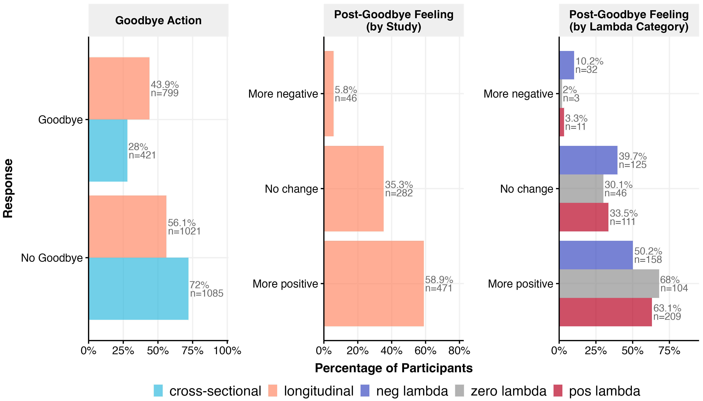

# Goodbye Analysis

*Generated: 2026-02-18 10:26:59.116332*

## Overview

This analysis examines whether users said goodbye to the AI assistant.

**Outcome:** `goodbye_action` (binary: 0 = did not say goodbye, 1 = said goodbye)

**Treatment Arms:**
- **$\lambda$**: Relationship-seeking intensity (-1 to +1)
- **Domain**: polchat vs emotchat
- **Personalisation**: personalised vs non-personalised

**Model Type:** Logistic regression (binary outcome, no random effects)

---

## Data Summary

### Goodbye action

- **Cross-sectional**: 1506 obs / 1506 participants
- **Longitudinal**: 1820 obs / 1820 participants

---

## Exploratory Data Analysis

---

## Treatment Association Tests

Chi-squared tests of independence between treatment variables and outcomes.
*p < .05, **p < .01, ***p < .001. † indicates expected cell count < 5.

### Cross-Study Comparison

**goodbye_action:**

- study_id: χ² = 89.54, df = 1, p = 0.0000 (SIGNIFICANT)

| study_id | 0 | 1 |
|---|---|---|
| cross-sectional | 72.0% (n=1085) | 28.0% (n=421) |
| longitudinal | 56.1% (n=1021) | 43.9% (n=799) |

### Cross-Sectional

**goodbye_action:**

- personalisation: χ² = 1.32, df = 1, p = 0.2508
- domain: χ² = 3.79, df = 1, p = 0.0515
- relationship_seeking_category: χ² = 4.14, df = 2, p = 0.1263
- lambda_factor: χ² = 4.83, df = 4, p = 0.3054

### Longitudinal

**goodbye_action:**

- personalisation: χ² = 0.02, df = 1, p = 0.8882
- domain: χ² = 0.16, df = 1, p = 0.6885
- relationship_seeking_category: χ² = 1.07, df = 2, p = 0.5858
- lambda_factor: χ² = 11.59, df = 4, p = 0.0207 (SIGNIFICANT)

| lambda_factor | 0 | 1 |
|---|---|---|
| neg1 | 53.2% (n=194) | 46.8% (n=171) |
| neg0.5 | 60.5% (n=221) | 39.5% (n=144) |
| zero | 57.5% (n=207) | 42.5% (n=153) |
| pos0.5 | 50.0% (n=183) | 50.0% (n=183) |
| pos1 | 59.3% (n=216) | 40.7% (n=148) |

**goodbye_feeling_recoded:**

- personalisation: χ² = 2.69, df = 2, p = 0.2601
- domain: χ² = 5.84, df = 2, p = 0.0540
- relationship_seeking_category: χ² = 28.26, df = 4, p = 0.0000 (SIGNIFICANT)

| relationship_seeking_category | More negative | More positive | No change |
|---|---|---|---|
| neg_lambda | 10.2% (n=32) | 50.2% (n=158) | 39.7% (n=125) |
| zero_lambda | 2.0% (n=3) | 68.0% (n=104) | 30.1% (n=46) |
| pos_lambda | 3.3% (n=11) | 63.1% (n=209) | 33.5% (n=111) |

- lambda_factor: χ² = 53.61, df = 8, p = 0.0000 (SIGNIFICANT)

| lambda_factor | More negative | More positive | No change |
|---|---|---|---|
| neg1 | 15.8% (n=27) | 42.1% (n=72) | 42.1% (n=72) |
| neg0.5 | 3.5% (n=5) | 59.7% (n=86) | 36.8% (n=53) |
| zero | 2.0% (n=3) | 68.0% (n=104) | 30.1% (n=46) |
| pos0.5 | 3.3% (n=6) | 63.4% (n=116) | 33.3% (n=61) |
| pos1 | 3.4% (n=5) | 62.8% (n=93) | 33.8% (n=50) |

---

## Functional Form Comparison

Best specification (linear, quadratic, cubic) selected by AIC.

### Cross-Sectional

| Outcome | Best Spec |
|---------|-----------|
| goodbye_action | quadratic |

### Longitudinal

| Outcome | Best Spec |
|---------|-----------|
| goodbye_action | cubic |

Full comparison tables (RMSE, AIC weights, BIC weights,
Performance Score) exported to LaTeX.

---

## Full-Model Specification Comparison

Performance comparison across the three full interaction
specifications (continuous, coarsened, factor $\lambda$).

### Cross-Sectional

| Outcome | Model | RMSE | AIC wt | AICc wt | BIC wt | Perf. Score |
|---------|-------|------|--------|---------|--------|-------------|
| Goodbye action | full_coarsened | 0.447 | 0.606 | 0.601 | 0.008 | 0.686 |
|  | full_continuous | 0.447 | 0.390 | 0.396 | 0.992 | 0.575 |
|  | full_5level | 0.446 | 0.003 | 0.003 | 0.000 | 0.250 |

### Longitudinal

| Outcome | Model | RMSE | AIC wt | AICc wt | BIC wt | Perf. Score |
|---------|-------|------|--------|---------|--------|-------------|
| Goodbye action | full_continuous | 0.495 | 0.956 | 0.959 | 1.000 | 0.879 |
|  | full_5level | 0.494 | 0.037 | 0.034 | 0.000 | 0.265 |
|  | full_coarsened | 0.496 | 0.007 | 0.006 | 0.000 | 0.000 |

Full comparison tables exported to LaTeX.

---

## Model Coefficients

Fixed effects from fitted models. Binary outcomes show odds ratios.

### Goodbye_action

#### Additive (lambda_3 Coarsened)

**Cross-Sectional Model:**
`goodbye_action ~ relationship_seeking_category + personalisation +      domain`

|Parameter    | Odds Ratio |    95% CI    | P-value |
|:------------|:----------:|:------------:|:-------:|
|(Intercept)  |  0.33***   | [0.26, 0.43] | p<0.001 |
|lambda=0     |    0.74    | [0.54, 1.02] | p=0.069 |
|lambda>0     |    1.01    | [0.79, 1.30] | p=0.922 |
|personalised |    1.17    | [0.93, 1.47] | p=0.177 |
|emotchat     |   1.27*    | [1.01, 1.59] | p=0.040 |

**Longitudinal Model:**
`goodbye_action ~ relationship_seeking_category + personalisation +      domain`

|Parameter    | Odds Ratio |    95% CI    | P-value |
|:------------|:----------:|:------------:|:-------:|
|(Intercept)  |   0.74**   | [0.60, 0.90] | p=0.002 |
|lambda=0     |    0.97    | [0.75, 1.26] | p=0.838 |
|lambda>0     |    1.09    | [0.89, 1.35] | p=0.395 |
|personalised |    1.01    | [0.84, 1.22] | p=0.875 |
|emotchat     |    1.05    | [0.87, 1.26] | p=0.632 |

#### Additive (lambda Continuous)

**Cross-Sectional Model:**
`goodbye_action ~ lambda + I(lambda^2) + personalisation + domain`

|Parameter    | Odds Ratio |    95% CI    | P-value |
|:------------|:----------:|:------------:|:-------:|
|(Intercept)  |  0.28***   | [0.22, 0.36] | p<0.001 |
|lambda       |    1.02    | [0.87, 1.19] | p=0.842 |
|lambda^2     |    1.29    | [0.99, 1.69] | p=0.060 |
|personalised |    1.16    | [0.93, 1.46] | p=0.197 |
|emotchat     |   1.28*    | [1.02, 1.61] | p=0.032 |

**Longitudinal Model:**
`goodbye_action ~ lambda + I(lambda^2) + I(lambda^3) + personalisation +      domain`

|Parameter    | Odds Ratio |    95% CI    | P-value |
|:------------|:----------:|:------------:|:-------:|
|(Intercept)  |   0.76**   | [0.62, 0.92] | p=0.006 |
|lambda       |   1.85**   | [1.25, 2.76] | p=0.002 |
|lambda^2     |    1.01    | [0.81, 1.26] | p=0.954 |
|lambda^3     |  0.48***   | [0.31, 0.74] | p<0.001 |
|personalised |    1.01    | [0.83, 1.21] | p=0.953 |
|emotchat     |    1.05    | [0.87, 1.26] | p=0.612 |

#### Full/Interaction (lambda_3 Coarsened)

**Cross-Sectional Model:**
`goodbye_action ~ relationship_seeking_category + personalisation +      domain + relationship_seeking_category:personalisation +      relationship_seeking_category:domain`

|Parameter             | Odds Ratio |    95% CI    | P-value |
|:---------------------|:----------:|:------------:|:-------:|
|(Intercept)           |  0.31***   | [0.22, 0.43] | p<0.001 |
|lambda=0              |    1.08    | [0.61, 1.90] | p=0.789 |
|lambda>0              |    1.03    | [0.66, 1.63] | p=0.886 |
|personalised          |    1.37    | [0.96, 1.95] | p=0.083 |
|emotchat              |    1.26    | [0.88, 1.79] | p=0.207 |
|lambda=0:personalised |   0.52*    | [0.27, 0.98] | p=0.045 |
|lambda>0:personalised |    0.90    | [0.55, 1.49] | p=0.689 |
|lambda=0:emotchat     |    0.91    | [0.48, 1.74] | p=0.783 |
|lambda>0:emotchat     |    1.06    | [0.64, 1.75] | p=0.822 |

**Longitudinal Model:**
`goodbye_action ~ relationship_seeking_category + personalisation +      domain + relationship_seeking_category:personalisation +      relationship_seeking_category:domain`

|Parameter             | Odds Ratio |    95% CI    | P-value |
|:---------------------|:----------:|:------------:|:-------:|
|(Intercept)           |   0.71**   | [0.55, 0.91] | p=0.008 |
|lambda=0              |    0.89    | [0.57, 1.38] | p=0.598 |
|lambda>0              |    1.28    | [0.89, 1.84] | p=0.183 |
|personalised          |    1.11    | [0.83, 1.49] | p=0.495 |
|emotchat              |    1.04    | [0.78, 1.40] | p=0.772 |
|lambda=0:personalised |    1.09    | [0.65, 1.81] | p=0.751 |
|lambda>0:personalised |    0.77    | [0.51, 1.17] | p=0.218 |
|lambda=0:emotchat     |    1.10    | [0.66, 1.83] | p=0.720 |
|lambda>0:emotchat     |    0.95    | [0.63, 1.44] | p=0.821 |

#### Full/Interaction (lambda Continuous)

**Cross-Sectional Model:**
`goodbye_action ~ lambda + I(lambda^2) + personalisation + domain +      lambda:personalisation + lambda:domain`

|Parameter           | Odds Ratio |    95% CI    | P-value |
|:-------------------|:----------:|:------------:|:-------:|
|(Intercept)         |  0.28***   | [0.22, 0.36] | p<0.001 |
|lambda              |    1.00    | [0.76, 1.33] | p=0.989 |
|lambda^2            |    1.30    | [0.99, 1.69] | p=0.059 |
|personalised        |    1.16    | [0.93, 1.46] | p=0.199 |
|emotchat            |   1.28*    | [1.02, 1.61] | p=0.032 |
|lambda:personalised |    0.98    | [0.72, 1.35] | p=0.921 |
|lambda:emotchat     |    1.04    | [0.76, 1.43] | p=0.784 |

**Longitudinal Model:**
`goodbye_action ~ lambda + I(lambda^2) + I(lambda^3) + personalisation +      domain + lambda:personalisation + lambda:domain`

|Parameter           | Odds Ratio |    95% CI    | P-value |
|:-------------------|:----------:|:------------:|:-------:|
|(Intercept)         |   0.76**   | [0.62, 0.92] | p=0.006 |
|lambda              |   1.98**   | [1.28, 3.06] | p=0.002 |
|lambda^2            |    1.01    | [0.81, 1.26] | p=0.959 |
|lambda^3            |  0.48***   | [0.31, 0.74] | p<0.001 |
|personalised        |    1.01    | [0.83, 1.21] | p=0.954 |
|emotchat            |    1.05    | [0.87, 1.26] | p=0.613 |
|lambda:personalised |    0.91    | [0.70, 1.19] | p=0.498 |
|lambda:emotchat     |    0.96    | [0.74, 1.25] | p=0.761 |

---

---

## Pairwise Comparisons

Estimated marginal means and pairwise contrasts (FDR-adjusted).

### Cross-Sectional

**Marginal Means:**

| Lambda | Prob | SE | 95% CI |
|--------|------|-----|--------|
| neg1 | 0.296 | 0.026 | [0.247, 0.350] |
| neg0.5 | 0.284 | 0.026 | [0.235, 0.338] |
| zero | 0.232 | 0.024 | [0.188, 0.283] |
| pos0.5 | 0.277 | 0.026 | [0.229, 0.331] |
| pos1 | 0.306 | 0.027 | [0.256, 0.361] |

**Pairwise Contrasts (FDR-adjusted):**

| Contrast | OR | SE | z | p |
|----------|-----|-----|-----|-----|
| neg1 / neg0.5 | 1.06 | 0.19 | 0.33 | 0.860 |
| neg1 / zero | 1.39 | 0.26 | 1.77 | 0.386 |
| neg1 / pos0.5 | 1.10 | 0.20 | 0.51 | 0.860 |
| neg1 / pos1 | 0.95 | 0.17 | -0.26 | 0.860 |
| neg0.5 / zero | 1.31 | 0.25 | 1.43 | 0.505 |
| neg0.5 / pos0.5 | 1.03 | 0.19 | 0.18 | 0.860 |
| neg0.5 / pos1 | 0.90 | 0.16 | -0.59 | 0.860 |
| zero / pos0.5 | 0.79 | 0.15 | -1.26 | 0.518 |
| zero / pos1 | 0.69 | 0.13 | -2.02 | 0.386 |
| pos0.5 / pos1 | 0.87 | 0.16 | -0.76 | 0.860 |

### Longitudinal

**Marginal Means:**

| Lambda | Prob | SE | 95% CI |
|--------|------|-----|--------|
| neg1 | 0.467 | 0.026 | [0.417, 0.519] |
| neg0.5 | 0.397 | 0.026 | [0.348, 0.449] |
| zero | 0.424 | 0.026 | [0.374, 0.476] |
| pos0.5 | 0.502 | 0.026 | [0.450, 0.553] |
| pos1 | 0.407 | 0.026 | [0.357, 0.458] |

**Pairwise Contrasts (FDR-adjusted):**

| Contrast | OR | SE | z | p |
|----------|-----|-----|-----|-----|
| neg1 / neg0.5 | 1.33 | 0.20 | 1.91 | 0.141 |
| neg1 / zero | 1.19 | 0.18 | 1.17 | 0.403 |
| neg1 / pos0.5 | 0.87 | 0.13 | -0.93 | 0.506 |
| neg1 / pos1 | 1.28 | 0.19 | 1.65 | 0.199 |
| neg0.5 / zero | 0.89 | 0.14 | -0.73 | 0.578 |
| neg0.5 / pos0.5 | 0.65 | 0.10 | -2.82 | 0.048* |
| neg0.5 / pos1 | 0.96 | 0.15 | -0.26 | 0.792 |
| zero / pos0.5 | 0.73 | 0.11 | -2.09 | 0.122 |
| zero / pos1 | 1.07 | 0.16 | 0.47 | 0.707 |
| pos0.5 / pos1 | 1.47 | 0.22 | 2.57 | 0.052 |

*p < .05, **p < .01, ***p < .001 (FDR-corrected)

---

## Robustness Checks

Robustness analyses test whether treatment effects hold under
alternative specifications. Cells show coefficient (SE) with
significance: *p<.05, **p<.01, ***p<.001.

**Specifications:**
- **Additive**: Base treatment effects (no interactions)
- **+ Interactions**: Full model with treatment interactions
- **Full + Demos**: Full model + demographic controls
- **Full + Prefs**: Full model + AI pre-treatment pref groups
- **Full + IPW**: Full model with IPW weights (attrition adjustment)

### Cross-Sectional

| Outcome | Predictor | Additive | + Interactions | Full + Demos | Full + Prefs | Full + IPW |
|---|---|---|---|---|---|---|
| goodbye_action | lambda | 0.02 (0.08) | 0.00 (0.14) | 0.03 (0.15) | 0.01 (0.15) | --- |
| goodbye_action | I(lambda^2) | 0.26 (0.14) | 0.26 (0.14) | 0.27 (0.14) | 0.23 (0.14) | --- |
| goodbye_action | personalisationpersonalised | 0.15 (0.12) | 0.15 (0.12) | 0.13 (0.12) | 0.15 (0.12) | --- |
| goodbye_action | domainemotchat | 0.25 (0.12)* | 0.25 (0.12)* | 0.23 (0.12) | 0.23 (0.12)* | --- |

### Longitudinal

| Outcome | Predictor | Additive | + Interactions | Full + Demos | Full + Prefs | Full + IPW |
|---|---|---|---|---|---|---|
| goodbye_action | lambda | 0.62 (0.20)** | 0.68 (0.22)** | 0.68 (0.22)** | 0.66 (0.23)** | 0.68 (0.22)** |
| goodbye_action | I(lambda^2) | 0.01 (0.11) | 0.01 (0.11) | -0.01 (0.11) | -0.01 (0.12) | -0.01 (0.11) |
| goodbye_action | I(lambda^3) | -0.74 (0.22)*** | -0.74 (0.22)*** | -0.73 (0.23)** | -0.78 (0.23)*** | -0.73 (0.22)** |
| goodbye_action | personalisationpersonalised | 0.01 (0.09) | 0.01 (0.09) | 0.01 (0.10) | 0.01 (0.10) | 0.00 (0.10) |
| goodbye_action | domainemotchat | 0.05 (0.09) | 0.05 (0.09) | 0.07 (0.10) | 0.05 (0.10) | 0.05 (0.10) |

Full tables: `goodbye_robustness_{cs,long}.tex`

---

## Combined Study Model

Tests whether goodbye action differs between cross-sectional and
longitudinal studies.

**Combined Studies Model:**
`goodbye_action ~ study_type`

|Parameter              | Odds Ratio |    95% CI    | P-value |
|:----------------------|:----------:|:------------:|:-------:|
|(Intercept)            |  0.39***   | [0.35, 0.43] | p<0.001 |
|study_typelongitudinal |  2.02***   | [1.74, 2.33] | p<0.001 |

---

## Output Files

All outputs use prefix `goodbye_`.

- Figures: `outputs/figures/main_studies/`
- Tables: `outputs/tables/main_studies/`
- Models: `outputs/models/`
