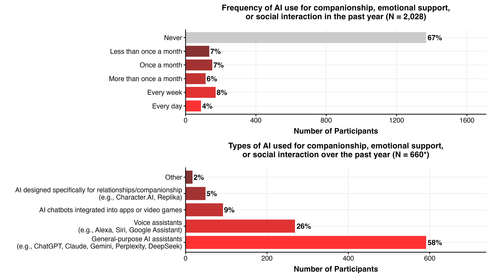
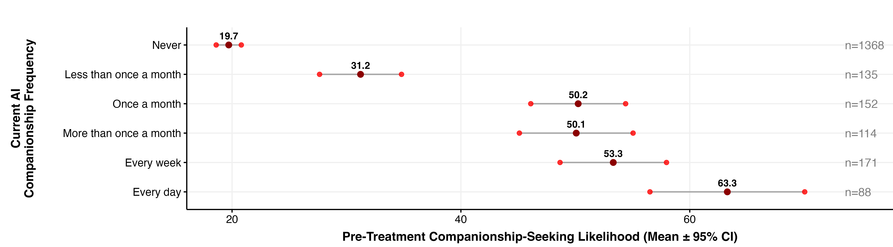
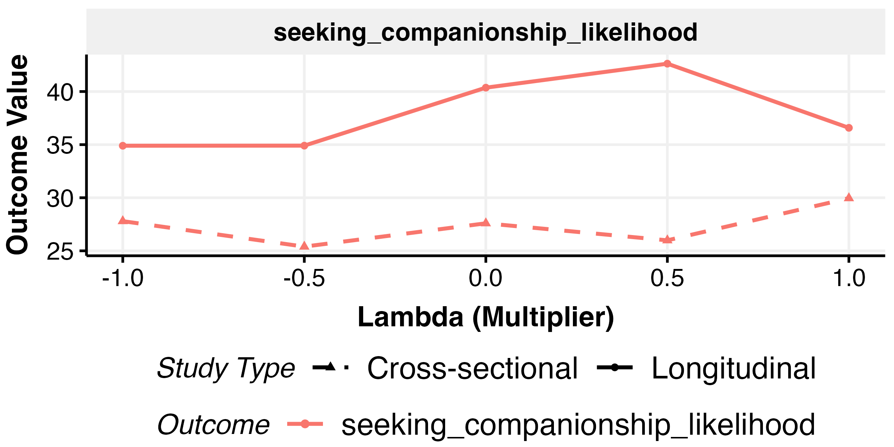
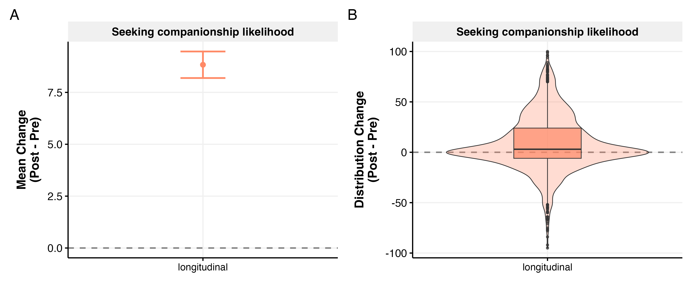
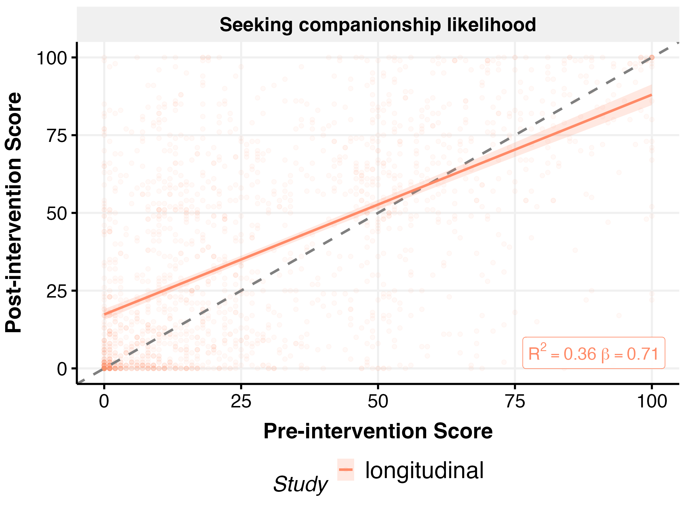
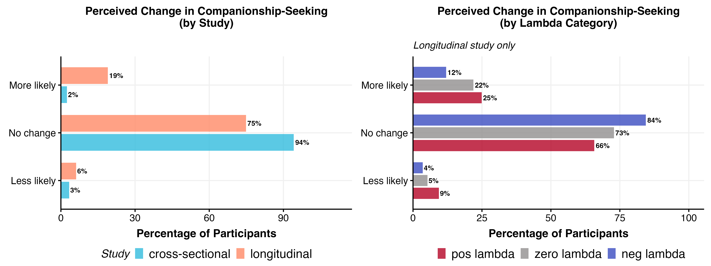

# Seeking Companionship Analysis

*Generated: 2026-02-18 10:27:30.723092*

## Overview

This analysis examines whether exposure to relationship-seeking AI affects
users' likelihood of seeking AI companionship in the future.

**Outcome:** `seeking_companionship_likelihood` (0-100 scale)

**Treatment Arms:**
- **$\lambda$**: Relationship-seeking intensity (-1 to +1)
- **Domain**: polchat vs emotchat
- **Personalisation**: personalised vs non-personalised

---

## Data Summary

### Seeking companionship likelihood

- **Cross-sectional**: 1303 obs / 1303 participants
- **Longitudinal**: 1820 obs / 1820 participants

---

## Pre-Treatment Survey: AI Companionship Use

This analysis examines pre-treatment patterns of AI use for companionship, emotional support, or social interaction among longitudinal study participants.

### Frequency of AI Companionship Use

**Total participants:** 2028

| Frequency | N | % |
|-----------|---|---|
| Never | 1368 | 67.5% |
| Less than once a month | 135 | 6.7% |
| Once a month | 152 | 7.5% |
| More than once a month | 114 | 5.6% |
| Every week | 171 | 8.4% |
| Every day | 88 | 4.3% |

### Products Used for AI Companionship

**Participants with any AI companionship use:** 660

| Product Type | N | % |
|--------------|---|---|
| General-purpose AI assistants (e.g., ChatGPT, Claude, Gemini, Perplexity, DeepSeek) | 591 | 58.1% |
| Voice assistants (e.g., Alexa, Siri, Google Assistant) | 269 | 26.4% |
| AI chatbots integrated into apps or video games | 92 | 9.0% |
| AI companions designed specifically for relationships/companionship (e.g., Character.AI, Replika) | 49 | 4.8% |
| Other | 17 | 1.7% |

### Likelihood by Current Frequency

### Predictors of AI Companionship Use

Logistic regression predicting any AI companionship use (vs Never).

`companionship_users ~ age + education_years + gender_binary +      disability_binary + ethnicity_binary + income_binary + religion_binary +      pre_psychosocial_F1 + pre_psychosocial_F2 + ai_frequency_coarsened +      cluster_name`

| Parameter | Odds Ratio | 95% CI | P-value |
|-----------|------------|--------|---------|
| Age (years) | 0.98*** | [0.97, 0.99] | 0.000 |
| Education (years) | 1.01 | [0.96, 1.06] | 0.656 |
| Non-Male | 0.94 | [0.76, 1.17] | 0.585 |
| Disabled | 1.14 | [0.88, 1.48] | 0.322 |
| Non-White | 1.09 | [0.79, 1.48] | 0.608 |
| Low Income | 1.09 | [0.86, 1.39] | 0.485 |
| Religious | 1.29 | [1.03, 1.62] | 0.025 |
| Emotional Health (F1) | 0.93 | [0.83, 1.05] | 0.265 |
| Social Health (F2) | 0.90 | [0.80, 1.01] | 0.074 |
| Moderate AI Users | 3.86*** | [2.20, 6.77] | 0.000 |
| Heavy AI Users | 10.92*** | [6.26, 19.03] | 0.000 |
| Pre-Treatment Pro-Relationship-Seeking | 3.34*** | [2.68, 4.17] | 0.000 |

#### Forest Plot

---

## EDA

### Outcome by Lambda

### Pre-Post Change

### Pre-Post Correlation

### Post-Treatment Survey

### Chi-Square Tests for Perceived Change

## Treatment Association Tests

Chi-squared tests of independence between treatment variables and outcomes.
*p < .05, **p < .01, ***p < .001. † indicates expected cell count < 5.

### Cross-Study Comparison

**change_recoded:**

- study_id: χ² = 166.11, df = 2, p = 0.0000 (SIGNIFICANT)

| study_id | Less likely | More likely | No change |
|---|---|---|---|
| cross-sectional | 3.3% (n=35) | 2.5% (n=26) | 94.2% (n=988) |
| longitudinal | 6.2% (n=67) | 19.0% (n=206) | 74.9% (n=813) |

### Cross-Sectional

**change_recoded:**

- personalisation: χ² = 4.88, df = 2, p = 0.0873
- domain: χ² = 1.81, df = 2, p = 0.4045
- relationship_seeking_category: χ² = 5.81, df = 4, p = 0.2140
- lambda_factor: χ² = 7.32, df = 8, p = 0.5027

### Longitudinal

**change_recoded:**

- personalisation: χ² = 6.71, df = 2, p = 0.0348 (SIGNIFICANT)

| personalisation | Less likely | More likely | No change |
|---|---|---|---|
| non-personalised | 5.4% (n=29) | 16.3% (n=87) | 78.3% (n=419) |
| personalised | 6.9% (n=38) | 21.6% (n=119) | 71.5% (n=394) |

- domain: χ² = 25.09, df = 2, p = 0.0000 (SIGNIFICANT)

| domain | Less likely | More likely | No change |
|---|---|---|---|
| polchat | 6.4% (n=37) | 13.4% (n=77) | 80.2% (n=462) |
| emotchat | 5.9% (n=30) | 25.3% (n=129) | 68.8% (n=351) |

- relationship_seeking_category: χ² = 43.15, df = 4, p = 0.0000 (SIGNIFICANT)

| relationship_seeking_category | Less likely | More likely | No change |
|---|---|---|---|
| neg_lambda | 3.6% (n=16) | 12.0% (n=54) | 84.4% (n=380) |
| zero_lambda | 5.2% (n=11) | 21.9% (n=46) | 72.9% (n=153) |
| pos_lambda | 9.4% (n=40) | 24.9% (n=106) | 65.7% (n=280) |

- lambda_factor: χ² = 55.26, df = 8, p = 0.0000 (SIGNIFICANT)

| lambda_factor | Less likely | More likely | No change |
|---|---|---|---|
| neg1 | 5.3% (n=12) | 13.2% (n=30) | 81.5% (n=185) |
| neg0.5 | 1.8% (n=4) | 10.8% (n=24) | 87.4% (n=195) |
| zero | 5.2% (n=11) | 21.9% (n=46) | 72.9% (n=153) |
| pos0.5 | 5.7% (n=11) | 27.6% (n=53) | 66.7% (n=128) |
| pos1 | 12.4% (n=29) | 22.6% (n=53) | 65.0% (n=152) |

---

---

## Treatment Effect Analysis

### Functional Form Comparison

**PRE_POST Analysis** (Main - longitudinal only, controlling for pre):

- **Best spec:** cubic

**POST_ONLY Analysis** (Supplementary - post-treatment values only):

- **Cross-sectional best spec:** linear
- **Longitudinal best spec:** cubic

### PRE_POST Model Results (Main Analysis)

Best specification: cubic. Controlling for pre-treatment value.

**Longitudinal (PRE_POST) Model:**
`seeking_companionship_likelihood ~ lambda + I(lambda^2) + I(lambda^3) +      personalisation + domain + seeking_companionship_likelihood_pre +      lambda:personalisation + lambda:domain`

|Parameter                            | Coefficient |     95% CI      | P-value |
|:------------------------------------|:-----------:|:---------------:|:-------:|
|(Intercept)                          |  14.09***   | [11.29, 16.90]  | p<0.001 |
|lambda                               |  10.53***   |  [5.02, 16.03]  | p<0.001 |
|lambda^2                             |   -3.72**   | [-6.53, -0.90]  | p=0.010 |
|lambda^3                             |  -11.68***  | [-17.22, -6.14] | p<0.001 |
|personalised                         |    2.35     |  [-0.01, 4.70]  | p=0.051 |
|emotchat                             |   7.50***   |  [5.15, 9.85]   | p<0.001 |
|seeking_companionship_likelihood_pre |   0.71***   |  [0.67, 0.76]   | p<0.001 |
|lambda:personalised                  |    0.94     |  [-2.39, 4.26]  | p=0.581 |
|lambda:emotchat                      |    3.30     |  [-0.02, 6.63]  | p=0.051 |

### POST_ONLY Model Results (Supplementary)

Post-treatment values only (no baseline control).

**Cross-sectional** (best spec: linear):

**Cross-sectional Model:**
`seeking_companionship_likelihood ~ lambda + personalisation +      domain + lambda:personalisation + lambda:domain`

|Parameter           | Coefficient |     95% CI     | P-value |
|:-------------------|:-----------:|:--------------:|:-------:|
|(Intercept)         |  25.04***   | [22.38, 27.70] | p<0.001 |
|lambda              |    0.74     | [-2.98, 4.45]  | p=0.697 |
|personalised        |    1.89     | [-1.14, 4.91]  | p=0.221 |
|emotchat            |    2.70     | [-0.32, 5.72]  | p=0.080 |
|lambda:personalised |    2.01     | [-2.24, 6.27]  | p=0.354 |
|lambda:emotchat     |    -1.77    | [-6.02, 2.49]  | p=0.415 |

**Longitudinal** (best spec: cubic):

**Longitudinal (POST_ONLY) Model:**
`seeking_companionship_likelihood ~ lambda + I(lambda^2) + I(lambda^3) +      personalisation + domain + lambda:personalisation + lambda:domain`

|Parameter           | Coefficient |     95% CI      | P-value |
|:-------------------|:-----------:|:---------------:|:-------:|
|(Intercept)         |  35.93***   | [32.81, 39.04]  | p<0.001 |
|lambda              |   10.18**   |  [3.25, 17.10]  | p=0.004 |
|lambda^2            |   -4.38*    | [-7.92, -0.84]  | p=0.015 |
|lambda^3            |   -9.39**   | [-16.36, -2.43] | p=0.008 |
|personalised        |    0.91     |  [-2.06, 3.87]  | p=0.548 |
|emotchat            |   7.37***   |  [4.41, 10.33]  | p<0.001 |
|lambda:personalised |    -0.89    |  [-5.07, 3.29]  | p=0.676 |
|lambda:emotchat     |    1.19     |  [-2.99, 5.37]  | p=0.578 |

### Combined Study Model

Tests whether seeking companionship likelihood differs between
cross-sectional and longitudinal studies.

**Combined Studies Model:**
`seeking_companionship_likelihood ~ study_type`

|Parameter              | Coefficient |     95% CI     | P-value |
|:----------------------|:-----------:|:--------------:|:-------:|
|(Intercept)            |  27.36***   | [25.69, 29.02] | p<0.001 |
|study_typelongitudinal |  10.51***   | [8.34, 12.69]  | p<0.001 |

---

## Output Files

All outputs use prefix `seeking_companionship_`.

- Figures: `outputs/figures/main_studies/`
- Tables: `outputs/tables/main_studies/`
- Models: `outputs/models/`
