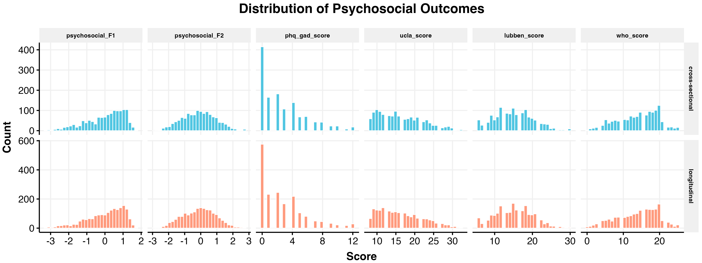
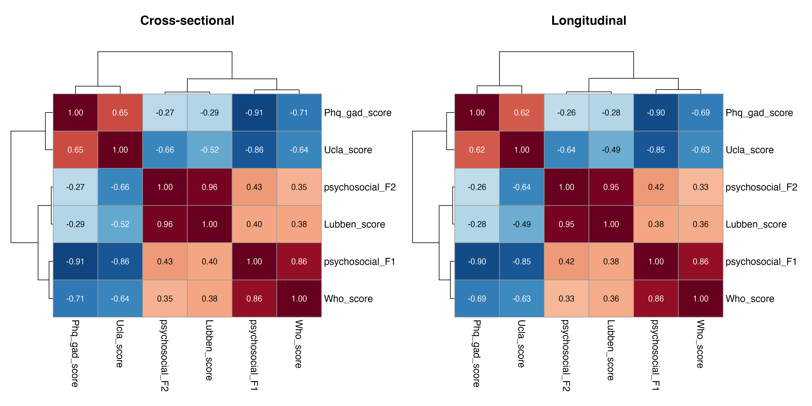
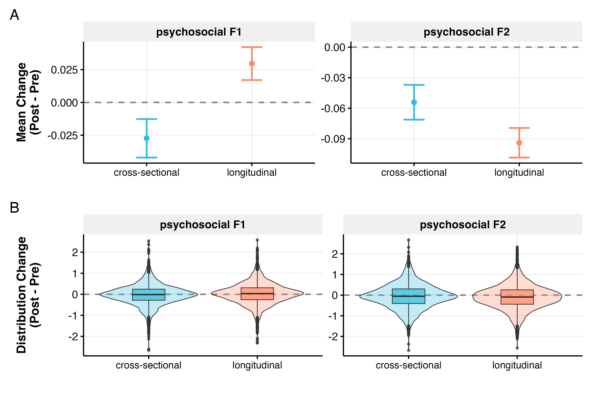
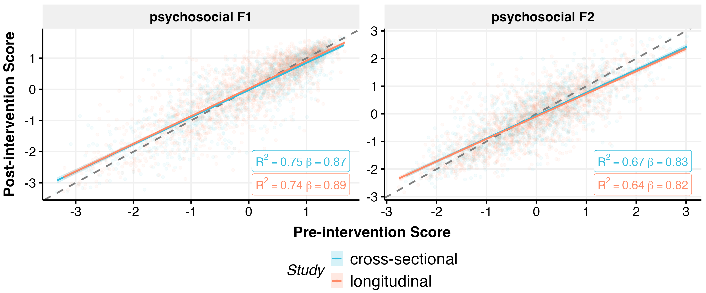
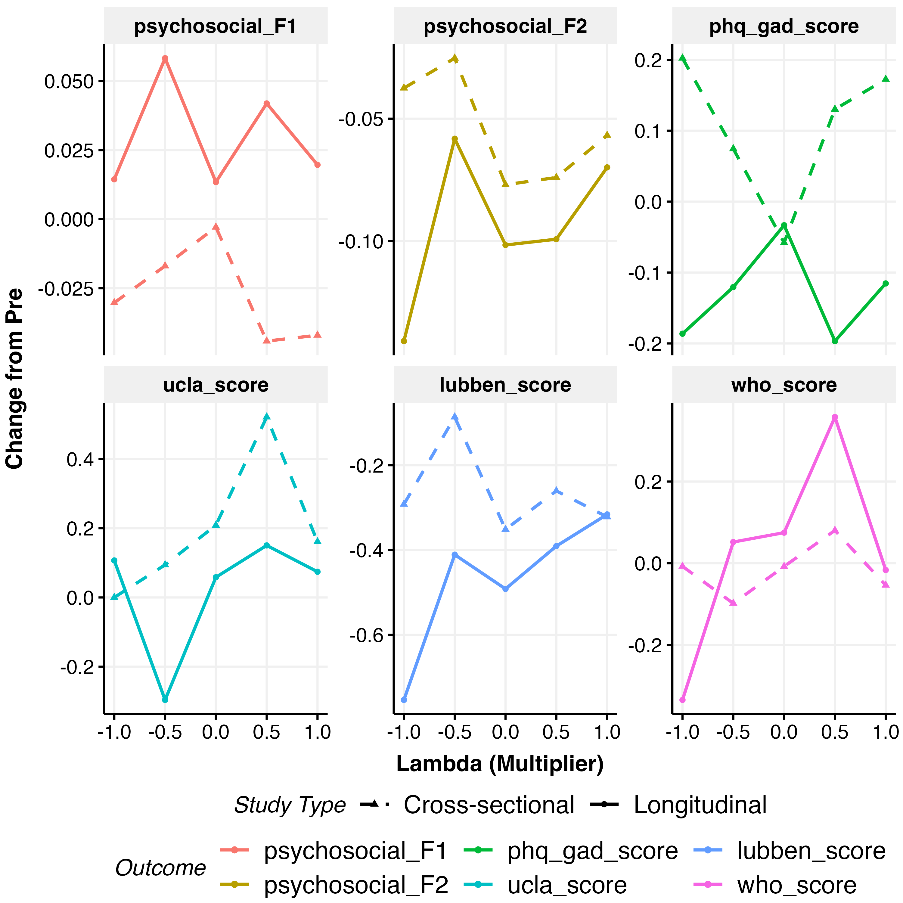

# Psychosocial Wellbeing Analysis

*Generated: 2026-02-18 10:29:00.58382*

## Overview

This analysis examines effects on psychosocial wellbeing outcomes.

**Main Outcomes (Factor Scores):**
- **Psychosocial F1**: Emotional health factor (from EFA)
- **Psychosocial F2**: Social health factor (from EFA)

**Individual Scales (Supplementary):**
- **PHQ-GAD**: Combined anxiety and depression
- **UCLA**: Loneliness scale
- **Lubben**: Social network scale
- **WHO-5**: Quality of life/wellbeing

**Model Specification:**
- OLS regression with pre-treatment covariate control
- Domain effects included
- Pre-post design (measured at beginning and end of month)

---

## Data Summary

### psychosocial F1

- **Cross-sectional**: 1303 obs / 1303 participants
- **Longitudinal**: 1820 obs / 1820 participants

### psychosocial F2

- **Cross-sectional**: 1303 obs / 1303 participants
- **Longitudinal**: 1820 obs / 1820 participants

### Phq gad score

- **Cross-sectional**: 1303 obs / 1303 participants
- **Longitudinal**: 1820 obs / 1820 participants

### Ucla score

- **Cross-sectional**: 1303 obs / 1303 participants
- **Longitudinal**: 1820 obs / 1820 participants

### Lubben score

- **Cross-sectional**: 1303 obs / 1303 participants
- **Longitudinal**: 1820 obs / 1820 participants

### Who score

- **Cross-sectional**: 1303 obs / 1303 participants
- **Longitudinal**: 1820 obs / 1820 participants

---

---

## Exploratory Data Analysis

---

## Functional Form Comparison

Best specification (linear, quadratic, cubic) selected by AIC.

### Cross-Sectional

| Outcome | Best Spec |
|---------|-----------|
| psychosocial_F1 | linear |
| psychosocial_F2 | linear |

### Longitudinal

| Outcome | Best Spec |
|---------|-----------|
| psychosocial_F1 | linear |
| psychosocial_F2 | linear |

Full comparison tables (RMSE, AIC weights, BIC weights,
Performance Score) exported to LaTeX.

---

## Full-Model Specification Comparison

Performance comparison across the three full interaction
specifications (continuous, coarsened, factor $\lambda$).

### Cross-Sectional

| Outcome | Model | RMSE | AIC wt | AICc wt | BIC wt | Perf. Score |
|---------|-------|------|--------|---------|--------|-------------|
| psychosocial F1 | full_continuous | 0.513 | 0.871 | 0.876 | 1.000 | 0.750 |
|  | full_5level | 0.512 | 0.001 | 0.001 | 0.000 | 0.250 |
|  | full_coarsened | 0.513 | 0.128 | 0.123 | 0.000 | 0.175 |
| psychosocial F2 | full_continuous | 0.590 | 0.907 | 0.911 | 1.000 | 0.750 |
|  | full_5level | 0.589 | 0.001 | 0.001 | 0.000 | 0.250 |
|  | full_coarsened | 0.590 | 0.092 | 0.088 | 0.000 | 0.133 |

### Longitudinal

| Outcome | Model | RMSE | AIC wt | AICc wt | BIC wt | Perf. Score |
|---------|-------|------|--------|---------|--------|-------------|
| psychosocial F1 | full_continuous | 0.521 | 0.948 | 0.950 | 1.000 | 0.750 |
|  | full_5level | 0.521 | 0.000 | 0.000 | 0.000 | 0.250 |
|  | full_coarsened | 0.521 | 0.052 | 0.050 | 0.000 | 0.051 |
| psychosocial F2 | full_continuous | 0.593 | 0.765 | 0.773 | 1.000 | 0.750 |
|  | full_5level | 0.591 | 0.026 | 0.023 | 0.000 | 0.250 |
|  | full_coarsened | 0.592 | 0.209 | 0.204 | 0.000 | 0.199 |

Full comparison tables exported to LaTeX.

---

## Model Coefficients

Fixed effects from fitted models. Binary outcomes show odds ratios.

### psychosocial_F1

#### Additive (lambda_3 Coarsened)

**Cross-Sectional Model:**
`psychosocial_F1 ~ relationship_seeking_category + personalisation +      domain + psychosocial_F1_pre`

|Parameter           | Coefficient |    95% CI     | P-value |
|:-------------------|:-----------:|:-------------:|:-------:|
|(Intercept)         |    -0.00    | [-0.06, 0.06] | p=0.938 |
|lambda=0            |    0.01     | [-0.06, 0.09] | p=0.705 |
|lambda>0            |    -0.02    | [-0.08, 0.04] | p=0.551 |
|personalised        |    -0.04    | [-0.10, 0.02] | p=0.152 |
|emotchat            |    0.01     | [-0.04, 0.07] | p=0.666 |
|psychosocial_F1_pre |   0.87***   | [0.85, 0.90]  | p<0.001 |

**Longitudinal Model:**
`psychosocial_F1 ~ relationship_seeking_category + personalisation +      domain + psychosocial_F1_pre`

|Parameter           | Coefficient |     95% CI     | P-value |
|:-------------------|:-----------:|:--------------:|:-------:|
|(Intercept)         |    0.05*    |  [0.00, 0.10]  | p=0.048 |
|lambda=0            |    -0.02    | [-0.08, 0.05]  | p=0.607 |
|lambda>0            |    -0.00    | [-0.06, 0.05]  | p=0.886 |
|personalised        |    0.02     | [-0.03, 0.07]  | p=0.355 |
|emotchat            |   -0.06*    | [-0.11, -0.01] | p=0.016 |
|psychosocial_F1_pre |   0.89***   |  [0.86, 0.91]  | p<0.001 |

#### Additive (lambda Continuous)

**Cross-Sectional Model:**
`psychosocial_F1 ~ lambda + personalisation + domain + psychosocial_F1_pre`

|Parameter           | Coefficient |    95% CI     | P-value |
|:-------------------|:-----------:|:-------------:|:-------:|
|(Intercept)         |    -0.01    | [-0.06, 0.04] | p=0.785 |
|lambda              |    -0.01    | [-0.05, 0.03] | p=0.649 |
|personalised        |    -0.04    | [-0.10, 0.02] | p=0.152 |
|emotchat            |    0.01     | [-0.04, 0.07] | p=0.679 |
|psychosocial_F1_pre |   0.87***   | [0.85, 0.90]  | p<0.001 |

**Longitudinal Model:**
`psychosocial_F1 ~ lambda + personalisation + domain + psychosocial_F1_pre`

|Parameter           | Coefficient |     95% CI     | P-value |
|:-------------------|:-----------:|:--------------:|:-------:|
|(Intercept)         |    0.05*    |  [0.00, 0.09]  | p=0.029 |
|lambda              |    0.00     | [-0.03, 0.04]  | p=0.910 |
|personalised        |    0.02     | [-0.03, 0.07]  | p=0.360 |
|emotchat            |   -0.06*    | [-0.11, -0.01] | p=0.016 |
|psychosocial_F1_pre |   0.89***   |  [0.86, 0.91]  | p<0.001 |

#### Full/Interaction (lambda_3 Coarsened)

**Cross-Sectional Model:**
`psychosocial_F1 ~ relationship_seeking_category + personalisation +      domain + psychosocial_F1_pre + relationship_seeking_category:personalisation +      relationship_seeking_category:domain`

|Parameter             | Coefficient |    95% CI     | P-value |
|:---------------------|:-----------:|:-------------:|:-------:|
|(Intercept)           |    -0.03    | [-0.11, 0.05] | p=0.407 |
|lambda=0              |    0.09     | [-0.04, 0.23] | p=0.172 |
|lambda>0              |    0.02     | [-0.09, 0.13] | p=0.763 |
|personalised          |    -0.02    | [-0.11, 0.06] | p=0.597 |
|emotchat              |    0.06     | [-0.03, 0.15] | p=0.208 |
|psychosocial_F1_pre   |   0.87***   | [0.85, 0.90]  | p<0.001 |
|lambda=0:personalised |    -0.05    | [-0.20, 0.10] | p=0.525 |
|lambda>0:personalised |    -0.02    | [-0.14, 0.11] | p=0.786 |
|lambda=0:emotchat     |    -0.11    | [-0.27, 0.04] | p=0.149 |
|lambda>0:emotchat     |    -0.06    | [-0.18, 0.07] | p=0.387 |

**Longitudinal Model:**
`psychosocial_F1 ~ relationship_seeking_category + personalisation +      domain + psychosocial_F1_pre + relationship_seeking_category:personalisation +      relationship_seeking_category:domain`

|Parameter             | Coefficient |    95% CI     | P-value |
|:---------------------|:-----------:|:-------------:|:-------:|
|(Intercept)           |    0.04     | [-0.03, 0.11] | p=0.225 |
|lambda=0              |    -0.01    | [-0.13, 0.10] | p=0.844 |
|lambda>0              |    0.02     | [-0.08, 0.11] | p=0.707 |
|personalised          |    0.01     | [-0.07, 0.08] | p=0.842 |
|emotchat              |    -0.02    | [-0.10, 0.05] | p=0.525 |
|psychosocial_F1_pre   |   0.89***   | [0.86, 0.91]  | p<0.001 |
|lambda=0:personalised |    0.01     | [-0.12, 0.15] | p=0.832 |
|lambda>0:personalised |    0.03     | [-0.08, 0.14] | p=0.589 |
|lambda=0:emotchat     |    -0.02    | [-0.16, 0.11] | p=0.718 |
|lambda>0:emotchat     |    -0.07    | [-0.18, 0.03] | p=0.179 |

#### Full/Interaction (lambda Continuous)

**Cross-Sectional Model:**
`psychosocial_F1 ~ lambda + personalisation + domain + psychosocial_F1_pre +      lambda:personalisation + lambda:domain`

|Parameter           | Coefficient |    95% CI     | P-value |
|:-------------------|:-----------:|:-------------:|:-------:|
|(Intercept)         |    -0.01    | [-0.06, 0.04] | p=0.774 |
|lambda              |    0.02     | [-0.05, 0.08] | p=0.655 |
|personalised        |    -0.04    | [-0.10, 0.02] | p=0.159 |
|emotchat            |    0.01     | [-0.04, 0.07] | p=0.674 |
|psychosocial_F1_pre |   0.87***   | [0.85, 0.90]  | p<0.001 |
|lambda:personalised |    -0.01    | [-0.09, 0.06] | p=0.712 |
|lambda:emotchat     |    -0.04    | [-0.11, 0.04] | p=0.373 |

**Longitudinal Model:**
`psychosocial_F1 ~ lambda + personalisation + domain + psychosocial_F1_pre +      lambda:personalisation + lambda:domain`

|Parameter           | Coefficient |     95% CI     | P-value |
|:-------------------|:-----------:|:--------------:|:-------:|
|(Intercept)         |    0.05*    |  [0.00, 0.09]  | p=0.031 |
|lambda              |    0.01     | [-0.05, 0.07]  | p=0.643 |
|personalised        |    0.02     | [-0.03, 0.07]  | p=0.361 |
|emotchat            |   -0.06*    | [-0.11, -0.01] | p=0.016 |
|psychosocial_F1_pre |   0.89***   |  [0.86, 0.91]  | p<0.001 |
|lambda:personalised |    0.02     | [-0.05, 0.09]  | p=0.517 |
|lambda:emotchat     |    -0.05    | [-0.11, 0.02]  | p=0.177 |

---

### psychosocial_F2

#### Additive (lambda_3 Coarsened)

**Cross-Sectional Model:**
`psychosocial_F2 ~ relationship_seeking_category + personalisation +      domain + psychosocial_F2_pre`

|Parameter           | Coefficient |    95% CI     | P-value |
|:-------------------|:-----------:|:-------------:|:-------:|
|(Intercept)         |    0.01     | [-0.05, 0.08] | p=0.674 |
|lambda=0            |    -0.05    | [-0.13, 0.04] | p=0.301 |
|lambda>0            |    -0.03    | [-0.10, 0.04] | p=0.456 |
|personalised        |    -0.06    | [-0.12, 0.01] | p=0.076 |
|emotchat            |    -0.06    | [-0.12, 0.01] | p=0.093 |
|psychosocial_F2_pre |   0.83***   | [0.79, 0.86]  | p<0.001 |

**Longitudinal Model:**
`psychosocial_F2 ~ relationship_seeking_category + personalisation +      domain + psychosocial_F2_pre`

|Parameter           | Coefficient |     95% CI     | P-value |
|:-------------------|:-----------:|:--------------:|:-------:|
|(Intercept)         |   -0.09**   | [-0.15, -0.03] | p=0.002 |
|lambda=0            |    -0.00    | [-0.08, 0.07]  | p=0.975 |
|lambda>0            |    0.03     | [-0.03, 0.09]  | p=0.369 |
|personalised        |    -0.02    | [-0.07, 0.04]  | p=0.534 |
|emotchat            |    -0.01    | [-0.06, 0.05]  | p=0.841 |
|psychosocial_F2_pre |   0.81***   |  [0.79, 0.84]  | p<0.001 |

#### Additive (lambda Continuous)

**Cross-Sectional Model:**
`psychosocial_F2 ~ lambda + personalisation + domain + psychosocial_F2_pre`

|Parameter           | Coefficient |    95% CI     | P-value |
|:-------------------|:-----------:|:-------------:|:-------:|
|(Intercept)         |    -0.01    | [-0.06, 0.05] | p=0.851 |
|lambda              |    -0.01    | [-0.06, 0.03] | p=0.625 |
|personalised        |    -0.06    | [-0.12, 0.01] | p=0.073 |
|emotchat            |    -0.05    | [-0.12, 0.01] | p=0.096 |
|psychosocial_F2_pre |   0.83***   | [0.79, 0.86]  | p<0.001 |

**Longitudinal Model:**
`psychosocial_F2 ~ lambda + personalisation + domain + psychosocial_F2_pre`

|Parameter           | Coefficient |     95% CI     | P-value |
|:-------------------|:-----------:|:--------------:|:-------:|
|(Intercept)         |  -0.08***   | [-0.13, -0.03] | p<0.001 |
|lambda              |    0.03     | [-0.01, 0.07]  | p=0.172 |
|personalised        |    -0.02    | [-0.07, 0.04]  | p=0.531 |
|emotchat            |    -0.01    | [-0.06, 0.05]  | p=0.845 |
|psychosocial_F2_pre |   0.81***   |  [0.79, 0.84]  | p<0.001 |

#### Full/Interaction (lambda_3 Coarsened)

**Cross-Sectional Model:**
`psychosocial_F2 ~ relationship_seeking_category + personalisation +      domain + psychosocial_F2_pre + relationship_seeking_category:personalisation +      relationship_seeking_category:domain`

|Parameter             | Coefficient |    95% CI     | P-value |
|:---------------------|:-----------:|:-------------:|:-------:|
|(Intercept)           |    0.02     | [-0.07, 0.11] | p=0.641 |
|lambda=0              |    -0.07    | [-0.23, 0.08] | p=0.359 |
|lambda>0              |    -0.03    | [-0.16, 0.09] | p=0.621 |
|personalised          |    -0.08    | [-0.18, 0.02] | p=0.114 |
|emotchat              |    -0.05    | [-0.15, 0.06] | p=0.386 |
|psychosocial_F2_pre   |   0.83***   | [0.79, 0.86]  | p<0.001 |
|lambda=0:personalised |    0.05     | [-0.13, 0.23] | p=0.598 |
|lambda>0:personalised |    0.04     | [-0.11, 0.18] | p=0.606 |
|lambda=0:emotchat     |    0.01     | [-0.17, 0.18] | p=0.945 |
|lambda>0:emotchat     |    -0.03    | [-0.17, 0.11] | p=0.690 |

**Longitudinal Model:**
`psychosocial_F2 ~ relationship_seeking_category + personalisation +      domain + psychosocial_F2_pre + relationship_seeking_category:personalisation +      relationship_seeking_category:domain`

|Parameter             | Coefficient |     95% CI     | P-value |
|:---------------------|:-----------:|:--------------:|:-------:|
|(Intercept)           |   -0.08*    | [-0.16, -0.01] | p=0.027 |
|lambda=0              |    -0.08    | [-0.21, 0.05]  | p=0.211 |
|lambda>0              |    0.05     | [-0.05, 0.16]  | p=0.340 |
|personalised          |    -0.03    | [-0.12, 0.05]  | p=0.445 |
|emotchat              |    -0.01    | [-0.09, 0.08]  | p=0.909 |
|psychosocial_F2_pre   |   0.82***   |  [0.79, 0.84]  | p<0.001 |
|lambda=0:personalised |    0.12     | [-0.03, 0.28]  | p=0.103 |
|lambda>0:personalised |    -0.02    | [-0.15, 0.10]  | p=0.713 |
|lambda=0:emotchat     |    0.04     | [-0.11, 0.19]  | p=0.638 |
|lambda>0:emotchat     |    -0.02    | [-0.15, 0.10]  | p=0.710 |

#### Full/Interaction (lambda Continuous)

**Cross-Sectional Model:**
`psychosocial_F2 ~ lambda + personalisation + domain + psychosocial_F2_pre +      lambda:personalisation + lambda:domain`

|Parameter           | Coefficient |    95% CI     | P-value |
|:-------------------|:-----------:|:-------------:|:-------:|
|(Intercept)         |    -0.01    | [-0.06, 0.05] | p=0.844 |
|lambda              |    -0.01    | [-0.09, 0.07] | p=0.852 |
|personalised        |    -0.06    | [-0.12, 0.01] | p=0.074 |
|emotchat            |    -0.05    | [-0.12, 0.01] | p=0.095 |
|psychosocial_F2_pre |   0.83***   | [0.79, 0.86]  | p<0.001 |
|lambda:personalised |    0.01     | [-0.08, 0.10] | p=0.859 |
|lambda:emotchat     |    -0.02    | [-0.11, 0.07] | p=0.716 |

**Longitudinal Model:**
`psychosocial_F2 ~ lambda + personalisation + domain + psychosocial_F2_pre +      lambda:personalisation + lambda:domain`

|Parameter           | Coefficient |     95% CI     | P-value |
|:-------------------|:-----------:|:--------------:|:-------:|
|(Intercept)         |  -0.08***   | [-0.13, -0.03] | p<0.001 |
|lambda              |    0.03     | [-0.03, 0.10]  | p=0.316 |
|personalised        |    -0.02    | [-0.07, 0.04]  | p=0.531 |
|emotchat            |    -0.01    | [-0.06, 0.05]  | p=0.844 |
|psychosocial_F2_pre |   0.81***   |  [0.79, 0.84]  | p<0.001 |
|lambda:personalised |    -0.02    | [-0.10, 0.05]  | p=0.564 |
|lambda:emotchat     |    0.01     | [-0.07, 0.09]  | p=0.840 |

---

---

## Robustness Checks

Robustness analyses test whether treatment effects hold under
alternative specifications. Cells show coefficient (SE) with
significance: *p<.05, **p<.01, ***p<.001.

**Specifications:**
- **Additive**: Base treatment effects (no interactions)
- **+ Interactions**: Full model with treatment interactions
- **Full + Demos**: Full model + demographic controls
- **Full + Prefs**: Full model + AI pre-treatment pref groups
- **Full + IPW**: Full model with IPW weights (attrition adjustment)

### Cross-Sectional

| Outcome | Predictor | Additive | + Interactions | Full + Demos | Full + Prefs | Full + IPW |
|---|---|---|---|---|---|---|
| psychosocial_F1 | lambda | -0.01 (0.02) | 0.02 (0.04) | 0.02 (0.04) | 0.02 (0.04) | 0.02 (0.04) |
| psychosocial_F1 | personalisationpersonalised | -0.04 (0.03) | -0.04 (0.03) | -0.04 (0.03) | -0.04 (0.03) | -0.04 (0.03) |
| psychosocial_F1 | domainemotchat | 0.01 (0.03) | 0.01 (0.03) | 0.01 (0.03) | 0.01 (0.03) | 0.01 (0.03) |
| psychosocial_F2 | lambda | -0.01 (0.02) | -0.01 (0.04) | -0.01 (0.04) | -0.01 (0.04) | -0.01 (0.04) |
| psychosocial_F2 | personalisationpersonalised | -0.06 (0.03) | -0.06 (0.03) | -0.06 (0.03) | -0.06 (0.03) | -0.06 (0.03) |
| psychosocial_F2 | domainemotchat | -0.05 (0.03) | -0.05 (0.03) | -0.06 (0.03) | -0.06 (0.03) | -0.05 (0.03) |

### Longitudinal

| Outcome | Predictor | Additive | + Interactions | Full + Demos | Full + Prefs | Full + IPW |
|---|---|---|---|---|---|---|
| psychosocial_F1 | lambda | 0.00 (0.02) | 0.01 (0.03) | 0.01 (0.03) | 0.01 (0.03) | 0.02 (0.03) |
| psychosocial_F1 | personalisationpersonalised | 0.02 (0.02) | 0.02 (0.02) | 0.02 (0.02) | 0.02 (0.02) | 0.02 (0.02) |
| psychosocial_F1 | domainemotchat | -0.06 (0.02)* | -0.06 (0.02)* | -0.06 (0.02)* | -0.06 (0.02)* | -0.06 (0.02)* |
| psychosocial_F2 | lambda | 0.03 (0.02) | 0.03 (0.03) | 0.03 (0.03) | 0.03 (0.03) | 0.04 (0.03) |
| psychosocial_F2 | personalisationpersonalised | -0.02 (0.03) | -0.02 (0.03) | -0.02 (0.03) | -0.02 (0.03) | -0.02 (0.03) |
| psychosocial_F2 | domainemotchat | -0.01 (0.03) | -0.01 (0.03) | -0.01 (0.03) | -0.01 (0.03) | -0.00 (0.03) |

Full tables: `psychosocial_robustness_{cs,long}.tex`

---

## ANCOVA: Domain × Study Interaction

Tests whether the effect of domain (EmotChat vs PolChat) differs
between cross-sectional and longitudinal studies, controlling for
pre-treatment scores.

### Psychosocial F1

**Combined Studies Model:**
`outcome_value ~ outcome_value_pre + domain * study_id`

|Parameter                   | Coefficient |     95% CI     | P-value |
|:---------------------------|:-----------:|:--------------:|:-------:|
|(Intercept)                 |    -0.03    | [-0.07, 0.01]  | p=0.145 |
|outcome_value_pre           |   0.88***   |  [0.86, 0.90]  | p<0.001 |
|emotchat                    |    0.01     | [-0.04, 0.07]  | p=0.610 |
|study:longitudinal          |   0.09***   |  [0.04, 0.14]  | p<0.001 |
|emotchat:study:longitudinal |   -0.07*    | [-0.15, -0.00] | p=0.049 |

### Psychosocial F2

**Combined Studies Model:**
`outcome_value ~ outcome_value_pre + domain * study_id`

|Parameter                   | Coefficient |    95% CI     | P-value |
|:---------------------------|:-----------:|:-------------:|:-------:|
|(Intercept)                 |    -0.04    | [-0.08, 0.01] | p=0.107 |
|outcome_value_pre           |   0.82***   | [0.80, 0.84]  | p<0.001 |
|emotchat                    |    -0.05    | [-0.12, 0.01] | p=0.112 |
|study:longitudinal          |    -0.05    | [-0.11, 0.01] | p=0.084 |
|emotchat:study:longitudinal |    0.05     | [-0.04, 0.13] | p=0.288 |

---

## Combined Study Model

Tests whether psychosocial outcomes differ between single-session (cross-sectional)
and month-long (longitudinal) AI exposure.

### Psychosocial F1

**Combined Studies Model:**
`psychosocial_F1 ~ psychosocial_F1_pre + study_type`

|Parameter              | Coefficient |    95% CI     | P-value |
|:----------------------|:-----------:|:-------------:|:-------:|
|(Intercept)            |    -0.02    | [-0.05, 0.01] | p=0.123 |
|psychosocial_F1_pre    |   0.88***   | [0.86, 0.90]  | p<0.001 |
|study_typelongitudinal |   0.05**    | [0.01, 0.09]  | p=0.007 |

### Psychosocial F2

**Combined Studies Model:**
`psychosocial_F2 ~ psychosocial_F2_pre + study_type`

|Parameter              | Coefficient |     95% CI     | P-value |
|:----------------------|:-----------:|:--------------:|:-------:|
|(Intercept)            |  -0.06***   | [-0.09, -0.03] | p<0.001 |
|psychosocial_F2_pre    |   0.82***   |  [0.80, 0.84]  | p<0.001 |
|study_typelongitudinal |    -0.03    | [-0.07, 0.01]  | p=0.162 |

---

## Output Files

All outputs use prefix `psychosocial_`.

- Figures: `outputs/figures/main_studies/`
- Tables: `outputs/tables/main_studies/`
- Models: `outputs/models/`
