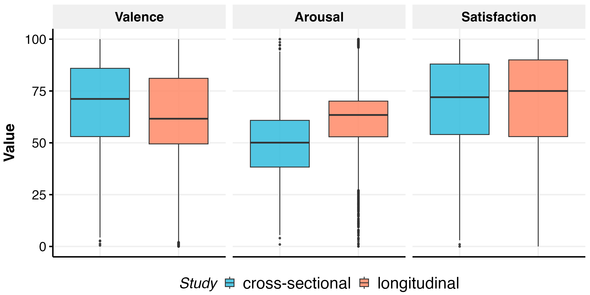
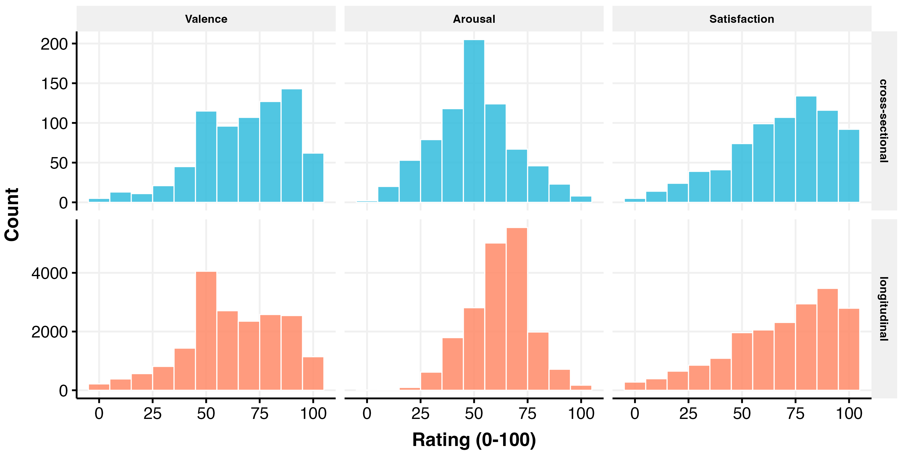
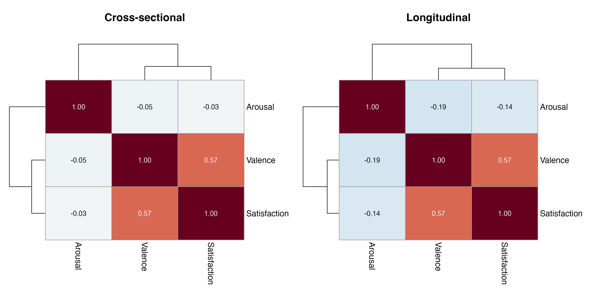
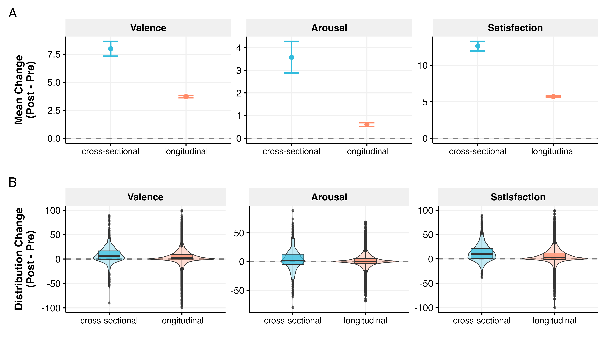
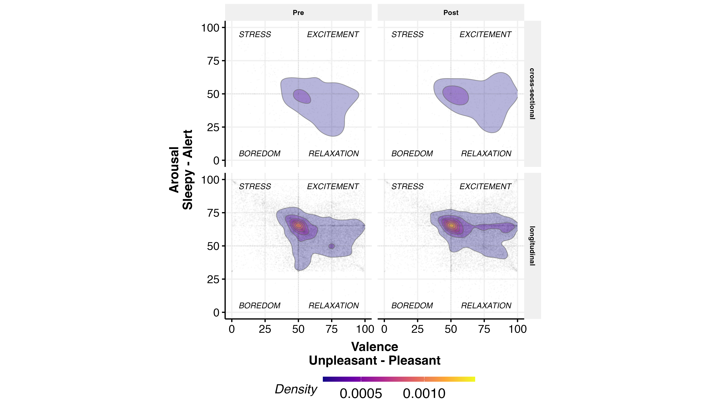
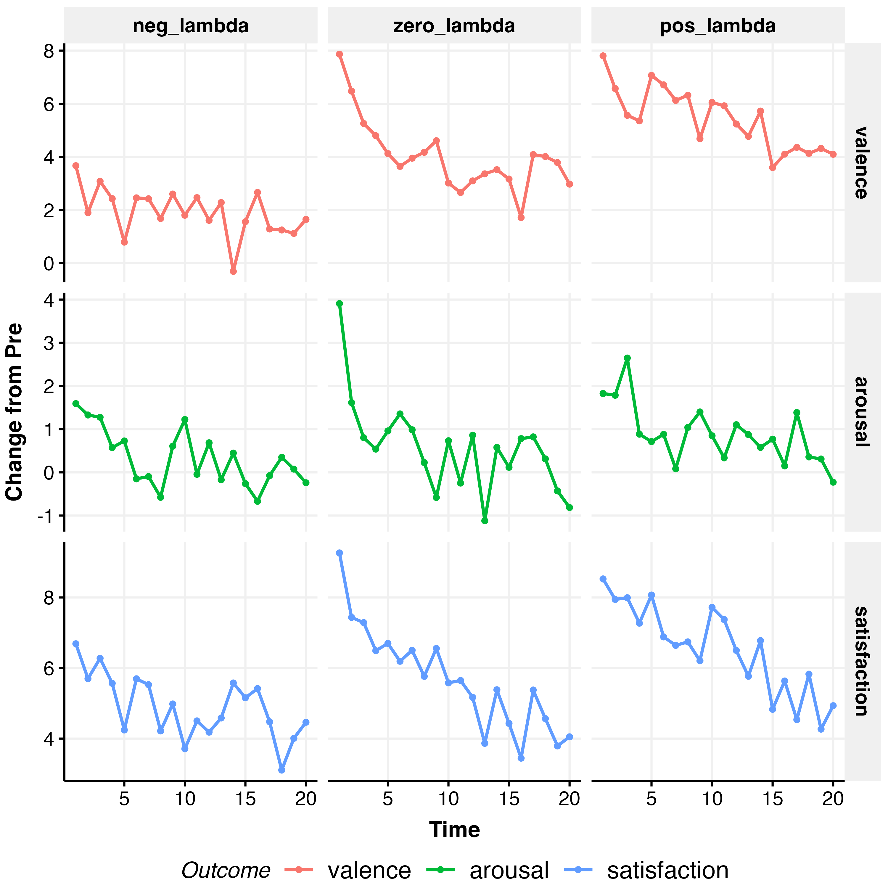
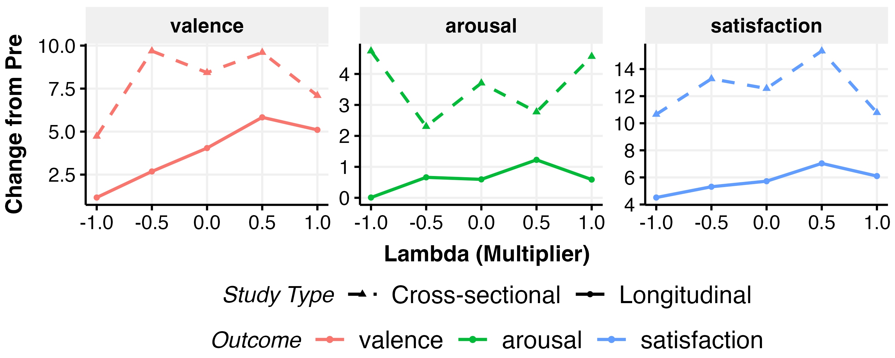
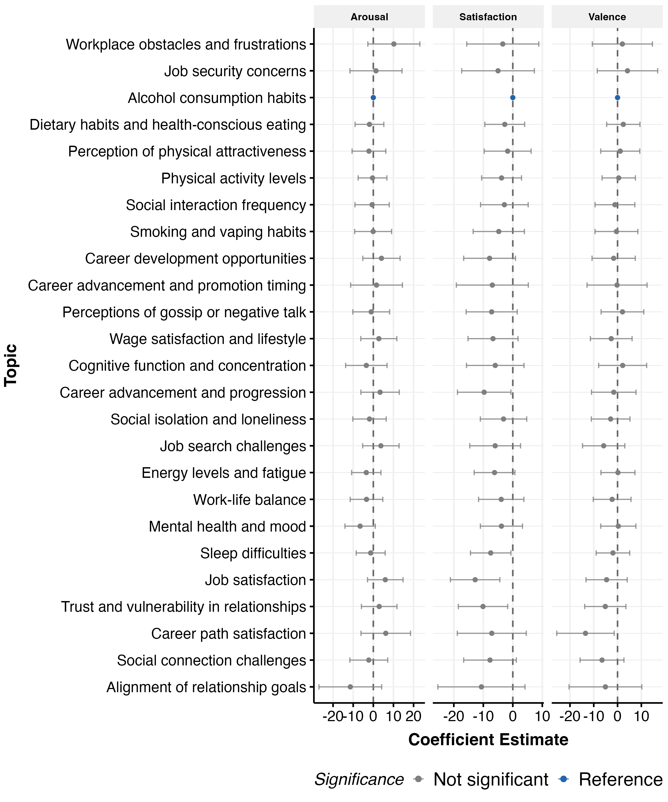
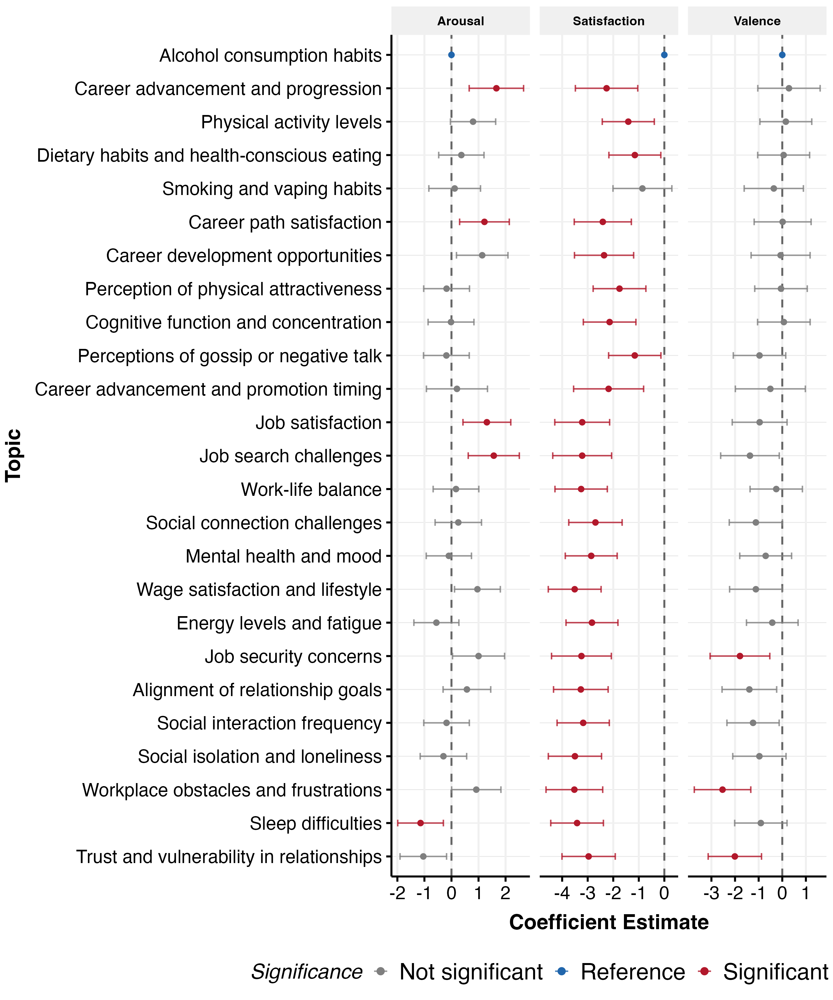

# Mood/Affect Analysis

*Generated: 2026-02-18 10:30:44.326499*

## Overview

This analysis examines effects on daily mood/affect outcomes.

**Outcomes (analysed in main paper):**
- **Valence**: Pleasantness (0-100, unpleasant to pleasant)
- **Arousal**: Activation level (0-100, sleepy to alert)

**Additional measures (collected but not analysed in main paper):**
- **Satisfaction**: How in control/satisfied participants felt about aspect of their personal wellbeing (0-100)

**Key Features:**
- Only emotchat domain data (no polchat for mood measures)
- Pre-convo baseline control

---

## Data Summary

### Valence

- **Cross-sectional**: 745 obs / 745 participants
- **Longitudinal**: 18798 obs / 997 participants

### Arousal

- **Cross-sectional**: 745 obs / 745 participants
- **Longitudinal**: 18798 obs / 997 participants

### Satisfaction

- **Cross-sectional**: 745 obs / 745 participants
- **Longitudinal**: 18798 obs / 997 participants

---

## Exploratory Data Analysis

### Pre-Post Change

### Affect Grid (Pre vs Post)

The affect grid shows the distribution of valence (x-axis) and arousal (y-axis)
before and after the intervention. Quadrants represent different affective states:
- **Top-Left (Stress)**: High arousal, unpleasant
- **Top-Right (Excitement)**: High arousal, pleasant
- **Bottom-Left (Boredom)**: Low arousal, unpleasant
- **Bottom-Right (Relaxation)**: Low arousal, pleasant

### Trajectories Over Time

### Outcomes by Lambda

---

## Functional Form Comparison

Best specification (linear, quadratic, cubic) selected by AIC.

### Cross-Sectional

| Outcome | Best Spec |
|---------|-----------|
| valence | quadratic |
| arousal | linear |
| satisfaction | quadratic |

### Longitudinal

| Outcome | Best Spec |
|---------|-----------|
| valence | linear |
| arousal | quadratic |
| satisfaction | linear |

Full comparison tables (RMSE, AIC weights, BIC weights,
Performance Score) exported to LaTeX.

---

## Full-Model Specification Comparison

Performance comparison across the three full interaction
specifications (continuous, coarsened, factor $\lambda$).

### Cross-Sectional

| Outcome | Model | RMSE | AIC wt | AICc wt | BIC wt | Perf. Score |
|---------|-------|------|--------|---------|--------|-------------|
| Valence | full_5level | 15.821 | 0.389 | 0.359 | 0.000 | 0.750 |
|  | full_continuous | 15.930 | 0.339 | 0.359 | 0.926 | 0.643 |
|  | full_coarsened | 15.914 | 0.272 | 0.281 | 0.074 | 0.058 |
| Arousal | full_continuous | 16.362 | 0.851 | 0.864 | 0.999 | 0.792 |
|  | full_5level | 16.278 | 0.096 | 0.083 | 0.000 | 0.272 |
|  | full_coarsened | 16.378 | 0.054 | 0.053 | 0.001 | 0.000 |
| Satisfaction | full_continuous | 15.421 | 0.873 | 0.883 | 0.994 | 0.854 |
|  | full_5level | 15.369 | 0.074 | 0.066 | 0.000 | 0.261 |
|  | full_coarsened | 15.459 | 0.052 | 0.052 | 0.006 | 0.001 |

### Longitudinal

| Outcome | Model | RMSE | AIC wt | AICc wt | BIC wt | Perf. Score |
|---------|-------|------|--------|---------|--------|-------------|
| Valence | full_continuous | 10.815 | 0.530 | 0.531 | 1.000 | 0.759 |
|  | full_coarsened | 10.815 | 0.459 | 0.458 | 0.000 | 0.431 |
|  | full_5level | 10.814 | 0.011 | 0.011 | 0.000 | 0.250 |
| Arousal | full_continuous | 8.242 | 0.982 | 0.982 | 1.000 | 0.750 |
|  | full_5level | 8.241 | 0.009 | 0.009 | 0.000 | 0.250 |
|  | full_coarsened | 8.241 | 0.009 | 0.009 | 0.000 | 0.125 |
| Satisfaction | full_continuous | 9.999 | 0.621 | 0.622 | 1.000 | 0.791 |
|  | full_coarsened | 10.000 | 0.377 | 0.376 | 0.000 | 0.303 |
|  | full_5level | 9.999 | 0.002 | 0.002 | 0.000 | 0.250 |

Full comparison tables exported to LaTeX.

---

## Model Coefficients

Fixed effects from fitted models. Binary outcomes show odds ratios.

### Valence

#### Additive (lambda_3 Coarsened)

**Cross-Sectional Model:**
`valence ~ relationship_seeking_category + personalisation + valence_pre`

|Parameter    | Coefficient |     95% CI     | P-value |
|:------------|:-----------:|:--------------:|:-------:|
|(Intercept)  |  28.12***   | [24.45, 31.78] | p<0.001 |
|lambda=0     |    1.27     | [-1.92, 4.45]  | p=0.435 |
|lambda>0     |    2.33     | [-0.26, 4.91]  | p=0.077 |
|personalised |    1.67     | [-0.65, 3.99]  | p=0.158 |
|valence_pre  |   0.63***   |  [0.58, 0.69]  | p<0.001 |

**Longitudinal Model:**
`valence ~ relationship_seeking_category + personalisation + valence_pre +      session_numeric + (1 + session_numeric | ppt_id)`

|Parameter    | Coefficient |     95% CI     | P-value |
|:------------|:-----------:|:--------------:|:-------:|
|(Intercept)  |  23.53***   | [22.31, 24.74] | p<0.001 |
|lambda=0     |   2.42**    |  [0.94, 3.89]  | p=0.001 |
|lambda>0     |   2.87***   |  [1.65, 4.09]  | p<0.001 |
|personalised |    1.21*    |  [0.12, 2.30]  | p=0.029 |
|valence_pre  |   0.64***   |  [0.63, 0.65]  | p<0.001 |
|session      |  -0.08***   | [-0.11, -0.04] | p<0.001 |

#### Additive (lambda Continuous)

**Cross-Sectional Model:**
`valence ~ lambda + I(lambda^2) + personalisation + valence_pre`

|Parameter    | Coefficient |     95% CI     | P-value |
|:------------|:-----------:|:--------------:|:-------:|
|(Intercept)  |  30.70***   | [27.02, 34.37] | p<0.001 |
|lambda       |    1.48     | [-0.17, 3.13]  | p=0.079 |
|lambda^2     |   -3.24*    | [-6.03, -0.45] | p=0.023 |
|personalised |    1.79     | [-0.52, 4.10]  | p=0.128 |
|valence_pre  |   0.64***   |  [0.58, 0.69]  | p<0.001 |

**Longitudinal Model:**
`valence ~ lambda + personalisation + valence_pre + session_numeric +      (1 + session_numeric | ppt_id)`

|Parameter    | Coefficient |     95% CI     | P-value |
|:------------|:-----------:|:--------------:|:-------:|
|(Intercept)  |  25.13***   | [24.09, 26.16] | p<0.001 |
|lambda       |   1.67***   |  [0.90, 2.44]  | p<0.001 |
|personalised |    1.27*    |  [0.18, 2.35]  | p=0.023 |
|valence_pre  |   0.64***   |  [0.63, 0.65]  | p<0.001 |
|session      |  -0.08***   | [-0.11, -0.04] | p<0.001 |

#### Full/Interaction (lambda_3 Coarsened)

**Cross-Sectional Model:**
`valence ~ relationship_seeking_category + personalisation + valence_pre +      relationship_seeking_category:personalisation`

|Parameter             | Coefficient |     95% CI      | P-value |
|:---------------------|:-----------:|:---------------:|:-------:|
|(Intercept)           |  27.00***   | [23.11, 30.89]  | p<0.001 |
|lambda=0              |    5.14*    |  [0.83, 9.44]   | p=0.019 |
|lambda>0              |    2.98     |  [-0.56, 6.51]  | p=0.099 |
|personalised          |    3.95*    |  [0.31, 7.58]   | p=0.033 |
|valence_pre           |   0.64***   |  [0.58, 0.69]   | p<0.001 |
|lambda=0:personalised |   -8.47**   | [-14.84, -2.09] | p=0.009 |
|lambda>0:personalised |    -1.57    |  [-6.71, 3.57]  | p=0.549 |

**Longitudinal Model:**
`valence ~ relationship_seeking_category + personalisation + valence_pre +      relationship_seeking_category:personalisation + session_numeric +      relationship_seeking_category:session_numeric + personalisation:session_numeric +      (1 + session_numeric | ppt_id)`

|Parameter             | Coefficient |     95% CI     | P-value |
|:---------------------|:-----------:|:--------------:|:-------:|
|(Intercept)           |  22.55***   | [21.06, 24.03] | p<0.001 |
|lambda=0              |   3.81**    |  [1.45, 6.17]  | p=0.002 |
|lambda>0              |   4.57***   |  [2.65, 6.48]  | p<0.001 |
|personalised          |    2.13*    |  [0.26, 3.99]  | p=0.026 |
|valence_pre           |   0.64***   |  [0.63, 0.65]  | p<0.001 |
|session               |    -0.02    | [-0.08, 0.05]  | p=0.595 |
|lambda=0:personalised |    -1.10    | [-4.06, 1.85]  | p=0.465 |
|lambda>0:personalised |    -1.44    | [-3.88, 1.00]  | p=0.246 |
|lambda=0:session      |    -0.08    | [-0.18, 0.02]  | p=0.106 |
|lambda>0:session      |   -0.09*    | [-0.18, -0.01] | p=0.023 |
|personalised:session  |    -0.01    | [-0.09, 0.06]  | p=0.741 |

#### Full/Interaction (lambda Continuous)

**Cross-Sectional Model:**
`valence ~ lambda + I(lambda^2) + personalisation + valence_pre +      lambda:personalisation`

|Parameter           | Coefficient |     95% CI     | P-value |
|:-------------------|:-----------:|:--------------:|:-------:|
|(Intercept)         |  30.69***   | [27.01, 34.37] | p<0.001 |
|lambda              |    1.88     | [-0.42, 4.18]  | p=0.109 |
|lambda^2            |   -3.23*    | [-6.02, -0.44] | p=0.023 |
|personalised        |    1.79     | [-0.52, 4.10]  | p=0.129 |
|valence_pre         |   0.64***   |  [0.58, 0.69]  | p<0.001 |
|lambda:personalised |    -0.83    | [-4.13, 2.47]  | p=0.621 |

**Longitudinal Model:**
`valence ~ lambda + personalisation + valence_pre + lambda:personalisation +      session_numeric + lambda:session_numeric + personalisation:session_numeric +      (1 + session_numeric | ppt_id)`

|Parameter            | Coefficient |     95% CI     | P-value |
|:--------------------|:-----------:|:--------------:|:-------:|
|(Intercept)          |  25.09***   | [23.99, 26.20] | p<0.001 |
|lambda               |   2.88***   |  [1.66, 4.10]  | p<0.001 |
|personalised         |    1.40*    |  [0.07, 2.72]  | p=0.039 |
|valence_pre          |   0.64***   |  [0.63, 0.65]  | p<0.001 |
|session              |   -0.07**   | [-0.12, -0.02] | p=0.007 |
|lambda:personalised  |    -1.32    | [-2.86, 0.22]  | p=0.094 |
|lambda:session       |   -0.05*    | [-0.10, -0.00] | p=0.048 |
|personalised:session |    -0.01    | [-0.09, 0.06]  | p=0.703 |

---

### Arousal

#### Additive (lambda_3 Coarsened)

**Cross-Sectional Model:**
`arousal ~ relationship_seeking_category + personalisation + arousal_pre`

|Parameter    | Coefficient |     95% CI     | P-value |
|:------------|:-----------:|:--------------:|:-------:|
|(Intercept)  |  28.32***   | [24.66, 31.99] | p<0.001 |
|lambda=0     |    0.57     | [-2.69, 3.83]  | p=0.731 |
|lambda>0     |    -0.36    | [-3.00, 2.28]  | p=0.790 |
|personalised |    -0.95    | [-3.33, 1.42]  | p=0.430 |
|arousal_pre  |   0.48***   |  [0.41, 0.54]  | p<0.001 |

**Longitudinal Model:**
`arousal ~ relationship_seeking_category + personalisation + arousal_pre +      session_numeric + (1 + session_numeric | ppt_id)`

|Parameter    | Coefficient |     95% CI     | P-value |
|:------------|:-----------:|:--------------:|:-------:|
|(Intercept)  |  26.92***   | [25.93, 27.90] | p<0.001 |
|lambda=0     |    0.11     | [-0.91, 1.12]  | p=0.834 |
|lambda>0     |    0.45     | [-0.39, 1.29]  | p=0.291 |
|personalised |    -0.29    | [-1.04, 0.46]  | p=0.446 |
|arousal_pre  |   0.58***   |  [0.57, 0.59]  | p<0.001 |
|session      |  -0.08***   | [-0.11, -0.05] | p<0.001 |

#### Additive (lambda Continuous)

**Cross-Sectional Model:**
`arousal ~ lambda + personalisation + arousal_pre`

|Parameter    | Coefficient |     95% CI     | P-value |
|:------------|:-----------:|:--------------:|:-------:|
|(Intercept)  |  28.27***   | [24.90, 31.64] | p<0.001 |
|lambda       |    -0.27    | [-1.96, 1.43]  | p=0.758 |
|personalised |    -0.96    | [-3.33, 1.41]  | p=0.427 |
|arousal_pre  |   0.48***   |  [0.41, 0.54]  | p<0.001 |

**Longitudinal Model:**
`arousal ~ lambda + I(lambda^2) + personalisation + arousal_pre +      session_numeric + (1 + session_numeric | ppt_id)`

|Parameter    | Coefficient |     95% CI     | P-value |
|:------------|:-----------:|:--------------:|:-------:|
|(Intercept)  |  27.66***   | [26.67, 28.65] | p<0.001 |
|lambda       |    0.34     | [-0.19, 0.87]  | p=0.211 |
|lambda^2     |   -1.09*    | [-1.98, -0.20] | p=0.017 |
|personalised |    -0.28    | [-1.03, 0.47]  | p=0.461 |
|arousal_pre  |   0.58***   |  [0.57, 0.59]  | p<0.001 |
|session      |  -0.08***   | [-0.11, -0.05] | p<0.001 |

#### Full/Interaction (lambda_3 Coarsened)

**Cross-Sectional Model:**
`arousal ~ relationship_seeking_category + personalisation + arousal_pre +      relationship_seeking_category:personalisation`

|Parameter             | Coefficient |     95% CI     | P-value |
|:---------------------|:-----------:|:--------------:|:-------:|
|(Intercept)           |  28.70***   | [24.84, 32.57] | p<0.001 |
|lambda=0              |    -0.01    | [-4.44, 4.42]  | p=0.997 |
|lambda>0              |    -1.11    | [-4.75, 2.52]  | p=0.549 |
|personalised          |    -1.85    | [-5.59, 1.89]  | p=0.332 |
|arousal_pre           |   0.48***   |  [0.41, 0.54]  | p<0.001 |
|lambda=0:personalised |    1.29     | [-5.27, 7.85]  | p=0.700 |
|lambda>0:personalised |    1.61     | [-3.69, 6.90]  | p=0.551 |

**Longitudinal Model:**
`arousal ~ relationship_seeking_category + personalisation + arousal_pre +      relationship_seeking_category:personalisation + session_numeric +      relationship_seeking_category:session_numeric + personalisation:session_numeric +      (1 + session_numeric | ppt_id)`

|Parameter             | Coefficient |     95% CI     | P-value |
|:---------------------|:-----------:|:--------------:|:-------:|
|(Intercept)           |  26.85***   | [25.70, 28.00] | p<0.001 |
|lambda=0              |    -0.11    | [-1.72, 1.51]  | p=0.895 |
|lambda>0              |    0.37     | [-0.94, 1.68]  | p=0.583 |
|personalised          |    -0.17    | [-1.44, 1.11]  | p=0.800 |
|arousal_pre           |   0.58***   |  [0.57, 0.59]  | p<0.001 |
|session               |   -0.06*    | [-0.11, -0.01] | p=0.021 |
|lambda=0:personalised |    0.71     | [-1.33, 2.75]  | p=0.494 |
|lambda>0:personalised |    0.03     | [-1.65, 1.71]  | p=0.973 |
|lambda=0:session      |    -0.02    | [-0.10, 0.06]  | p=0.656 |
|lambda>0:session      |    0.01     | [-0.06, 0.07]  | p=0.787 |
|personalised:session  |    -0.03    | [-0.09, 0.03]  | p=0.269 |

#### Full/Interaction (lambda Continuous)

**Cross-Sectional Model:**
`arousal ~ lambda + personalisation + arousal_pre + lambda:personalisation`

|Parameter           | Coefficient |     95% CI     | P-value |
|:-------------------|:-----------:|:--------------:|:-------:|
|(Intercept)         |  28.22***   | [24.85, 31.59] | p<0.001 |
|lambda              |    -1.48    | [-3.85, 0.88]  | p=0.218 |
|personalised        |    -0.95    | [-3.32, 1.42]  | p=0.432 |
|arousal_pre         |   0.48***   |  [0.41, 0.54]  | p<0.001 |
|lambda:personalised |    2.51     | [-0.88, 5.89]  | p=0.147 |

**Longitudinal Model:**
`arousal ~ lambda + I(lambda^2) + personalisation + arousal_pre +      lambda:personalisation + session_numeric + lambda:session_numeric +      personalisation:session_numeric + (1 + session_numeric |      ppt_id)`

|Parameter            | Coefficient |     95% CI     | P-value |
|:--------------------|:-----------:|:--------------:|:-------:|
|(Intercept)          |  27.52***   | [26.50, 28.54] | p<0.001 |
|lambda               |    0.37     | [-0.47, 1.20]  | p=0.387 |
|lambda^2             |   -1.09*    | [-1.98, -0.20] | p=0.017 |
|personalised         |    0.00     | [-0.89, 0.90]  | p=0.992 |
|arousal_pre          |   0.58***   |  [0.57, 0.59]  | p<0.001 |
|session              |   -0.06**   | [-0.10, -0.02] | p=0.003 |
|lambda:personalised  |    -0.16    | [-1.22, 0.89]  | p=0.763 |
|lambda:session       |    0.01     | [-0.03, 0.05]  | p=0.769 |
|personalised:session |    -0.03    | [-0.09, 0.02]  | p=0.260 |

---

### Satisfaction

#### Additive (lambda_3 Coarsened)

**Cross-Sectional Model:**
`satisfaction ~ relationship_seeking_category + personalisation +      satisfaction_pre`

|Parameter        | Coefficient |     95% CI     | P-value |
|:----------------|:-----------:|:--------------:|:-------:|
|(Intercept)      |  31.56***   | [28.45, 34.68] | p<0.001 |
|lambda=0         |    -0.09    | [-3.17, 2.98]  | p=0.952 |
|lambda>0         |    1.21     | [-1.28, 3.70]  | p=0.342 |
|personalised     |    -0.49    | [-2.73, 1.74]  | p=0.665 |
|satisfaction_pre |   0.66***   |  [0.62, 0.70]  | p<0.001 |

**Longitudinal Model:**
`satisfaction ~ relationship_seeking_category + personalisation +      satisfaction_pre + session_numeric + (1 + session_numeric |      ppt_id)`

|Parameter        | Coefficient |     95% CI     | P-value |
|:----------------|:-----------:|:--------------:|:-------:|
|(Intercept)      |  22.65***   | [21.59, 23.72] | p<0.001 |
|lambda=0         |    1.29     | [-0.00, 2.58]  | p=0.050 |
|lambda>0         |    1.20*    |  [0.13, 2.26]  | p=0.027 |
|personalised     |    0.23     | [-0.72, 1.18]  | p=0.633 |
|satisfaction_pre |   0.72***   |  [0.72, 0.73]  | p<0.001 |
|session          |    -0.03    | [-0.06, 0.00]  | p=0.079 |

#### Additive (lambda Continuous)

**Cross-Sectional Model:**
`satisfaction ~ lambda + I(lambda^2) + personalisation + satisfaction_pre`

|Parameter        | Coefficient |     95% CI     | P-value |
|:----------------|:-----------:|:--------------:|:-------:|
|(Intercept)      |  33.32***   | [30.25, 36.40] | p<0.001 |
|lambda           |    0.68     | [-0.91, 2.28]  | p=0.401 |
|lambda^2         |   -2.83*    | [-5.53, -0.13] | p=0.040 |
|personalised     |    -0.38    | [-2.62, 1.85]  | p=0.737 |
|satisfaction_pre |   0.66***   |  [0.62, 0.70]  | p<0.001 |

**Longitudinal Model:**
`satisfaction ~ lambda + personalisation + satisfaction_pre +      session_numeric + (1 + session_numeric | ppt_id)`

|Parameter        | Coefficient |     95% CI     | P-value |
|:----------------|:-----------:|:--------------:|:-------:|
|(Intercept)      |  23.37***   | [22.46, 24.28] | p<0.001 |
|lambda           |    0.72*    |  [0.05, 1.39]  | p=0.036 |
|personalised     |    0.26     | [-0.69, 1.21]  | p=0.591 |
|satisfaction_pre |   0.72***   |  [0.72, 0.73]  | p<0.001 |
|session          |    -0.03    | [-0.06, 0.00]  | p=0.077 |

#### Full/Interaction (lambda_3 Coarsened)

**Cross-Sectional Model:**
`satisfaction ~ relationship_seeking_category + personalisation +      satisfaction_pre + relationship_seeking_category:personalisation`

|Parameter             | Coefficient |     95% CI     | P-value |
|:---------------------|:-----------:|:--------------:|:-------:|
|(Intercept)           |  31.92***   | [28.53, 35.30] | p<0.001 |
|lambda=0              |    -0.34    | [-4.52, 3.84]  | p=0.874 |
|lambda>0              |    0.49     | [-2.95, 3.92]  | p=0.781 |
|personalised          |    -1.21    | [-4.75, 2.32]  | p=0.501 |
|satisfaction_pre      |   0.66***   |  [0.61, 0.70]  | p<0.001 |
|lambda=0:personalised |    0.55     | [-5.63, 6.74]  | p=0.861 |
|lambda>0:personalised |    1.52     | [-3.48, 6.52]  | p=0.551 |

**Longitudinal Model:**
`satisfaction ~ relationship_seeking_category + personalisation +      satisfaction_pre + relationship_seeking_category:personalisation +      session_numeric + relationship_seeking_category:session_numeric +      personalisation:session_numeric + (1 + session_numeric |      ppt_id)`

|Parameter             | Coefficient |     95% CI     | P-value |
|:---------------------|:-----------:|:--------------:|:-------:|
|(Intercept)           |  21.46***   | [20.12, 22.80] | p<0.001 |
|lambda=0              |   2.82**    |  [0.68, 4.96]  | p=0.010 |
|lambda>0              |   3.03***   |  [1.29, 4.76]  | p<0.001 |
|personalised          |    1.31     | [-0.37, 3.00]  | p=0.126 |
|satisfaction_pre      |   0.72***   |  [0.72, 0.73]  | p<0.001 |
|session               |    0.04     | [-0.02, 0.10]  | p=0.189 |
|lambda=0:personalised |    -0.65    | [-3.23, 1.93]  | p=0.622 |
|lambda>0:personalised |    -1.55    | [-3.68, 0.58]  | p=0.154 |
|lambda=0:session      |   -0.10*    | [-0.19, -0.01] | p=0.023 |
|lambda>0:session      |   -0.09*    | [-0.16, -0.02] | p=0.017 |
|personalised:session  |    -0.03    | [-0.09, 0.04]  | p=0.386 |

#### Full/Interaction (lambda Continuous)

**Cross-Sectional Model:**
`satisfaction ~ lambda + I(lambda^2) + personalisation + satisfaction_pre +      lambda:personalisation`

|Parameter           | Coefficient |     95% CI     | P-value |
|:-------------------|:-----------:|:--------------:|:-------:|
|(Intercept)         |  33.34***   | [30.26, 36.41] | p<0.001 |
|lambda              |    0.41     | [-1.82, 2.63]  | p=0.721 |
|lambda^2            |   -2.83*    | [-5.53, -0.13] | p=0.040 |
|personalised        |    -0.38    | [-2.61, 1.86]  | p=0.739 |
|satisfaction_pre    |   0.66***   |  [0.62, 0.70]  | p<0.001 |
|lambda:personalised |    0.57     | [-2.63, 3.77]  | p=0.725 |

**Longitudinal Model:**
`satisfaction ~ lambda + personalisation + satisfaction_pre +      lambda:personalisation + session_numeric + lambda:session_numeric +      personalisation:session_numeric + (1 + session_numeric |      ppt_id)`

|Parameter            | Coefficient |     95% CI     | P-value |
|:--------------------|:-----------:|:--------------:|:-------:|
|(Intercept)          |  23.20***   | [22.21, 24.20] | p<0.001 |
|lambda               |   1.81**    |  [0.71, 2.92]  | p=0.001 |
|personalised         |    0.62     | [-0.60, 1.85]  | p=0.319 |
|satisfaction_pre     |   0.72***   |  [0.72, 0.73]  | p<0.001 |
|session              |    -0.01    | [-0.06, 0.03]  | p=0.535 |
|lambda:personalised  |    -0.97    | [-2.31, 0.37]  | p=0.157 |
|lambda:session       |   -0.05*    | [-0.10, -0.00] | p=0.033 |
|personalised:session |    -0.03    | [-0.10, 0.03]  | p=0.347 |

---

---

## Robustness Checks

Robustness analyses test whether treatment effects hold under
alternative specifications. Cells show coefficient (SE) with
significance: *p<.05, **p<.01, ***p<.001.

**Specifications:**
- **Additive**: Base treatment effects (no interactions)
- **+ Interactions**: Full model with treatment interactions
- **Full + Demos**: Full model + demographic controls
- **Full + Prefs**: Full model + AI pre-treatment pref groups
- **Full + IPW**: Full model with IPW weights (attrition adjustment)

### Cross-Sectional

| Outcome | Predictor | Additive | + Interactions | Full + Demos | Full + Prefs | Full + IPW |
|---|---|---|---|---|---|---|
| valence | lambda | 1.48 (0.84) | 1.88 (1.17) | 2.08 (1.17) | 2.03 (1.16) | --- |
| valence | I(lambda^2) | -3.24 (1.42)* | -3.23 (1.42)* | -3.36 (1.43)* | -3.58 (1.40)* | --- |
| valence | personalisationpersonalised | 1.79 (1.18) | 1.79 (1.18) | 1.61 (1.17) | 1.82 (1.16) | --- |
| arousal | lambda | -0.27 (0.86) | -1.48 (1.20) | -1.54 (1.21) | -1.43 (1.20) | --- |
| arousal | personalisationpersonalised | -0.96 (1.21) | -0.95 (1.21) | -1.03 (1.21) | -0.95 (1.20) | --- |
| satisfaction | lambda | 0.68 (0.81) | 0.41 (1.14) | 0.49 (1.12) | 0.57 (1.11) | --- |
| satisfaction | I(lambda^2) | -2.83 (1.38)* | -2.83 (1.38)* | -2.99 (1.37)* | -3.26 (1.34)* | --- |
| satisfaction | personalisationpersonalised | -0.38 (1.14) | -0.38 (1.14) | -0.47 (1.13) | -0.37 (1.11) | --- |

### Longitudinal

| Outcome | Predictor | Additive | + Interactions | Full + Demos | Full + Prefs | Full + IPW |
|---|---|---|---|---|---|---|
| valence | lambda | 1.67 (0.39)*** | 2.88 (0.62)*** | 2.91 (0.61)*** | 2.88 (0.61)*** | 2.76 (0.63)*** |
| valence | personalisationpersonalised | 1.27 (0.56)* | 1.40 (0.68)* | 1.38 (0.67)* | 1.41 (0.66)* | 1.28 (0.69) |
| arousal | lambda | 0.34 (0.27) | 0.37 (0.42) | 0.34 (0.43) | 0.37 (0.42) | 0.23 (0.43) |
| arousal | I(lambda^2) | -1.09 (0.45)* | -1.09 (0.45)* | -1.05 (0.46)* | -1.09 (0.45)* | -1.11 (0.46)* |
| arousal | personalisationpersonalised | -0.28 (0.38) | 0.00 (0.46) | 0.01 (0.46) | 0.00 (0.46) | 0.14 (0.46) |
| satisfaction | lambda | 0.72 (0.34)* | 1.81 (0.56)** | 1.75 (0.56)** | 1.81 (0.55)** | 1.91 (0.57)*** |
| satisfaction | personalisationpersonalised | 0.26 (0.48) | 0.62 (0.63) | 0.54 (0.62) | 0.64 (0.62) | 0.68 (0.64) |

Full tables: `mood_robustness_{cs,long}.tex`

---

## Topic Fixed Effects

Analysis of how different conversation topics affect mood outcomes,
with "Alcohol consumption habits" as the reference category.

Forest plots show coefficients for each topic relative to the reference,
with FDR-adjusted significance indicators.

### Cross-sectional

### Longitudinal

---

## Output Files

All outputs use prefix `mood_`.

- Figures: `outputs/figures/main_studies/`
- Tables: `outputs/tables/main_studies/`
- Models: `outputs/models/`
