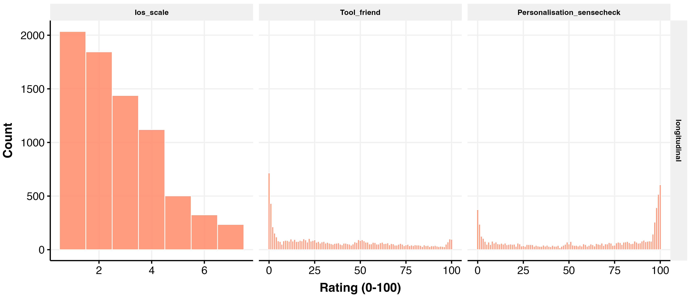
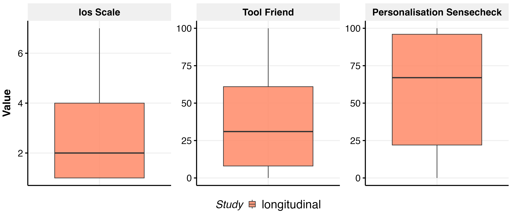
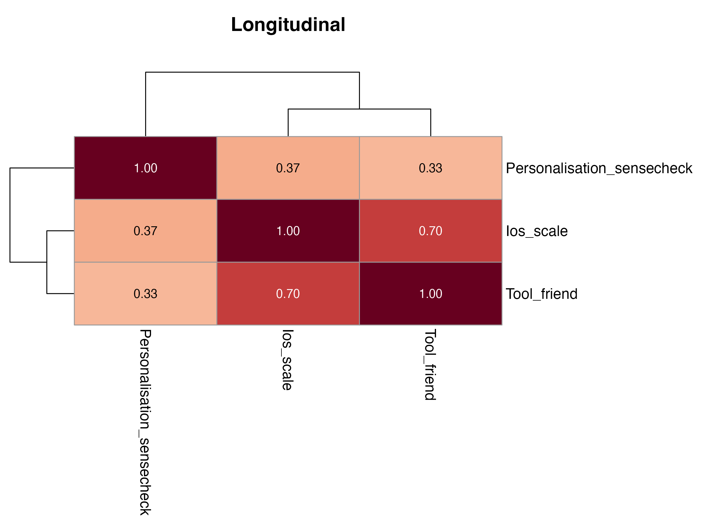
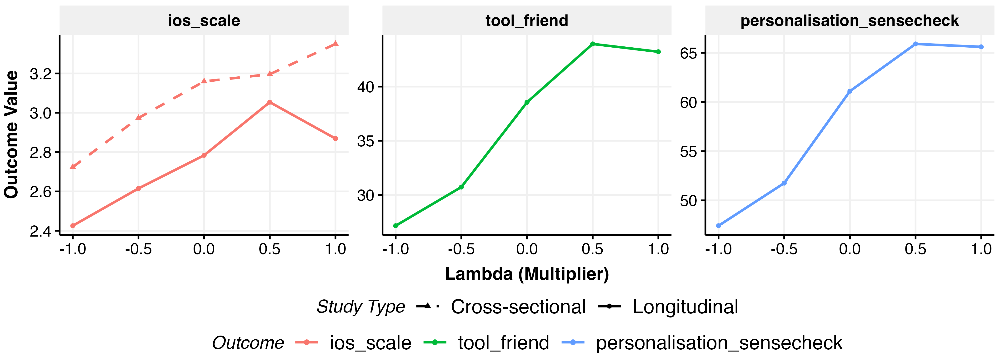
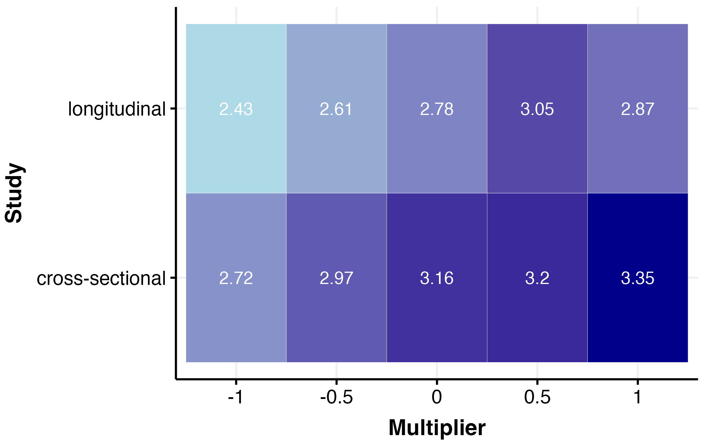
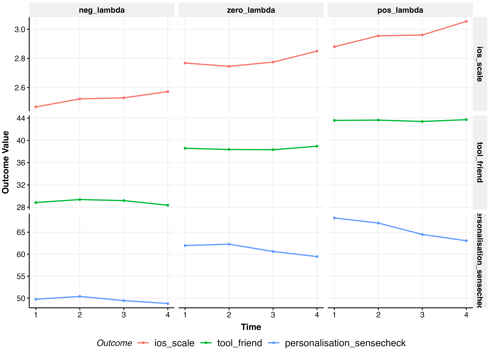
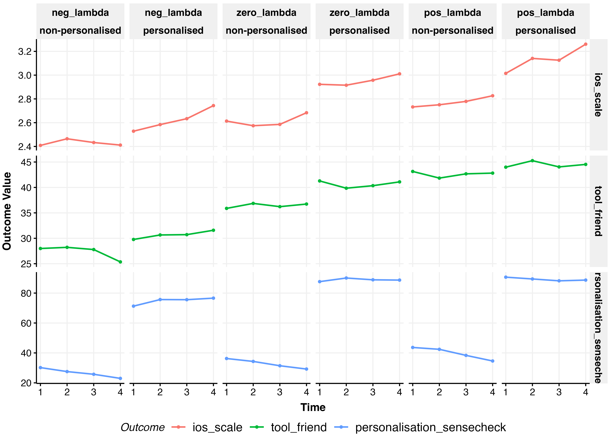

# Relational Measures Analysis

*Generated: 2026-02-18 10:31:35.247901*

## Overview

This analysis examines the effects on relational outcomes:

**Outcomes:**
- **IOS Scale** (Inclusion of Other in Self) - both studies (1-7 likert)
- **Tool vs Friend** - longitudinal only (0-100)
- **Personalisation Sensecheck** - longitudinal only (0-100)

**Treatment Arms:**
- **lambda**: Relationship-seeking intensity (-1 to +1)
- **Personalisation**: personalised vs non-personalised
- **Domain**: polchat vs emotchat

**Model Specifications:**
- Cross-sectional: OLS (only ios_scale available)
- Longitudinal: lmer with random slopes for week

---

## Data Summary

### Ios scale

- **Cross-sectional**: 1506 obs / 1506 participants
- **Longitudinal**: 7500 obs / 1939 participants

---

## Exploratory Data Analysis

### Outcome Distributions (Longitudinal)

### Outcome Boxplots

### Correlation Heatmap (Longitudinal)

### Outcomes by Lambda

### IOS Scale by Study and Multiplier

### Trajectory Plots (Longitudinal)

#### By Relationship-Seeking Category

#### Full Breakdown

---

## Personalisation Sensecheck Validation

### Manipulation Check

Does actual personalisation treatment affect perceived personalisation?

- **Non-personalised**: M = 33.0 (SD = 29.4, n = 3740)
- **Personalised**: M = 83.6 (SD = 22.7, n = 3761)
- **Difference**: 50.7pp, t(7021.9) = -83.61, p < 0.001

**Interpretation**: Manipulation check PASSED - participants accurately 
detected personalisation.

### RS Effect on Perceived Personalisation

Does relationship-seeking behaviour affect perceived personalisation?

- **Neg λ**: M = 49.6
- **Pos λ**: M = 65.8
- **Difference**: 16.2pp, p < 0.001

### Illusion of Personalisation

Does RS create perceived personalisation even when NOT personalised?

**Within non-personalised condition:**

- **Neg λ**: M = 26.7
- **Pos λ**: M = 39.9
- **Difference**: 13.2pp, p < 0.001

**Interpretation**: RS creates an illusion of personalisation - 
participants perceived RS models as more personalised even when 
they were NOT actually personalised.

**Within personalised condition:**

- **Neg λ**: M = 74.7
- **Pos λ**: M = 89.3
- **Difference**: 14.5pp, p < 0.001

---

## Functional Form Comparison

Best specification (linear, quadratic, cubic) selected by AIC.

### Cross-Sectional

| Outcome | Best Spec |
|---------|-----------|
| ios_scale | linear |

### Longitudinal

| Outcome | Best Spec |
|---------|-----------|
| ios_scale | linear |
| tool_friend | cubic |
| personalisation_sensecheck | quadratic |

Full comparison tables (RMSE, AIC weights, BIC weights,
Performance Score) exported to LaTeX.

---

## Model Coefficients

### Cross-Sectional

## Model Coefficients

Fixed effects from fitted models. Binary outcomes show odds ratios.

### Ios_scale

#### Additive (lambda_3 Coarsened)

**Cross-Sectional Model:**
`ios_scale ~ relationship_seeking_category + personalisation +      domain`

|Parameter    | Coefficient |    95% CI     | P-value |
|:------------|:-----------:|:-------------:|:-------:|
|(Intercept)  |   2.75***   | [2.58, 2.93]  | p<0.001 |
|lambda=0     |   0.31**    | [0.09, 0.54]  | p=0.007 |
|lambda>0     |   0.42***   | [0.24, 0.61]  | p<0.001 |
|personalised |    0.07     | [-0.09, 0.24] | p=0.372 |
|emotchat     |    0.12     | [-0.05, 0.28] | p=0.170 |

#### Additive (lambda Continuous)

**Cross-Sectional Model:**
`ios_scale ~ lambda + personalisation + domain`

|Parameter    | Coefficient |    95% CI     | P-value |
|:------------|:-----------:|:-------------:|:-------:|
|(Intercept)  |   2.98***   | [2.84, 3.13]  | p<0.001 |
|lambda       |   0.30***   | [0.18, 0.41]  | p<0.001 |
|personalised |    0.08     | [-0.09, 0.24] | p=0.360 |
|emotchat     |    0.12     | [-0.05, 0.28] | p=0.169 |

#### Full/Interaction (lambda_3 Coarsened)

**Cross-Sectional Model:**
`ios_scale ~ relationship_seeking_category + personalisation +      domain + relationship_seeking_category:personalisation +      relationship_seeking_category:domain`

|Parameter             | Coefficient |    95% CI     | P-value |
|:---------------------|:-----------:|:-------------:|:-------:|
|(Intercept)           |   2.70***   | [2.47, 2.93]  | p<0.001 |
|lambda=0              |   0.55**    | [0.15, 0.95]  | p=0.007 |
|lambda>0              |   0.43**    | [0.11, 0.75]  | p=0.009 |
|personalised          |    0.08     | [-0.18, 0.34] | p=0.569 |
|emotchat              |    0.21     | [-0.05, 0.47] | p=0.109 |
|lambda=0:personalised |    -0.40    | [-0.85, 0.05] | p=0.081 |
|lambda>0:personalised |    0.21     | [-0.16, 0.58] | p=0.269 |
|lambda=0:emotchat     |    -0.07    | [-0.52, 0.38] | p=0.752 |
|lambda>0:emotchat     |    -0.22    | [-0.59, 0.14] | p=0.234 |

#### Full/Interaction (lambda Continuous)

**Cross-Sectional Model:**
`ios_scale ~ lambda + personalisation + domain + lambda:personalisation +      lambda:domain`

|Parameter           | Coefficient |    95% CI     | P-value |
|:-------------------|:-----------:|:-------------:|:-------:|
|(Intercept)         |   2.98***   | [2.84, 3.13]  | p<0.001 |
|lambda              |   0.33**    | [0.12, 0.53]  | p=0.002 |
|personalised        |    0.08     | [-0.08, 0.24] | p=0.338 |
|emotchat            |    0.11     | [-0.05, 0.28] | p=0.178 |
|lambda:personalised |    0.13     | [-0.10, 0.36] | p=0.277 |
|lambda:emotchat     |    -0.20    | [-0.43, 0.03] | p=0.091 |

---

### Longitudinal

## Model Coefficients

Fixed effects from fitted models. Binary outcomes show odds ratios.

### Ios_scale

#### Additive (lambda_3 Coarsened)

**Longitudinal Model:**
`ios_scale ~ relationship_seeking_category + personalisation +      domain + week_numeric + (1 + week_numeric | ppt_id)`

|Parameter    | Coefficient |    95% CI    | P-value |
|:------------|:-----------:|:------------:|:-------:|
|(Intercept)  |   2.24***   | [2.10, 2.38] | p<0.001 |
|lambda=0     |   0.25**    | [0.07, 0.43] | p=0.006 |
|lambda>0     |   0.40***   | [0.26, 0.55] | p<0.001 |
|personalised |   0.24***   | [0.11, 0.37] | p<0.001 |
|emotchat     |    0.16*    | [0.02, 0.29] | p=0.021 |
|week         |   0.04***   | [0.02, 0.05] | p<0.001 |

#### Additive (lambda Continuous)

**Longitudinal Model:**
`ios_scale ~ lambda + personalisation + domain + week_numeric +      (1 + week_numeric | ppt_id)`

|Parameter    | Coefficient |    95% CI    | P-value |
|:------------|:-----------:|:------------:|:-------:|
|(Intercept)  |   2.45***   | [2.34, 2.57] | p<0.001 |
|lambda       |   0.24***   | [0.15, 0.33] | p<0.001 |
|personalised |   0.25***   | [0.11, 0.38] | p<0.001 |
|emotchat     |    0.15*    | [0.02, 0.28] | p=0.022 |
|week         |   0.04***   | [0.02, 0.05] | p<0.001 |

#### Full/Interaction (lambda_3 Coarsened)

**Longitudinal Model:**
`ios_scale ~ relationship_seeking_category + personalisation +      domain + relationship_seeking_category:personalisation +      relationship_seeking_category:domain + week_numeric + relationship_seeking_category:week_numeric +      personalisation:week_numeric + domain:week_numeric + (1 +      week_numeric | ppt_id)`

|Parameter             | Coefficient |    95% CI     | P-value |
|:---------------------|:-----------:|:-------------:|:-------:|
|(Intercept)           |   2.35***   | [2.16, 2.53]  | p<0.001 |
|lambda=0              |    0.03     | [-0.28, 0.34] | p=0.841 |
|lambda>0              |    0.33*    | [0.07, 0.59]  | p=0.012 |
|personalised          |    0.06     | [-0.16, 0.27] | p=0.598 |
|emotchat              |    0.13     | [-0.08, 0.34] | p=0.234 |
|week                  |    0.01     | [-0.02, 0.04] | p=0.428 |
|lambda=0:personalised |    0.17     | [-0.19, 0.53] | p=0.358 |
|lambda>0:personalised |    0.20     | [-0.10, 0.49] | p=0.192 |
|lambda=0:emotchat     |    0.33     | [-0.03, 0.69] | p=0.071 |
|lambda>0:emotchat     |    -0.10    | [-0.39, 0.20] | p=0.516 |
|lambda=0:week         |    -0.02    | [-0.06, 0.02] | p=0.325 |
|lambda>0:week         |    0.01     | [-0.02, 0.05] | p=0.397 |
|personalised:week     |   0.05**    | [0.02, 0.07]  | p=0.002 |
|emotchat:week         |    -0.00    | [-0.03, 0.03] | p=0.955 |

#### Full/Interaction (lambda Continuous)

**Longitudinal Model:**
`ios_scale ~ lambda + personalisation + domain + lambda:personalisation +      lambda:domain + week_numeric + lambda:week_numeric + personalisation:week_numeric +      domain:week_numeric + (1 + week_numeric | ppt_id)`

|Parameter           | Coefficient |    95% CI     | P-value |
|:-------------------|:-----------:|:-------------:|:-------:|
|(Intercept)         |   2.48***   | [2.36, 2.60]  | p<0.001 |
|lambda              |    0.21*    | [0.04, 0.37]  | p=0.014 |
|personalised        |    0.18*    | [0.04, 0.32]  | p=0.012 |
|emotchat            |    0.16*    | [0.02, 0.29]  | p=0.027 |
|week                |    0.01     | [-0.01, 0.04] | p=0.270 |
|lambda:personalised |    0.12     | [-0.07, 0.31] | p=0.207 |
|lambda:emotchat     |    -0.09    | [-0.27, 0.10] | p=0.361 |
|lambda:week         |    0.01     | [-0.01, 0.03] | p=0.316 |
|personalised:week   |   0.05**    | [0.02, 0.07]  | p=0.002 |
|emotchat:week       |    -0.00    | [-0.03, 0.03] | p=0.944 |

---

### Tool_friend

#### Additive (lambda_3 Coarsened)

**Longitudinal Model:**
`tool_friend ~ relationship_seeking_category + personalisation +      domain + week_numeric + (1 + week_numeric | ppt_id)`

|Parameter    | Coefficient |     95% CI     | P-value |
|:------------|:-----------:|:--------------:|:-------:|
|(Intercept)  |  25.13***   | [22.50, 27.75] | p<0.001 |
|lambda=0     |   9.16***   | [5.80, 12.53]  | p<0.001 |
|lambda>0     |  14.43***   | [11.68, 17.17] | p<0.001 |
|personalised |    2.41     | [-0.04, 4.87]  | p=0.054 |
|emotchat     |   5.71***   |  [3.26, 8.17]  | p<0.001 |
|week         |    -0.06    | [-0.35, 0.22]  | p=0.672 |

#### Additive (lambda Continuous)

**Longitudinal Model:**
`tool_friend ~ lambda + I(lambda^2) + I(lambda^3) + personalisation +      domain + week_numeric + (1 + week_numeric | ppt_id)`

|Parameter    | Coefficient |     95% CI      | P-value |
|:------------|:-----------:|:---------------:|:-------:|
|(Intercept)  |  34.36***   | [31.75, 36.96]  | p<0.001 |
|lambda       |  14.79***   |  [9.59, 19.99]  | p<0.001 |
|lambda^2     |   -3.35*    | [-6.28, -0.41]  | p=0.026 |
|lambda^3     |   -6.88*    | [-12.65, -1.10] | p=0.020 |
|personalised |    2.48*    |  [0.02, 4.94]   | p=0.048 |
|emotchat     |   5.72***   |  [3.26, 8.17]   | p<0.001 |
|week         |    -0.06    |  [-0.35, 0.22]  | p=0.673 |

#### Full/Interaction (lambda_3 Coarsened)

**Longitudinal Model:**
`tool_friend ~ relationship_seeking_category + personalisation +      domain + relationship_seeking_category:personalisation +      relationship_seeking_category:domain + week_numeric + relationship_seeking_category:week_numeric +      personalisation:week_numeric + domain:week_numeric + (1 +      week_numeric | ppt_id)`

|Parameter             | Coefficient |     95% CI     | P-value |
|:---------------------|:-----------:|:--------------:|:-------:|
|(Intercept)           |  25.29***   | [21.83, 28.75] | p<0.001 |
|lambda=0              |    6.17*    | [0.30, 12.03]  | p=0.039 |
|lambda>0              |  16.62***   | [11.76, 21.48] | p<0.001 |
|personalised          |    1.23     | [-2.75, 5.21]  | p=0.545 |
|emotchat              |   6.71***   | [2.73, 10.68]  | p<0.001 |
|week                  |    -0.39    | [-1.00, 0.21]  | p=0.202 |
|lambda=0:personalised |    1.68     | [-5.05, 8.42]  | p=0.624 |
|lambda>0:personalised |    -0.20    | [-5.69, 5.29]  | p=0.943 |
|lambda=0:emotchat     |    4.36     | [-2.37, 11.09] | p=0.204 |
|lambda>0:emotchat     |    -4.74    | [-10.23, 0.75] | p=0.091 |
|lambda=0:week         |    -0.04    | [-0.82, 0.74]  | p=0.916 |
|lambda>0:week         |    0.16     | [-0.47, 0.80]  | p=0.616 |
|personalised:week     |    0.54     | [-0.03, 1.11]  | p=0.064 |
|emotchat:week         |    0.01     | [-0.56, 0.58]  | p=0.985 |

#### Full/Interaction (lambda Continuous)

**Longitudinal Model:**
`tool_friend ~ lambda + I(lambda^2) + I(lambda^3) + personalisation +      domain + lambda:personalisation + lambda:domain + week_numeric +      lambda:week_numeric + personalisation:week_numeric + domain:week_numeric +      (1 + week_numeric | ppt_id)`

|Parameter           | Coefficient |     95% CI      | P-value |
|:-------------------|:-----------:|:---------------:|:-------:|
|(Intercept)         |  34.76***   | [32.09, 37.44]  | p<0.001 |
|lambda              |  16.60***   | [10.85, 22.35]  | p<0.001 |
|lambda^2            |   -3.35*    | [-6.29, -0.41]  | p=0.025 |
|lambda^3            |   -6.82*    | [-12.59, -1.05] | p=0.021 |
|personalised        |    1.64     |  [-0.97, 4.24]  | p=0.218 |
|emotchat            |   5.72***   |  [3.12, 8.32]   | p<0.001 |
|week                |    -0.34    |  [-0.83, 0.16]  | p=0.184 |
|lambda:personalised |    -0.53    |  [-4.01, 2.95]  | p=0.767 |
|lambda:emotchat     |    -3.23    |  [-6.71, 0.25]  | p=0.069 |
|lambda:week         |    0.02     |  [-0.38, 0.42]  | p=0.928 |
|personalised:week   |    0.54     |  [-0.03, 1.11]  | p=0.061 |
|emotchat:week       |    0.00     |  [-0.57, 0.57]  | p=0.998 |

---

### Personalisation_sensecheck

#### Additive (lambda_3 Coarsened)

**Longitudinal Model:**
`personalisation_sensecheck ~ relationship_seeking_category +      personalisation + domain + week_numeric + (1 + week_numeric |      ppt_id)`

|Parameter    | Coefficient |     95% CI     | P-value |
|:------------|:-----------:|:--------------:|:-------:|
|(Intercept)  |  25.61***   | [23.40, 27.82] | p<0.001 |
|lambda=0     |  10.10***   | [7.41, 12.79]  | p<0.001 |
|lambda>0     |  14.04***   | [11.84, 16.24] | p<0.001 |
|personalised |  49.59***   | [47.62, 51.56] | p<0.001 |
|emotchat     |   6.04***   |  [4.07, 8.00]  | p<0.001 |
|week         |  -1.11***   | [-1.45, -0.77] | p<0.001 |

#### Additive (lambda Continuous)

**Longitudinal Model:**
`personalisation_sensecheck ~ lambda + I(lambda^2) + personalisation +      domain + week_numeric + (1 + week_numeric | ppt_id)`

|Parameter    | Coefficient |     95% CI     | P-value |
|:------------|:-----------:|:--------------:|:-------:|
|(Intercept)  |  35.48***   | [33.29, 37.66] | p<0.001 |
|lambda       |   9.16***   | [7.77, 10.55]  | p<0.001 |
|lambda^2     |  -4.64***   | [-6.98, -2.30] | p<0.001 |
|personalised |  49.74***   | [47.78, 51.70] | p<0.001 |
|emotchat     |   6.02***   |  [4.07, 7.98]  | p<0.001 |
|week         |  -1.11***   | [-1.45, -0.76] | p<0.001 |

#### Full/Interaction (lambda_3 Coarsened)

**Longitudinal Model:**
`personalisation_sensecheck ~ relationship_seeking_category +      personalisation + domain + relationship_seeking_category:personalisation +      relationship_seeking_category:domain + week_numeric + relationship_seeking_category:week_numeric +      personalisation:week_numeric + domain:week_numeric + (1 +      week_numeric | ppt_id)`

|Parameter             | Coefficient |      95% CI      | P-value |
|:---------------------|:-----------:|:----------------:|:-------:|
|(Intercept)           |  22.65***   |  [19.58, 25.72]  | p<0.001 |
|lambda=0              |  11.95***   |  [6.97, 16.93]   | p<0.001 |
|lambda>0              |  24.57***   |  [20.45, 28.69]  | p<0.001 |
|personalised          |  40.43***   |  [37.01, 43.84]  | p<0.001 |
|emotchat              |  16.99***   |  [13.57, 20.40]  | p<0.001 |
|week                  |   -0.99**   |  [-1.69, -0.29]  | p=0.006 |
|lambda=0:personalised |   7.20**    |  [1.87, 12.54]   | p=0.008 |
|lambda>0:personalised |    1.64     |  [-2.71, 5.99]   | p=0.459 |
|lambda=0:emotchat     |   -7.05**   | [-12.38, -1.71]  | p=0.010 |
|lambda>0:emotchat     |  -14.77***  | [-19.11, -10.43] | p<0.001 |
|lambda=0:week         |    -0.81    |  [-1.72, 0.11]   | p=0.083 |
|lambda>0:week         |  -1.75***   |  [-2.49, -1.00]  | p<0.001 |
|personalised:week     |   3.10***   |   [2.44, 3.77]   | p<0.001 |
|emotchat:week         |  -1.63***   |  [-2.30, -0.97]  | p<0.001 |

#### Full/Interaction (lambda Continuous)

**Longitudinal Model:**
`personalisation_sensecheck ~ lambda + I(lambda^2) + personalisation +      domain + lambda:personalisation + lambda:domain + week_numeric +      lambda:week_numeric + personalisation:week_numeric + domain:week_numeric +      (1 + week_numeric | ppt_id)`

|Parameter           | Coefficient |     95% CI      | P-value |
|:-------------------|:-----------:|:---------------:|:-------:|
|(Intercept)         |  37.07***   | [34.68, 39.46]  | p<0.001 |
|lambda              |  16.29***   | [13.69, 18.88]  | p<0.001 |
|lambda^2            |  -4.67***   | [-6.98, -2.36]  | p<0.001 |
|personalised        |  42.73***   | [40.30, 45.16]  | p<0.001 |
|emotchat            |   9.72***   |  [7.29, 12.15]  | p<0.001 |
|week                |  -1.84***   | [-2.42, -1.27]  | p<0.001 |
|lambda:personalised |    1.27     |  [-1.47, 4.00]  | p=0.363 |
|lambda:emotchat     |  -10.50***  | [-13.23, -7.76] | p<0.001 |
|lambda:week         |  -1.11***   | [-1.58, -0.64]  | p<0.001 |
|personalised:week   |   3.09***   |  [2.43, 3.75]   | p<0.001 |
|emotchat:week       |  -1.63***   | [-2.29, -0.96]  | p<0.001 |

---

## Robustness Checks

Robustness analyses test whether treatment effects hold under
alternative specifications. Cells show coefficient (SE) with
significance: *p<.05, **p<.01, ***p<.001.

**Specifications:**
- **Additive**: Base treatment effects (no interactions)
- **+ Interactions**: Full model with treatment interactions
- **Full + Demos**: Full model + demographic controls
- **Full + Prefs**: Full model + AI pre-treatment pref groups
- **Full + IPW**: Full model with IPW weights (attrition adjustment)

### Cross-Sectional

| Outcome | Predictor | Additive | + Interactions | Full + Demos | Full + Prefs | Full + IPW |
|---|---|---|---|---|---|---|
| ios_scale | lambda | 0.30 (0.06)*** | 0.33 (0.10)** | 0.38 (0.10)*** | 0.35 (0.09)*** | --- |
| ios_scale | personalisationpersonalised | 0.08 (0.08) | 0.08 (0.08) | 0.05 (0.08) | 0.08 (0.08) | --- |
| ios_scale | domainemotchat | 0.12 (0.08) | 0.11 (0.08) | 0.08 (0.08) | 0.08 (0.08) | --- |

### Longitudinal

| Outcome | Predictor | Additive | + Interactions | Full + Demos | Full + Prefs | Full + IPW |
|---|---|---|---|---|---|---|
| ios_scale | lambda | 0.24 (0.05)*** | 0.21 (0.08)* | 0.23 (0.08)** | 0.16 (0.08)* | 0.19 (0.08)* |
| ios_scale | personalisationpersonalised | 0.25 (0.07)*** | 0.18 (0.07)* | 0.17 (0.07)* | 0.18 (0.07)** | 0.18 (0.07)** |
| ios_scale | domainemotchat | 0.15 (0.07)* | 0.16 (0.07)* | 0.17 (0.07)* | 0.15 (0.07)* | 0.15 (0.07)* |
| tool_friend | lambda | 14.79 (2.65)*** | 16.60 (2.93)*** | 16.66 (2.85)*** | 14.80 (2.65)*** | 16.34 (2.94)*** |
| tool_friend | I(lambda^2) | -3.35 (1.50)* | -3.35 (1.50)* | -3.91 (1.46)** | -3.94 (1.35)** | -3.26 (1.50)* |
| tool_friend | I(lambda^3) | -6.88 (2.95)* | -6.82 (2.94)* | -6.63 (2.86)* | -6.01 (2.65)* | -6.89 (2.95)* |
| tool_friend | personalisationpersonalised | 2.48 (1.25)* | 1.64 (1.33) | 1.45 (1.30) | 1.77 (1.22) | 1.54 (1.35) |
| tool_friend | domainemotchat | 5.72 (1.25)*** | 5.72 (1.33)*** | 5.89 (1.30)*** | 5.54 (1.22)*** | 5.76 (1.34)*** |
| personalisation_sensecheck | lambda | 9.16 (0.71)*** | 16.29 (1.32)*** | 16.52 (1.29)*** | 15.84 (1.30)*** | 16.08 (1.35)*** |
| personalisation_sensecheck | I(lambda^2) | -4.64 (1.19)*** | -4.67 (1.18)*** | -5.30 (1.15)*** | -4.91 (1.15)*** | -4.65 (1.18)*** |
| personalisation_sensecheck | personalisationpersonalised | 49.74 (1.00)*** | 42.73 (1.24)*** | 42.57 (1.21)*** | 42.78 (1.23)*** | 42.79 (1.28)*** |
| personalisation_sensecheck | domainemotchat | 6.02 (1.00)*** | 9.72 (1.24)*** | 9.90 (1.21)*** | 9.65 (1.23)*** | 9.18 (1.28)*** |

Full tables: `relational_robustness_{cs,long}.tex`

---

## Output Files

All outputs use prefix `relational_`.

- Figures: `outputs/figures/main_studies/`
- Tables: `outputs/tables/main_studies/`
- Models: `outputs/models/`
