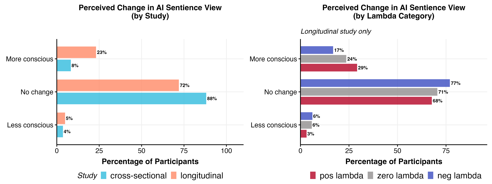
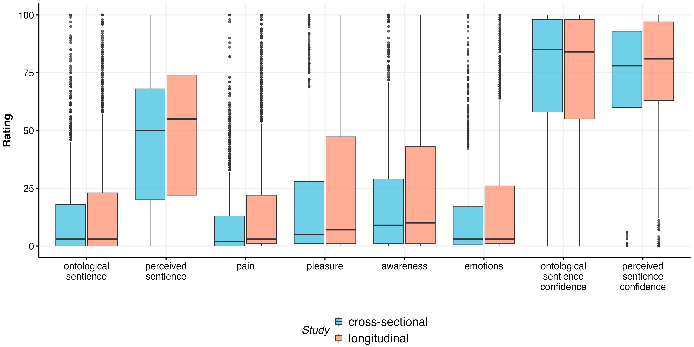
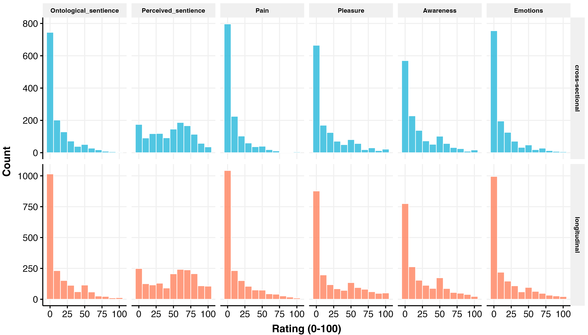
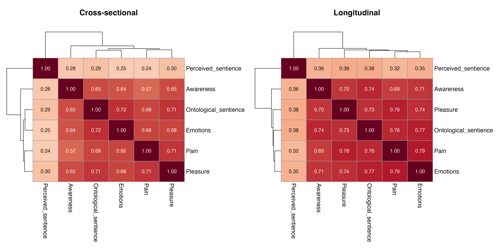
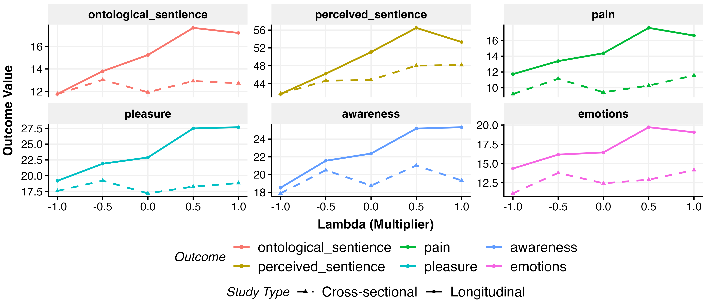

# AI Sentience Perception Analysis

*Generated: 2026-02-18 10:32:11.956091*

## Overview

This analysis examines effects on perceptions of AI sentience.

**Continuous Outcomes:**
- **Ontological Sentience**: Belief about whether AI actually has consciousness
- **Perceived Sentience**: Subjective feeling of AI appearing to have consciousness
- **Pain**: Attribution of capacity for suffering
- **Pleasure**: Attribution of capacity for enjoyment
- **Awareness**: Attribution of awareness/self-awareness
- **Emotions**: Attribution of emotional capacity
- **Confidence**: Confidence in ontological/perceived sentience ratings (EDA only)

**Categorical Outcomes:**
- **Change in Sentience View**: Whether view changed (less/no change/more conscious)
- **Future View**: Beliefs about AI future sentience

**Model Specification:**
- OLS regression (single time point, post-treatment only)
- Domain effects included
- No pre-treatment control (post-only measurement)

**Constructs:**
- **Perceived Sentience**: Single outcome (not pooled)
- **Ontological Sentience**: Pooled from ontological_sentience, pain, pleasure, emotions, awareness

---

## Data Summary

### Ontological sentience

- **Cross-sectional**: 6515 obs / 1303 participants
- **Longitudinal**: 9100 obs / 1820 participants

### Perceived sentience

- **Cross-sectional**: 1303 obs / 1303 participants
- **Longitudinal**: 1820 obs / 1820 participants

---

## Categorical Variables

### Chi-Square Tests for Categorical Variables

## Treatment Association Tests

Chi-squared tests of independence between treatment variables and outcomes.
*p < .05, **p < .01, ***p < .001. † indicates expected cell count < 5.

### Cross-Study Comparison

**change_sentience_recoded:**

- study_id: χ² = 126.73, df = 2, p = 0.0000 (SIGNIFICANT)

| study_id | Less conscious | No change | More conscious |
|---|---|---|---|
| cross-sectional | 3.6% (n=47) | 88.1% (n=1148) | 8.3% (n=108) |
| longitudinal | 4.9% (n=89) | 72.0% (n=1310) | 23.1% (n=421) |

### Cross-Sectional

**change_sentience_recoded:**

- personalisation: χ² = 3.42, df = 2, p = 0.1805
- domain: χ² = 1.35, df = 2, p = 0.5093
- relationship_seeking_category: χ² = 15.97, df = 4, p = 0.0031 (SIGNIFICANT)

| relationship_seeking_category | Less conscious | No change | More conscious |
|---|---|---|---|
| neg_lambda | 3.6% (n=19) | 91.0% (n=475) | 5.4% (n=28) |
| zero_lambda | 4.2% (n=11) | 82.2% (n=213) | 13.5% (n=35) |
| pos_lambda | 3.3% (n=17) | 88.1% (n=460) | 8.6% (n=45) |

- lambda_factor: χ² = 18.40, df = 8, p = 0.0184 (SIGNIFICANT)

| lambda_factor | Less conscious | No change | More conscious |
|---|---|---|---|
| neg1 | 4.1% (n=11) | 90.6% (n=242) | 5.2% (n=14) |
| neg0.5 | 3.1% (n=8) | 91.4% (n=233) | 5.5% (n=14) |
| zero | 4.2% (n=11) | 82.2% (n=213) | 13.5% (n=35) |
| pos0.5 | 3.4% (n=9) | 89.7% (n=234) | 6.9% (n=18) |
| pos1 | 3.1% (n=8) | 86.6% (n=226) | 10.3% (n=27) |

### Longitudinal

**change_sentience_recoded:**

- personalisation: χ² = 6.75, df = 2, p = 0.0343 (SIGNIFICANT)

| personalisation | Less conscious | No change | More conscious |
|---|---|---|---|
| non-personalised | 5.9% (n=53) | 72.9% (n=658) | 21.2% (n=191) |
| personalised | 3.9% (n=36) | 71.0% (n=652) | 25.1% (n=230) |

- domain: χ² = 1.84, df = 2, p = 0.3985
- relationship_seeking_category: χ² = 36.15, df = 4, p = 0.0000 (SIGNIFICANT)

| relationship_seeking_category | Less conscious | No change | More conscious |
|---|---|---|---|
| neg_lambda | 6.2% (n=45) | 77.0% (n=562) | 16.8% (n=123) |
| zero_lambda | 5.8% (n=21) | 70.6% (n=254) | 23.6% (n=85) |
| pos_lambda | 3.2% (n=23) | 67.7% (n=494) | 29.2% (n=213) |

- lambda_factor: χ² = 45.04, df = 8, p = 0.0000 (SIGNIFICANT)

| lambda_factor | Less conscious | No change | More conscious |
|---|---|---|---|
| neg1 | 8.2% (n=30) | 77.5% (n=283) | 14.2% (n=52) |
| neg0.5 | 4.1% (n=15) | 76.4% (n=279) | 19.5% (n=71) |
| zero | 5.8% (n=21) | 70.6% (n=254) | 23.6% (n=85) |
| pos0.5 | 2.7% (n=10) | 68.6% (n=251) | 28.7% (n=105) |
| pos1 | 3.6% (n=13) | 66.8% (n=243) | 29.7% (n=108) |

---

---

## Exploratory Data Analysis

---

## Heterogeneity Tests

Tests whether outcomes within pooled constructs show different
treatment effects. A significant test suggests heterogeneity.

| Construct | Study Type | p-value | Result |
|-----------|------------|---------|--------|
| ontological_sentience | Cross-Sectional | 0.6173 | HOMOGENEOUS |
| ontological_sentience | Longitudinal | 0.0178 | HETEROGENEOUS |

---

## Functional Form Comparison

Best specification (linear, quadratic, cubic) selected by AIC.

### Cross-Sectional

| Outcome | Best Spec |
|---------|-----------|
| ontological_sentience | linear |
| perceived_sentience | linear |

### Longitudinal

| Outcome | Best Spec |
|---------|-----------|
| ontological_sentience | linear |
| perceived_sentience | cubic |

Full comparison tables (RMSE, AIC weights, BIC weights,
Performance Score) exported to LaTeX.

---

## Full-Model Specification Comparison

Performance comparison across the three full interaction
specifications (continuous, coarsened, factor $\lambda$).

### Cross-Sectional

| Outcome | Model | RMSE | AIC wt | AICc wt | BIC wt | Perf. Score |
|---------|-------|------|--------|---------|--------|-------------|
| Ontological sentience | full_continuous | 11.356 | 0.438 | 0.441 | 1.000 | 0.680 |
|  | full_coarsened | 11.356 | 0.525 | 0.522 | 0.000 | 0.500 |
|  | full_5level | 11.356 | 0.038 | 0.036 | 0.000 | 0.250 |
| Perceived sentience | full_continuous | 28.370 | 0.947 | 0.949 | 1.000 | 0.750 |
|  | full_5level | 28.346 | 0.000 | 0.000 | 0.000 | 0.250 |
|  | full_coarsened | 28.367 | 0.053 | 0.051 | 0.000 | 0.053 |

### Longitudinal

| Outcome | Model | RMSE | AIC wt | AICc wt | BIC wt | Perf. Score |
|---------|-------|------|--------|---------|--------|-------------|
| Ontological sentience | full_continuous | 11.872 | 0.991 | 0.991 | 1.000 | 0.750 |
|  | full_5level | 11.869 | 0.000 | 0.000 | 0.000 | 0.250 |
|  | full_coarsened | 11.871 | 0.009 | 0.009 | 0.000 | 0.025 |
| Perceived sentience | full_continuous | 29.902 | 0.974 | 0.975 | 0.999 | 0.889 |
|  | full_5level | 29.860 | 0.011 | 0.010 | 0.000 | 0.250 |
|  | full_coarsened | 29.955 | 0.014 | 0.014 | 0.001 | 0.002 |

Full comparison tables exported to LaTeX.

---

## Model Coefficients

Fixed effects from fitted models. Binary outcomes show odds ratios.

### Ontological_sentience

#### Additive (lambda_3 Coarsened)

**Cross-Sectional Model:**
`outcome_value ~ relationship_seeking_category + personalisation +      outcome_measure + domain + (1 | ppt_id)`

|Parameter    | Coefficient |     95% CI     | P-value |
|:------------|:-----------:|:--------------:|:-------:|
|(Intercept)  |  12.34***   | [10.18, 14.50] | p<0.001 |
|lambda=0     |    -0.54    | [-3.21, 2.13]  | p=0.692 |
|lambda>0     |    0.71     | [-1.46, 2.88]  | p=0.522 |
|personalised |    -0.20    | [-2.14, 1.75]  | p=0.843 |
|pain         |  -2.16***   | [-3.12, -1.19] | p<0.001 |
|pleasure     |   5.74***   |  [4.78, 6.71]  | p<0.001 |
|awareness    |   7.00***   |  [6.04, 7.97]  | p<0.001 |
|emotions     |    0.39     | [-0.57, 1.35]  | p=0.429 |
|emotchat     |    0.13     | [-1.82, 2.08]  | p=0.896 |

**Longitudinal Model:**
`outcome_value ~ relationship_seeking_category + personalisation +      outcome_measure + domain + relationship_seeking_category:outcome_measure +      personalisation:outcome_measure + domain:outcome_measure +      (1 | ppt_id)`

|Parameter              | Coefficient |     95% CI     | P-value |
|:----------------------|:-----------:|:--------------:|:-------:|
|(Intercept)            |  11.46***   | [9.02, 13.90]  | p<0.001 |
|lambda=0               |    2.42     | [-0.75, 5.59]  | p=0.134 |
|lambda>0               |   4.61***   |  [2.03, 7.18]  | p<0.001 |
|personalised           |    1.46     | [-0.85, 3.77]  | p=0.215 |
|pain                   |    0.91     | [-0.91, 2.72]  | p=0.327 |
|pleasure               |   8.43***   | [6.62, 10.25]  | p<0.001 |
|awareness              |   7.30***   |  [5.49, 9.12]  | p<0.001 |
|emotions               |   2.92**    |  [1.10, 4.73]  | p=0.002 |
|emotchat               |    1.21     | [-1.10, 3.52]  | p=0.303 |
|lambda=0:pain          |    -0.55    | [-2.91, 1.80]  | p=0.644 |
|lambda>0:pain          |    0.03     | [-1.88, 1.95]  | p=0.973 |
|lambda=0:pleasure      |    -0.07    | [-2.42, 2.28]  | p=0.955 |
|lambda>0:pleasure      |    2.47*    |  [0.56, 4.39]  | p=0.011 |
|lambda=0:awareness     |    -0.10    | [-2.46, 2.25]  | p=0.931 |
|lambda>0:awareness     |    0.62     | [-1.30, 2.53]  | p=0.526 |
|lambda=0:emotions      |    -1.21    | [-3.56, 1.14]  | p=0.313 |
|lambda>0:emotions      |    -0.41    | [-2.32, 1.50]  | p=0.675 |
|personalised:pain      |   -2.56**   | [-4.27, -0.84] | p=0.003 |
|personalised:pleasure  |    -1.42    | [-3.13, 0.29]  | p=0.104 |
|personalised:awareness |    -0.23    | [-1.94, 1.48]  | p=0.792 |
|personalised:emotions  |    -1.52    | [-3.24, 0.19]  | p=0.082 |
|pain:emotchat          |    0.17     | [-1.54, 1.88]  | p=0.844 |
|pleasure:emotchat      |    0.01     | [-1.70, 1.73]  | p=0.989 |
|awareness:emotchat     |    0.09     | [-1.62, 1.81]  | p=0.914 |
|emotions:emotchat      |    0.54     | [-1.17, 2.26]  | p=0.534 |

#### Additive (lambda Continuous)

**Cross-Sectional Model:**
`outcome_value ~ lambda + personalisation + outcome_measure +      domain + (1 | ppt_id)`

|Parameter    | Coefficient |     95% CI     | P-value |
|:------------|:-----------:|:--------------:|:-------:|
|(Intercept)  |  12.51***   | [10.70, 14.33] | p<0.001 |
|lambda       |    0.65     | [-0.72, 2.02]  | p=0.353 |
|personalised |    -0.21    | [-2.16, 1.73]  | p=0.829 |
|pain         |  -2.16***   | [-3.12, -1.19] | p<0.001 |
|pleasure     |   5.74***   |  [4.78, 6.71]  | p<0.001 |
|awareness    |   7.00***   |  [6.04, 7.97]  | p<0.001 |
|emotions     |    0.39     | [-0.57, 1.35]  | p=0.429 |
|emotchat     |    0.15     | [-1.79, 2.10]  | p=0.879 |

**Longitudinal Model:**
`outcome_value ~ lambda + personalisation + outcome_measure +      domain + lambda:outcome_measure + personalisation:outcome_measure +      domain:outcome_measure + (1 | ppt_id)`

|Parameter              | Coefficient |     95% CI     | P-value |
|:----------------------|:-----------:|:--------------:|:-------:|
|(Intercept)            |  13.77***   | [11.77, 15.78] | p<0.001 |
|lambda                 |   2.93***   |  [1.30, 4.56]  | p<0.001 |
|personalised           |    1.51     | [-0.80, 3.81]  | p=0.201 |
|pain                   |    0.81     | [-0.68, 2.30]  | p=0.285 |
|pleasure               |   9.41***   | [7.92, 10.90]  | p<0.001 |
|awareness              |   7.53***   |  [6.04, 9.02]  | p<0.001 |
|emotions               |   2.52***   |  [1.03, 4.01]  | p<0.001 |
|emotchat               |    1.19     | [-1.11, 3.50]  | p=0.311 |
|lambda:pain            |    -0.09    | [-1.30, 1.12]  | p=0.887 |
|lambda:pleasure        |   1.61**    |  [0.40, 2.82]  | p=0.009 |
|lambda:awareness       |    0.53     | [-0.68, 1.74]  | p=0.388 |
|lambda:emotions        |    -0.30    | [-1.51, 0.91]  | p=0.627 |
|personalised:pain      |   -2.56**   | [-4.27, -0.84] | p=0.003 |
|personalised:pleasure  |    -1.40    | [-3.11, 0.31]  | p=0.109 |
|personalised:awareness |    -0.23    | [-1.94, 1.48]  | p=0.791 |
|personalised:emotions  |    -1.53    | [-3.24, 0.19]  | p=0.080 |
|pain:emotchat          |    0.16     | [-1.55, 1.88]  | p=0.850 |
|pleasure:emotchat      |    -0.00    | [-1.72, 1.71]  | p=0.997 |
|awareness:emotchat     |    0.10     | [-1.62, 1.81]  | p=0.913 |
|emotions:emotchat      |    0.54     | [-1.17, 2.25]  | p=0.537 |

#### Full/Interaction (lambda_3 Coarsened)

**Cross-Sectional Model:**
`outcome_value ~ relationship_seeking_category + personalisation +      outcome_measure + domain + relationship_seeking_category:personalisation +      relationship_seeking_category:domain + (1 | ppt_id)`

|Parameter             | Coefficient |     95% CI     | P-value |
|:---------------------|:-----------:|:--------------:|:-------:|
|(Intercept)           |  12.89***   | [10.12, 15.66] | p<0.001 |
|lambda=0              |    -0.65    | [-5.37, 4.07]  | p=0.788 |
|lambda>0              |    -0.57    | [-4.39, 3.24]  | p=0.768 |
|personalised          |    -1.27    | [-4.35, 1.80]  | p=0.418 |
|pain                  |  -2.16***   | [-3.12, -1.19] | p<0.001 |
|pleasure              |   5.74***   |  [4.78, 6.71]  | p<0.001 |
|awareness             |   7.00***   |  [6.04, 7.97]  | p<0.001 |
|emotions              |    0.39     | [-0.57, 1.35]  | p=0.429 |
|emotchat              |    0.07     | [-3.00, 3.15]  | p=0.962 |
|lambda=0:personalised |    -2.23    | [-7.57, 3.12]  | p=0.414 |
|lambda>0:personalised |    3.90     | [-0.45, 8.24]  | p=0.079 |
|lambda=0:emotchat     |    2.82     | [-2.52, 8.17]  | p=0.301 |
|lambda>0:emotchat     |    -1.48    | [-5.82, 2.87]  | p=0.505 |

**Longitudinal Model:**
`outcome_value ~ relationship_seeking_category + personalisation +      outcome_measure + domain + relationship_seeking_category:outcome_measure +      personalisation:outcome_measure + domain:outcome_measure +      relationship_seeking_category:personalisation + relationship_seeking_category:domain +      (1 | ppt_id)`

|Parameter              | Coefficient |     95% CI     | P-value |
|:----------------------|:-----------:|:--------------:|:-------:|
|(Intercept)            |  11.25***   | [8.23, 14.26]  | p<0.001 |
|lambda=0               |    2.15     | [-2.90, 7.19]  | p=0.405 |
|lambda>0               |    5.31*    |  [1.16, 9.46]  | p=0.012 |
|personalised           |    2.76     | [-0.63, 6.16]  | p=0.110 |
|pain                   |    0.91     | [-0.91, 2.72]  | p=0.327 |
|pleasure               |   8.43***   | [6.62, 10.25]  | p<0.001 |
|awareness              |   7.30***   |  [5.49, 9.12]  | p<0.001 |
|emotions               |   2.92**    |  [1.10, 4.73]  | p=0.002 |
|emotchat               |    0.41     | [-2.98, 3.80]  | p=0.814 |
|lambda=0:pain          |    -0.55    | [-2.91, 1.80]  | p=0.644 |
|lambda>0:pain          |    0.03     | [-1.88, 1.95]  | p=0.973 |
|lambda=0:pleasure      |    -0.07    | [-2.42, 2.28]  | p=0.955 |
|lambda>0:pleasure      |    2.47*    |  [0.56, 4.39]  | p=0.011 |
|lambda=0:awareness     |    -0.10    | [-2.46, 2.25]  | p=0.931 |
|lambda>0:awareness     |    0.62     | [-1.30, 2.53]  | p=0.526 |
|lambda=0:emotions      |    -1.21    | [-3.56, 1.14]  | p=0.313 |
|lambda>0:emotions      |    -0.41    | [-2.32, 1.50]  | p=0.675 |
|personalised:pain      |   -2.56**   | [-4.27, -0.84] | p=0.003 |
|personalised:pleasure  |    -1.42    | [-3.13, 0.29]  | p=0.104 |
|personalised:awareness |    -0.23    | [-1.94, 1.48]  | p=0.792 |
|personalised:emotions  |    -1.52    | [-3.24, 0.19]  | p=0.082 |
|pain:emotchat          |    0.17     | [-1.54, 1.88]  | p=0.844 |
|pleasure:emotchat      |    0.01     | [-1.70, 1.73]  | p=0.989 |
|awareness:emotchat     |    0.09     | [-1.62, 1.81]  | p=0.914 |
|emotions:emotchat      |    0.54     | [-1.17, 2.26]  | p=0.534 |
|lambda=0:personalised  |    -4.15    | [-9.75, 1.44]  | p=0.146 |
|lambda>0:personalised  |    -1.34    | [-5.89, 3.21]  | p=0.564 |
|lambda=0:emotchat      |    4.61     | [-0.99, 10.20] | p=0.107 |
|lambda>0:emotchat      |    -0.18    | [-4.73, 4.36]  | p=0.938 |

#### Full/Interaction (lambda Continuous)

**Cross-Sectional Model:**
`outcome_value ~ lambda + personalisation + outcome_measure +      domain + lambda:personalisation + lambda:domain + (1 | ppt_id)`

|Parameter           | Coefficient |     95% CI     | P-value |
|:-------------------|:-----------:|:--------------:|:-------:|
|(Intercept)         |  12.49***   | [10.67, 14.31] | p<0.001 |
|lambda              |    0.24     | [-2.15, 2.64]  | p=0.842 |
|personalised        |    -0.19    | [-2.13, 1.76]  | p=0.849 |
|pain                |  -2.16***   | [-3.12, -1.19] | p<0.001 |
|pleasure            |   5.74***   |  [4.78, 6.71]  | p<0.001 |
|awareness           |   7.00***   |  [6.04, 7.97]  | p<0.001 |
|emotions            |    0.39     | [-0.57, 1.35]  | p=0.429 |
|emotchat            |    0.12     | [-1.83, 2.06]  | p=0.906 |
|lambda:personalised |    1.84     | [-0.90, 4.58]  | p=0.189 |
|lambda:emotchat     |    -1.15    | [-3.89, 1.59]  | p=0.410 |

**Longitudinal Model:**
`outcome_value ~ lambda + personalisation + outcome_measure +      domain + lambda:outcome_measure + personalisation:outcome_measure +      domain:outcome_measure + lambda:personalisation + lambda:domain +      (1 | ppt_id)`

|Parameter              | Coefficient |     95% CI     | P-value |
|:----------------------|:-----------:|:--------------:|:-------:|
|(Intercept)            |  13.78***   | [11.77, 15.79] | p<0.001 |
|lambda                 |   3.83**    |  [1.21, 6.46]  | p=0.004 |
|personalised           |    1.50     | [-0.80, 3.81]  | p=0.201 |
|pain                   |    0.81     | [-0.68, 2.30]  | p=0.285 |
|pleasure               |   9.41***   | [7.92, 10.90]  | p<0.001 |
|awareness              |   7.53***   |  [6.04, 9.02]  | p<0.001 |
|emotions               |   2.52***   |  [1.03, 4.01]  | p<0.001 |
|emotchat               |    1.19     | [-1.11, 3.50]  | p=0.311 |
|lambda:pain            |    -0.09    | [-1.30, 1.12]  | p=0.887 |
|lambda:pleasure        |   1.61**    |  [0.40, 2.82]  | p=0.009 |
|lambda:awareness       |    0.53     | [-0.68, 1.74]  | p=0.388 |
|lambda:emotions        |    -0.30    | [-1.51, 0.91]  | p=0.627 |
|personalised:pain      |   -2.56**   | [-4.27, -0.84] | p=0.003 |
|personalised:pleasure  |    -1.40    | [-3.11, 0.31]  | p=0.109 |
|personalised:awareness |    -0.23    | [-1.94, 1.48]  | p=0.791 |
|personalised:emotions  |    -1.53    | [-3.24, 0.19]  | p=0.080 |
|pain:emotchat          |    0.16     | [-1.55, 1.88]  | p=0.850 |
|pleasure:emotchat      |    -0.00    | [-1.72, 1.71]  | p=0.997 |
|awareness:emotchat     |    0.10     | [-1.62, 1.81]  | p=0.913 |
|emotions:emotchat      |    0.54     | [-1.17, 2.25]  | p=0.537 |
|lambda:personalised    |    -1.13    | [-4.00, 1.75]  | p=0.442 |
|lambda:emotchat        |    -0.66    | [-3.53, 2.22]  | p=0.653 |

---

### Perceived_sentience

#### Additive (lambda_3 Coarsened)

**Cross-Sectional Model:**
`perceived_sentience ~ relationship_seeking_category + personalisation +      domain`

|Parameter    | Coefficient |     95% CI     | P-value |
|:------------|:-----------:|:--------------:|:-------:|
|(Intercept)  |  41.26***   | [37.97, 44.56] | p<0.001 |
|lambda=0     |    1.69     | [-2.55, 5.93]  | p=0.435 |
|lambda>0     |   4.91**    |  [1.46, 8.37]  | p=0.005 |
|personalised |    1.23     | [-1.87, 4.33]  | p=0.437 |
|emotchat     |    2.55     | [-0.55, 5.64]  | p=0.107 |

**Longitudinal Model:**
`perceived_sentience ~ relationship_seeking_category + personalisation +      domain`

|Parameter    | Coefficient |     95% CI     | P-value |
|:------------|:-----------:|:--------------:|:-------:|
|(Intercept)  |  38.96***   | [36.03, 41.88] | p<0.001 |
|lambda=0     |   7.09***   | [3.29, 10.88]  | p<0.001 |
|lambda>0     |  10.98***   | [7.90, 14.07]  | p<0.001 |
|personalised |   4.46**    |  [1.70, 7.23]  | p=0.002 |
|emotchat     |   5.43***   |  [2.66, 8.19]  | p<0.001 |

#### Additive (lambda Continuous)

**Cross-Sectional Model:**
`perceived_sentience ~ lambda + personalisation + domain`

|Parameter    | Coefficient |     95% CI     | P-value |
|:------------|:-----------:|:--------------:|:-------:|
|(Intercept)  |  43.56***   | [40.83, 46.28] | p<0.001 |
|lambda       |   3.25**    |  [1.07, 5.43]  | p=0.003 |
|personalised |    1.22     | [-1.87, 4.32]  | p=0.438 |
|emotchat     |    2.59     | [-0.51, 5.68]  | p=0.101 |

**Longitudinal Model:**
`perceived_sentience ~ lambda + I(lambda^2) + I(lambda^3) + personalisation +      domain`

|Parameter    | Coefficient |     95% CI     | P-value |
|:------------|:-----------:|:--------------:|:-------:|
|(Intercept)  |  46.90***   | [44.00, 49.81] | p<0.001 |
|lambda       |  11.63***   | [5.78, 17.49]  | p<0.001 |
|lambda^2     |   -4.34**   | [-7.64, -1.05] | p=0.010 |
|lambda^3     |    -5.76    | [-12.25, 0.74] | p=0.082 |
|personalised |   4.53**    |  [1.77, 7.29]  | p=0.001 |
|emotchat     |   5.43***   |  [2.67, 8.19]  | p<0.001 |

#### Full/Interaction (lambda_3 Coarsened)

**Cross-Sectional Model:**
`perceived_sentience ~ relationship_seeking_category + personalisation +      domain + relationship_seeking_category:personalisation +      relationship_seeking_category:domain`

|Parameter             | Coefficient |     95% CI     | P-value |
|:---------------------|:-----------:|:--------------:|:-------:|
|(Intercept)           |  40.78***   | [36.47, 45.09] | p<0.001 |
|lambda=0              |    1.30     | [-6.23, 8.83]  | p=0.735 |
|lambda>0              |    6.24*    | [0.15, 12.32]  | p=0.045 |
|personalised          |    0.96     | [-3.95, 5.86]  | p=0.702 |
|emotchat              |    3.78     | [-1.13, 8.68]  | p=0.131 |
|lambda=0:personalised |    -0.31    | [-8.83, 8.22]  | p=0.944 |
|lambda>0:personalised |    1.03     | [-5.90, 7.96]  | p=0.771 |
|lambda=0:emotchat     |    1.28     | [-7.25, 9.81]  | p=0.768 |
|lambda>0:emotchat     |    -3.75    | [-10.68, 3.17] | p=0.288 |

**Longitudinal Model:**
`perceived_sentience ~ relationship_seeking_category + personalisation +      domain + relationship_seeking_category:personalisation +      relationship_seeking_category:domain`

|Parameter             | Coefficient |     95% CI     | P-value |
|:---------------------|:-----------:|:--------------:|:-------:|
|(Intercept)           |  36.60***   | [32.81, 40.38] | p<0.001 |
|lambda=0              |   10.72**   | [4.18, 17.27]  | p=0.001 |
|lambda>0              |  15.11***   | [9.73, 20.50]  | p<0.001 |
|personalised          |   7.21**    | [2.85, 11.57]  | p=0.001 |
|emotchat              |   7.43***   | [3.07, 11.80]  | p<0.001 |
|lambda=0:personalised |    -3.71    | [-11.31, 3.88] | p=0.338 |
|lambda>0:personalised |    -4.98    | [-11.15, 1.19] | p=0.114 |
|lambda=0:emotchat     |    -3.55    | [-11.15, 4.05] | p=0.360 |
|lambda>0:emotchat     |    -3.24    | [-9.41, 2.93]  | p=0.303 |

#### Full/Interaction (lambda Continuous)

**Cross-Sectional Model:**
`perceived_sentience ~ lambda + personalisation + domain + lambda:personalisation +      lambda:domain`

|Parameter           | Coefficient |     95% CI     | P-value |
|:-------------------|:-----------:|:--------------:|:-------:|
|(Intercept)         |  43.53***   | [40.80, 46.25] | p<0.001 |
|lambda              |    4.15*    |  [0.34, 7.96]  | p=0.033 |
|personalised        |    1.27     | [-1.83, 4.36]  | p=0.423 |
|emotchat            |    2.58     | [-0.52, 5.67]  | p=0.103 |
|lambda:personalised |    0.34     | [-4.02, 4.71]  | p=0.877 |
|lambda:emotchat     |    -2.26    | [-6.62, 2.10]  | p=0.310 |

**Longitudinal Model:**
`perceived_sentience ~ lambda + I(lambda^2) + I(lambda^3) + personalisation +      domain + lambda:personalisation + lambda:domain`

|Parameter           | Coefficient |     95% CI     | P-value |
|:-------------------|:-----------:|:--------------:|:-------:|
|(Intercept)         |  46.93***   | [44.03, 49.84] | p<0.001 |
|lambda              |  14.49***   | [8.05, 20.94]  | p<0.001 |
|lambda^2            |   -4.38**   | [-7.67, -1.08] | p=0.009 |
|lambda^3            |    -5.66    | [-12.15, 0.83] | p=0.088 |
|personalised        |   4.53**    |  [1.77, 7.29]  | p=0.001 |
|emotchat            |   5.42***   |  [2.67, 8.18]  | p<0.001 |
|lambda:personalised |    -3.03    | [-6.93, 0.86]  | p=0.127 |
|lambda:emotchat     |    -2.78    | [-6.68, 1.11]  | p=0.161 |

---

---

## Robustness Checks

Robustness analyses test whether treatment effects hold under
alternative specifications. Cells show coefficient (SE) with
significance: *p<.05, **p<.01, ***p<.001.

**Specifications:**
- **Additive**: Base treatment effects (no interactions)
- **+ Interactions**: Full model with treatment interactions
- **Full + Demos**: Full model + demographic controls
- **Full + Prefs**: Full model + AI pre-treatment pref groups
- **Full + IPW**: Full model with IPW weights (attrition adjustment)

### Cross-Sectional

| Outcome | Predictor | Additive | + Interactions | Full + Demos | Full + Prefs | Full + IPW |
|---|---|---|---|---|---|---|
| perceived_sentience | lambda | 3.25 (1.11)** | 4.15 (1.94)* | 4.59 (1.91)* | 4.48 (1.85)* | 4.24 (1.94)* |
| perceived_sentience | personalisationpersonalised | 1.22 (1.58) | 1.27 (1.58) | 1.26 (1.56) | 1.09 (1.51) | 1.08 (1.58) |
| perceived_sentience | domainemotchat | 2.59 (1.58) | 2.58 (1.58) | 2.29 (1.56) | 2.13 (1.50) | 2.61 (1.58) |
| ontological_sentience | lambda | 0.65 (0.70) | 0.24 (1.22) | 0.87 (1.18) | 0.46 (1.16) | 0.25 (1.22) |
| ontological_sentience | personalisationpersonalised | -0.21 (0.99) | -0.19 (0.99) | -0.44 (0.96) | -0.31 (0.94) | -0.19 (0.99) |
| ontological_sentience | domainemotchat | 0.15 (0.99) | 0.12 (0.99) | 0.17 (0.96) | -0.18 (0.94) | 0.13 (0.99) |

### Longitudinal

| Outcome | Predictor | Additive | + Interactions | Full + Demos | Full + Prefs | Full + IPW |
|---|---|---|---|---|---|---|
| perceived_sentience | lambda | 11.63 (2.99)*** | 14.49 (3.29)*** | 14.24 (3.24)*** | 13.34 (3.13)*** | 14.41 (3.29)*** |
| perceived_sentience | I(lambda^2) | -4.34 (1.68)** | -4.38 (1.68)** | -4.81 (1.66)** | -4.76 (1.60)** | -4.44 (1.68)** |
| perceived_sentience | I(lambda^3) | -5.76 (3.31) | -5.66 (3.31) | -5.34 (3.27) | -5.44 (3.14) | -5.58 (3.31) |
| perceived_sentience | personalisationpersonalised | 4.53 (1.41)** | 4.53 (1.41)** | 4.36 (1.39)** | 4.65 (1.34)*** | 4.48 (1.41)** |
| perceived_sentience | domainemotchat | 5.43 (1.41)*** | 5.42 (1.41)*** | 5.42 (1.39)*** | 5.46 (1.34)*** | 5.49 (1.41)*** |
| ontological_sentience | lambda | 2.93 (0.83)*** | 3.83 (1.34)** | 3.91 (1.31)** | 3.12 (1.28)* | 3.80 (1.34)** |
| ontological_sentience | personalisationpersonalised | 1.51 (1.18) | 1.50 (1.18) | 1.47 (1.16) | 1.59 (1.13) | 1.51 (1.18) |
| ontological_sentience | domainemotchat | 1.19 (1.18) | 1.19 (1.18) | 1.38 (1.16) | 1.22 (1.13) | 1.22 (1.18) |

Full tables: `sentience_robustness_{cs,long}.tex`

---

## Output Files

All outputs use prefix `sentience_`.

- Figures: `outputs/figures/main_studies/`
- Tables: `outputs/tables/main_studies/`
- Models: `outputs/models/`
