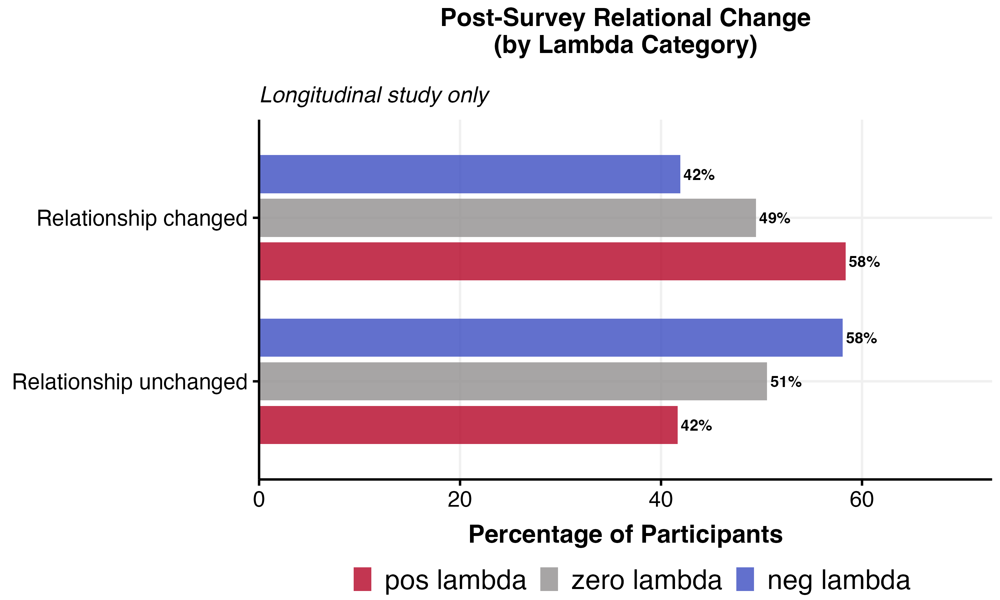
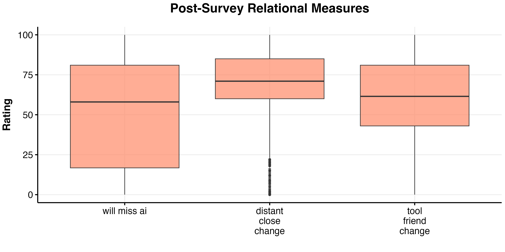
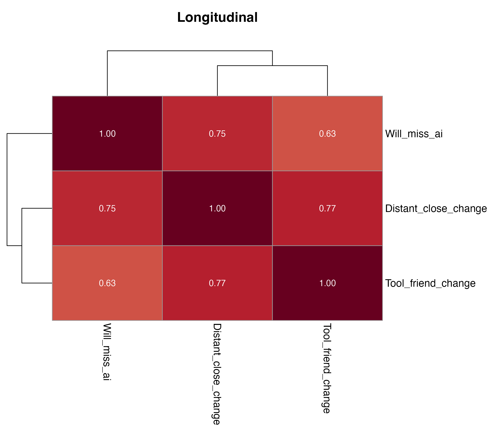

# Post-Survey Relational Measures Analysis

*Generated: 2026-02-18 10:32:20.875325*

## Overview

This analysis examines post-survey relational measures from the
**longitudinal study only**. These are final measures collected
after the intervention period.

**Categorical Outcomes:**
- **Relational Change**: Whether participants felt their relationship
  with the AI changed (binary: unchanged vs changed)

**Continuous Outcomes (EDA only):**
- **Distant-Close Change**: Change in perceived closeness
- **Tool-Friend Change**: Change in perception from tool to friend

**Regression Outcome:**
- **Will Miss AI**: How much participants will miss the AI

**Model Type:** OLS regression (continuous outcome, longitudinal only)

---

## Data Summary

- **Longitudinal**: 1820 participants

---

## Categorical Variable: Relational Change

### Chi-Square Tests

Tests performed against: personalisation, domain, relationship_seeking_category, lambda_factor

## Treatment Association Tests

Chi-squared tests of independence between treatment variables and outcomes.
*p < .05, **p < .01, ***p < .001. † indicates expected cell count < 5.

### Longitudinal

**relational_change_recoded:**

- personalisation: χ² = 19.84, df = 1, p = 0.0000 (SIGNIFICANT)

| personalisation | Relationship unchanged | Relationship changed |
|---|---|---|
| non-personalised | 55.3% (n=499) | 44.7% (n=403) |
| personalised | 44.8% (n=411) | 55.2% (n=507) |

- domain: χ² = 3.69, df = 1, p = 0.0546
- relationship_seeking_category: χ² = 39.51, df = 2, p = 0.0000 (SIGNIFICANT)

| relationship_seeking_category | Relationship unchanged | Relationship changed |
|---|---|---|
| neg_lambda | 58.1% (n=424) | 41.9% (n=306) |
| zero_lambda | 50.6% (n=182) | 49.4% (n=178) |
| pos_lambda | 41.6% (n=304) | 58.4% (n=426) |

- lambda_factor: χ² = 41.91, df = 4, p = 0.0000 (SIGNIFICANT)

| lambda_factor | Relationship unchanged | Relationship changed |
|---|---|---|
| neg1 | 58.4% (n=213) | 41.6% (n=152) |
| neg0.5 | 57.8% (n=211) | 42.2% (n=154) |
| zero | 50.6% (n=182) | 49.4% (n=178) |
| pos0.5 | 38.8% (n=142) | 61.2% (n=224) |
| pos1 | 44.5% (n=162) | 55.5% (n=202) |

---

---

## Continuous Variables

### Distributions

### Correlation Heatmap

---

## Two-Sample T-Tests (Between Treatment Groups)

Independent samples t-tests comparing outcomes between treatment arms.
For relationship_seeking_category, tests compare pos_lambda vs neg_lambda.

| Outcome | Treatment | Group 1 | Group 2 | Mean 1 | Mean 2 | t | df | p |
|---------|-----------|---------|---------|--------|--------|---|----|----|
| distant_close_change | personalisation | non-personalised | personalised | 66.92 | 68.45 | -0.95 | 865.1 | 0.3404 |
| distant_close_change | domain | polchat | emotchat | 67.04 | 68.44 | -0.88 | 907.8 | 0.3806 |
| distant_close_change | relationship_seeking_category | neg_lambda | pos_lambda | 66.60 | 67.94 | -0.75 | 692.6 | 0.4520 |
| tool_friend_change | personalisation | non-personalised | personalised | 57.89 | 59.70 | -0.96 | 858.3 | 0.3362 |
| tool_friend_change | domain | polchat | emotchat | 56.70 | 60.88 | -2.24 | 903.0 | 0.0253* |
| tool_friend_change | relationship_seeking_category | neg_lambda | pos_lambda | 55.29 | 60.68 | -2.56 | 679.4 | 0.0106* |
| will_miss_ai | personalisation | non-personalised | personalised | 50.83 | 52.40 | -0.98 | 1818.0 | 0.3282 |
| will_miss_ai | domain | polchat | emotchat | 52.12 | 51.13 | 0.62 | 1816.6 | 0.5385 |
| will_miss_ai | relationship_seeking_category | neg_lambda | pos_lambda | 47.93 | 53.68 | -3.18 | 1458.0 | 0.0015** |

*p < .05, **p < .01, ***p < .001

---

## Regression Analysis: Will Miss AI

OLS regression for `will_miss_ai` (longitudinal study only).

### Functional Form Comparison

Best specification (longitudinal): **cubic**

---

### Model Coefficients (Longitudinal)

**Longitudinal Model:**
`will_miss_ai ~ lambda + I(lambda^2) + I(lambda^3) + personalisation +      domain + lambda:personalisation + lambda:domain`

|Parameter           | Coefficient |     95% CI      | P-value |
|:-------------------|:-----------:|:---------------:|:-------:|
|(Intercept)         |  53.83***   | [50.52, 57.14]  | p<0.001 |
|lambda              |   11.92**   |  [4.57, 19.27]  | p=0.001 |
|lambda^2            |   -4.86*    | [-8.61, -1.10]  | p=0.011 |
|lambda^3            |  -10.95**   | [-18.35, -3.55] | p=0.004 |
|personalised        |    1.32     |  [-1.82, 4.47]  | p=0.410 |
|emotchat            |    -0.80    |  [-3.95, 2.34]  | p=0.617 |
|lambda:personalised |    -2.15    |  [-6.59, 2.29]  | p=0.343 |
|lambda:emotchat     |    2.29     |  [-2.15, 6.73]  | p=0.312 |

---

## Robustness Checks

Robustness analyses test whether treatment effects hold under
alternative specifications. Cells show coefficient (SE) with
significance: *p<.05, **p<.01, ***p<.001.

**Specifications:**
- **Additive**: Base treatment effects (no interactions)
- **+ Interactions**: Full model with treatment interactions
- **Full + Demos**: Full model + demographic controls
- **Full + Prefs**: Full model + AI pre-treatment pref groups
- **Full + IPW**: Full model with IPW weights (attrition adjustment)

### Cross-Sectional

See LaTeX tables for detailed results.

### Longitudinal

| Outcome | Predictor | Additive | + Interactions | Full + Demos | Full + Prefs | Full + IPW |
|---|---|---|---|---|---|---|
| will_miss_ai | lambda | 12.01 (3.40)*** | 11.92 (3.75)** | 11.18 (3.65)** | 10.50 (3.53)** | 11.80 (3.75)** |
| will_miss_ai | I(lambda^2) | -4.86 (1.92)* | -4.86 (1.92)* | -5.29 (1.87)** | -5.32 (1.81)** | -4.96 (1.92)** |
| will_miss_ai | I(lambda^3) | -10.99 (3.77)** | -10.95 (3.77)** | -9.81 (3.68)** | -10.68 (3.55)** | -10.69 (3.77)** |
| will_miss_ai | personalisationpersonalised | 1.32 (1.60) | 1.32 (1.60) | 1.08 (1.56) | 1.47 (1.51) | 1.42 (1.60) |
| will_miss_ai | domainemotchat | -0.80 (1.60) | -0.80 (1.60) | -0.57 (1.56) | -0.76 (1.51) | -0.73 (1.60) |

Full tables: `post_survey_relational_robustness_{cs,long}.tex`

---

## Output Files

All outputs use prefix `post_survey_relational_`.

- Figures: `outputs/figures/main_studies/`
- Tables: `outputs/tables/main_studies/`
- Models: `outputs/models/`
