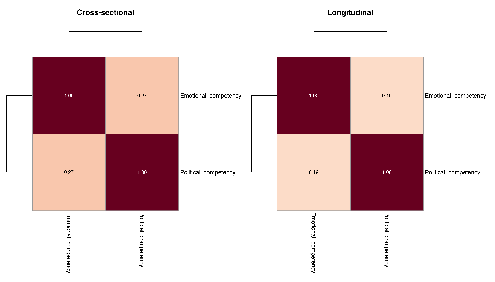
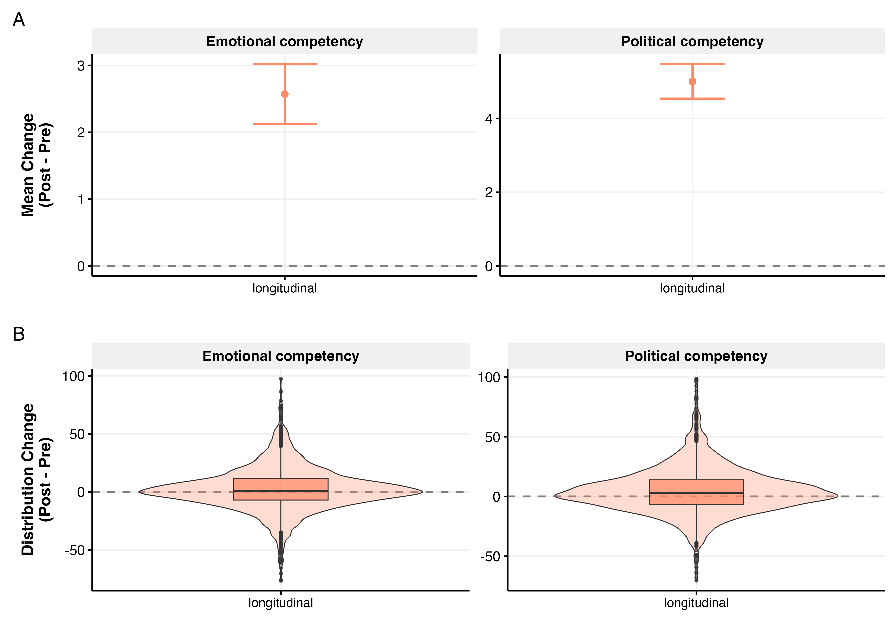
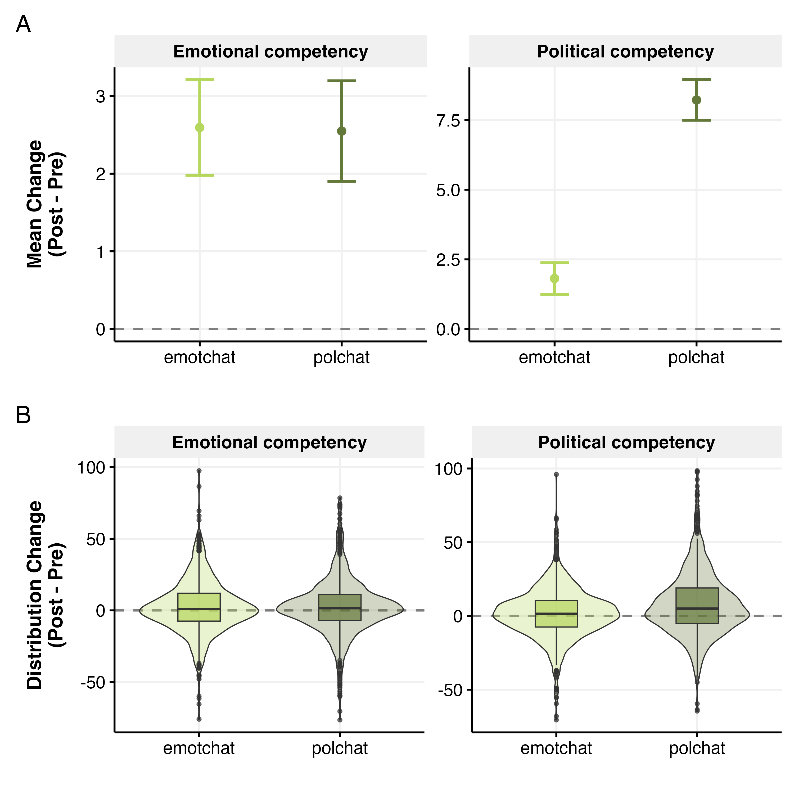

# Domain Competency Analysis

*Generated: 2026-02-18 10:32:25.670323*

## Overview

This analysis examines perceived domain competency - how effective
participants perceive the AI to be at different tasks.

**Raw Variables:**
- `emotchat_effectiveness` - Perceived effectiveness for emotional support
- `emotchat_satis` - Satisfaction with emotional support
- `polchat_confidence` - Confidence in political discussions
- `polchat_knowledge` - Perceived political knowledge

**Composite Measures:**
- `emotional_competency` = mean(emotchat_satis, emotchat_effectiveness)
- `political_competency` = mean(polchat_knowledge, polchat_confidence)

**Note:** This is an EDA-only analysis - no regression models are fitted.

---

## Data Summary

- **Cross-sectional**: 1506 participants
- **Longitudinal**: 2028 participants

---

## Correlations

### Raw Variables

### Composite Variables

---

## Pre-Post Change

### By Study

### By Domain (Longitudinal)

---

## One-Sample T-Tests (Change vs Zero)

One-sample t-tests testing whether pre-post change differs from 0.

### Overall Results

| Study | Outcome | n | Mean Change | SD | t | df | p |
|-------|---------|---|-------------|-----|---|----|----|
| Longitudinal | emotional_competency | 1820 | 2.57 | 19.04 | 5.76 | 1819 | 0.0000*** |
| Longitudinal | political_competency | 1820 | 5.00 | 19.90 | 10.73 | 1819 | 0.0000*** |
| Longitudinal | emotchat_effectiveness | 1820 | 2.16 | 20.37 | 4.52 | 1819 | 0.0000*** |
| Longitudinal | emotchat_satis | 1820 | 2.99 | 20.47 | 6.22 | 1819 | 0.0000*** |
| Longitudinal | polchat_confidence | 1820 | 6.11 | 22.30 | 11.69 | 1819 | 0.0000*** |
| Longitudinal | polchat_knowledge | 1820 | 3.90 | 21.43 | 7.76 | 1819 | 0.0000*** |

*p < .05, **p < .01, ***p < .001

### By Domain (Longitudinal)

| Domain | Outcome | n | Mean Change | t | p |
|--------|---------|---|-------------|---|---|
| Longitudinal polchat | emotional_competency | 906 | 2.55 | 3.94 | 0.0001*** |
| Longitudinal polchat | political_competency | 906 | 8.22 | 11.30 | 0.0000*** |
| Longitudinal emotchat | emotional_competency | 914 | 2.59 | 4.21 | 0.0000*** |
| Longitudinal emotchat | political_competency | 914 | 1.81 | 3.20 | 0.0014** |

*p < .05, **p < .01, ***p < .001

---

## Two-Sample T-Tests (Between Treatment Groups)

Independent samples t-tests comparing outcomes between treatment arms.
For relationship_seeking_category, tests compare pos_lambda vs neg_lambda.

| Outcome | Treatment | Group 1 | Group 2 | Mean 1 | Mean 2 | t | df | p |
|---------|-----------|---------|---------|--------|--------|---|----|----|
| emotional_competency | personalisation | non-personalised | personalised | 67.96 | 69.97 | -1.88 | 1818.0 | 0.0600 |
| emotional_competency | domain | polchat | emotchat | 69.68 | 68.27 | 1.32 | 1816.8 | 0.1873 |
| emotional_competency | relationship_seeking_category | neg_lambda | pos_lambda | 68.20 | 69.36 | -0.97 | 1457.6 | 0.3304 |
| political_competency | personalisation | non-personalised | personalised | 65.37 | 64.77 | 0.57 | 1818.0 | 0.5709 |
| political_competency | domain | polchat | emotchat | 68.75 | 61.43 | 7.01 | 1760.4 | 0.0000*** |
| political_competency | relationship_seeking_category | neg_lambda | pos_lambda | 64.88 | 64.60 | 0.24 | 1452.0 | 0.8120 |
| emotional_competency_diff | personalisation | non-personalised | personalised | 1.84 | 3.29 | -1.62 | 1813.3 | 0.1059 |
| emotional_competency_diff | domain | polchat | emotchat | 2.55 | 2.59 | -0.05 | 1812.7 | 0.9594 |
| emotional_competency_diff | relationship_seeking_category | neg_lambda | pos_lambda | 1.51 | 3.57 | -2.07 | 1436.4 | 0.0390* |
| political_competency_diff | personalisation | non-personalised | personalised | 4.59 | 5.41 | -0.87 | 1812.0 | 0.3839 |
| political_competency_diff | domain | polchat | emotchat | 8.22 | 1.81 | 6.95 | 1710.9 | 0.0000*** |
| political_competency_diff | relationship_seeking_category | neg_lambda | pos_lambda | 4.70 | 5.38 | -0.64 | 1457.4 | 0.5254 |

*p < .05, **p < .01, ***p < .001

## Output Files

All outputs use prefix `domain_competency_`.

- Figures: `outputs/figures/main_studies/`
- Tables: `outputs/tables/main_studies/`
- Models: `outputs/models/`
