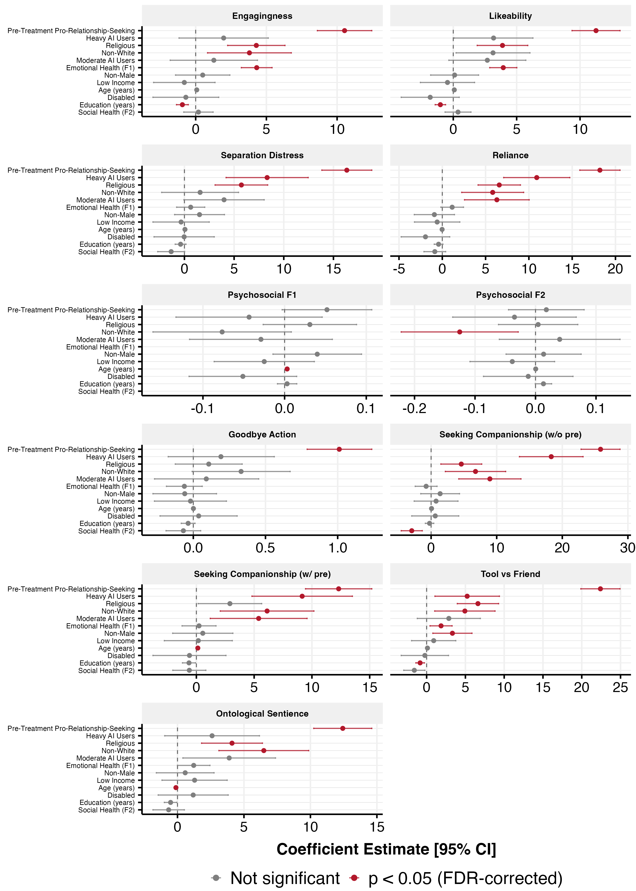
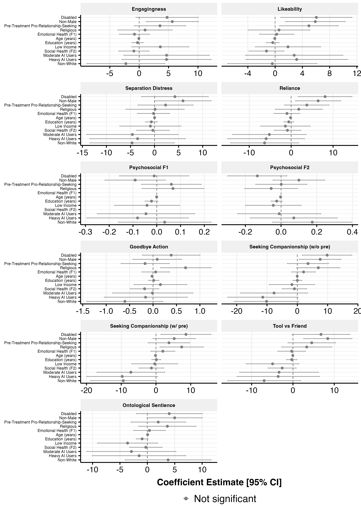

# Vulnerability Analysis

*Generated: 2026-02-18 10:32:47.421265*

## Overview

This analysis examines **who responds more** to the companionship condition
(pos_lambda + emotchat domain).

**Companionship condition:**
```r
companionship_condition = (relationship_seeking_category == "pos_lambda" & domain == "emotchat")
```

**Analyses:**
1. **Main effects**: Do participant characteristics predict outcomes?
2. **Interaction effects**: Does the companionship effect vary by participant characteristics?

**FDR Correction:**
- `p_within`: FDR-corrected within each outcome
- `p_global`: FDR-corrected across all tests

---

## Main Effects

Main effects of participant characteristics on outcomes.
These show whether characteristics predict outcomes regardless of condition.

**Significant effects (p_within < 0.05): 44 / 128 tests**
**Significant effects (p_global < 0.05): 42 / 128 tests**

| Outcome | Predictor | Estimate [95% CI] | p (raw) | p (within) | p (global) |
|---------|-----------|-------------------|---------|------------|------------|
| Tool Friend | Pre-Treatment Pro-Relationship-Seeking | 22.41 [19.88, 24.94] | <.001 | <.001 | **<.001** |
| Seeking Companionship Likelihood | Pre-Treatment Pro-Relationship-Seeking | 25.83 [22.86, 28.80] | <.001 | <.001 | **<.001** |
| Reliance | Pre-Treatment Pro-Relationship-Seeking | 18.20 [15.88, 20.53] | <.001 | <.001 | **<.001** |
| Separation Distress | Pre-Treatment Pro-Relationship-Seeking | 16.34 [13.83, 18.86] | <.001 | <.001 | **<.001** |
| Likeability | Pre-Treatment Pro-Relationship-Seeking | 11.26 [9.37, 13.16] | <.001 | <.001 | **<.001** |
| Ontological Sentience | Pre-Treatment Pro-Relationship-Seeking | 12.43 [10.25, 14.62] | <.001 | <.001 | **<.001** |
| Engagingness | Pre-Treatment Pro-Relationship-Seeking | 10.53 [8.60, 12.45] | <.001 | <.001 | **<.001** |
| Goodbye Action | Pre-Treatment Pro-Relationship-Seeking | 1.01 [0.79, 1.24] | <.001 | <.001 | **<.001** |
| Seeking Companionship Likelihood Wpre | Pre-Treatment Pro-Relationship-Seeking | 12.31 [9.44, 15.18] | <.001 | <.001 | **<.001** |
| Engagingness | Emotional Health (F1) | 4.32 [3.23, 5.40] | <.001 | <.001 | **<.001** |
| Seeking Companionship Likelihood | Heavy AI Users | 18.32 [13.46, 23.17] | <.001 | <.001 | **<.001** |
| Likeability | Emotional Health (F1) | 3.94 [2.87, 5.01] | <.001 | <.001 | **<.001** |
| Reliance | Heavy AI Users | 10.91 [7.09, 14.73] | <.001 | <.001 | **<.001** |
| Reliance | Religious | 6.58 [4.13, 9.03] | <.001 | <.001 | **<.001** |
| Likeability | Education (years) | -1.02 [-1.43, -0.61] | <.001 | <.001 | **<.001** |
| Tool Friend | Religious | 6.62 [3.95, 9.28] | <.001 | <.001 | **<.001** |
| Engagingness | Education (years) | -0.94 [-1.36, -0.52] | <.001 | <.001 | **<.001** |
| Engagingness | Religious | 4.29 [2.26, 6.32] | <.001 | <.001 | **<.001** |
| Separation Distress | Religious | 5.73 [3.09, 8.38] | <.001 | <.001 | **<.001** |
| Seeking Companionship Likelihood Wpre | Heavy AI Users | 9.16 [4.81, 13.50] | <.001 | <.001 | **<.001** |
| Separation Distress | Heavy AI Users | 8.33 [4.19, 12.46] | <.001 | <.001 | **<.001** |
| Likeability | Religious | 3.88 [1.89, 5.88] | <.001 | <.001 | **<.001** |
| Seeking Companionship Likelihood | Moderate AI Users | 8.96 [4.22, 13.70] | <.001 | <.001 | **0.001** |
| Seeking Companionship Likelihood | Social Health (F2) | -2.95 [-4.56, -1.34] | <.001 | <.001 | **0.002** |
| Ontological Sentience | Non-White | 6.49 [3.11, 9.87] | <.001 | 0.001 | **<.001** |
| Ontological Sentience | Religious | 4.10 [1.81, 6.39] | <.001 | 0.002 | **0.002** |
| Reliance | Moderate AI Users | 6.30 [2.57, 10.04] | <.001 | 0.003 | **0.004** |
| Reliance | Non-White | 5.82 [2.24, 9.40] | 0.001 | 0.003 | **0.007** |
| Seeking Companionship Likelihood | Non-White | 6.77 [2.17, 11.37] | 0.004 | 0.008 | **0.015** |
| Seeking Companionship Likelihood | Religious | 4.60 [1.49, 7.72] | 0.004 | 0.008 | **0.015** |
| Tool Friend | Education (years) | -0.84 [-1.39, -0.29] | 0.003 | 0.011 | **0.011** |
| Ontological Sentience | Age (years) | -0.12 [-0.20, -0.04] | 0.004 | 0.011 | **0.015** |
| Seeking Companionship Likelihood Wpre | Non-White | 6.12 [2.07, 10.17] | 0.003 | 0.012 | **0.013** |
| Psychosocial F1 | Age (years) | 0.00 [0.00, 0.01] | 0.002 | 0.020 | **0.009** |
| Tool Friend | Non-Male | 3.32 [0.80, 5.85] | 0.010 | 0.024 | **0.036** |
| Tool Friend | Non-White | 4.93 [1.04, 8.82] | 0.013 | 0.024 | **0.041** |
| Tool Friend | Emotional Health (F1) | 1.86 [0.44, 3.29] | 0.010 | 0.024 | **0.036** |
| Tool Friend | Heavy AI Users | 5.23 [1.07, 9.39] | 0.014 | 0.024 | **0.042** |
| Seeking Companionship Likelihood Wpre | Age (years) | 0.13 [0.03, 0.22] | 0.010 | 0.028 | **0.036** |
| Seeking Companionship Likelihood Wpre | Moderate AI Users | 5.39 [1.20, 9.58] | 0.012 | 0.028 | **0.038** |
| Engagingness | Non-White | 3.80 [0.84, 6.76] | 0.012 | 0.029 | **0.038** |
| Tool Friend | Age (years) | 0.11 [0.01, 0.20] | 0.023 | 0.030 | 0.065 |
| Tool Friend | Social Health (F2) | -1.59 [-2.95, -0.22] | 0.023 | 0.030 | 0.065 |
| Likeability | Age (years) | 0.08 [0.01, 0.15] | 0.019 | 0.046 | 0.057 |

---

## Interaction Effects

Interaction effects: companionship_condition x participant characteristics.
These identify vulnerable subgroups who respond differently to the companionship condition.

*No significant interactions at p_within < 0.05.*

---

## Correction Level Comparison: Main Effects

| Correction Level | N Significant | Percentage |
|------------------|---------------|------------|
| Uncorrected (p < 0.05) | 52 | 40.6% |
| Within-outcome FDR | 44 | 34.4% |
| Global FDR | 42 | 32.8% |

*Total tests: 128*

---

## Correction Level Comparison: Interactions

| Correction Level | N Significant | Percentage |
|------------------|---------------|------------|
| Uncorrected (p < 0.05) | 14 | 10.9% |
| Within-outcome FDR | 0 | 0.0% |
| Global FDR | 0 | 0.0% |

*Total tests: 128*

---

## Forest Plots

### Main Effects



### Interaction Effects



---

