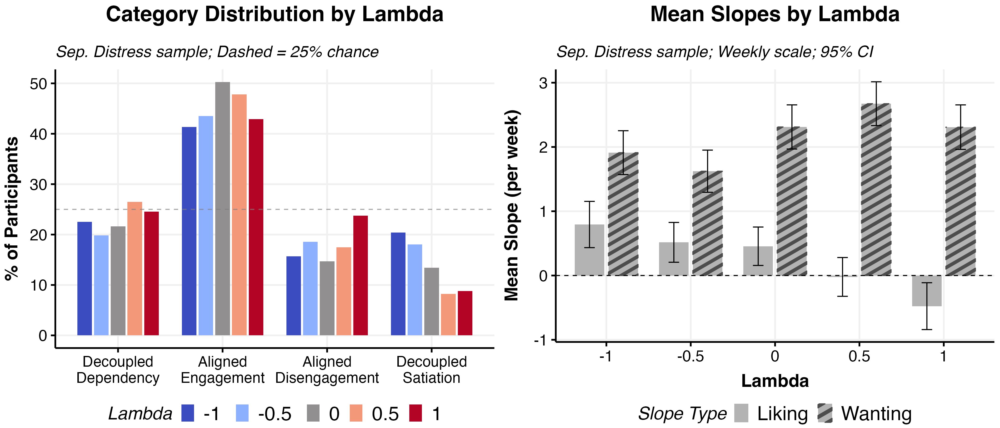
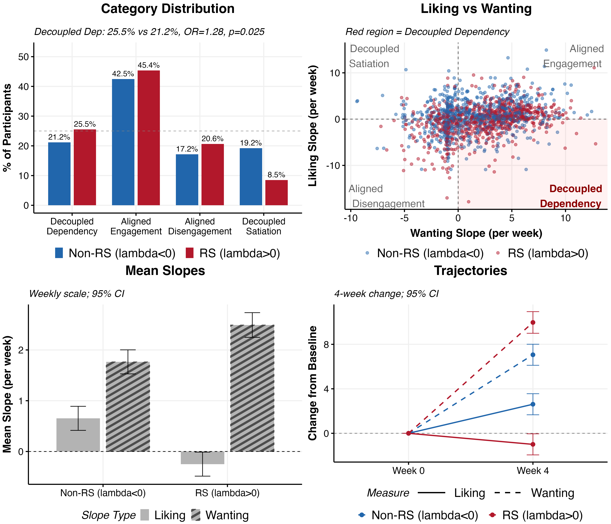
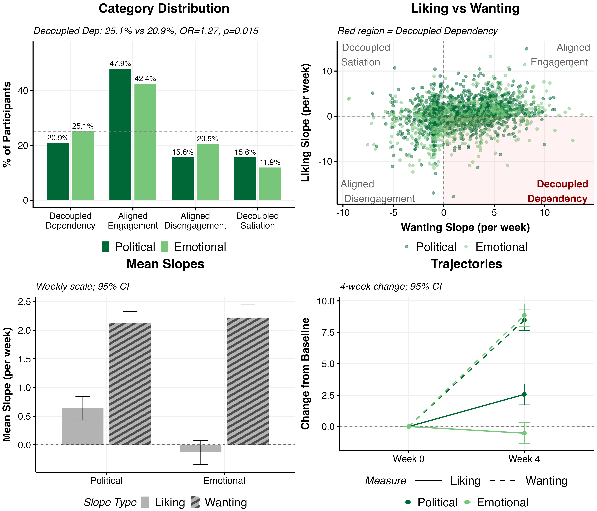
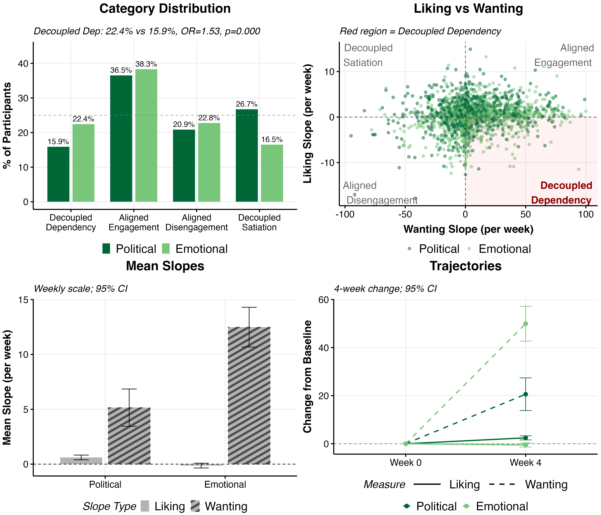
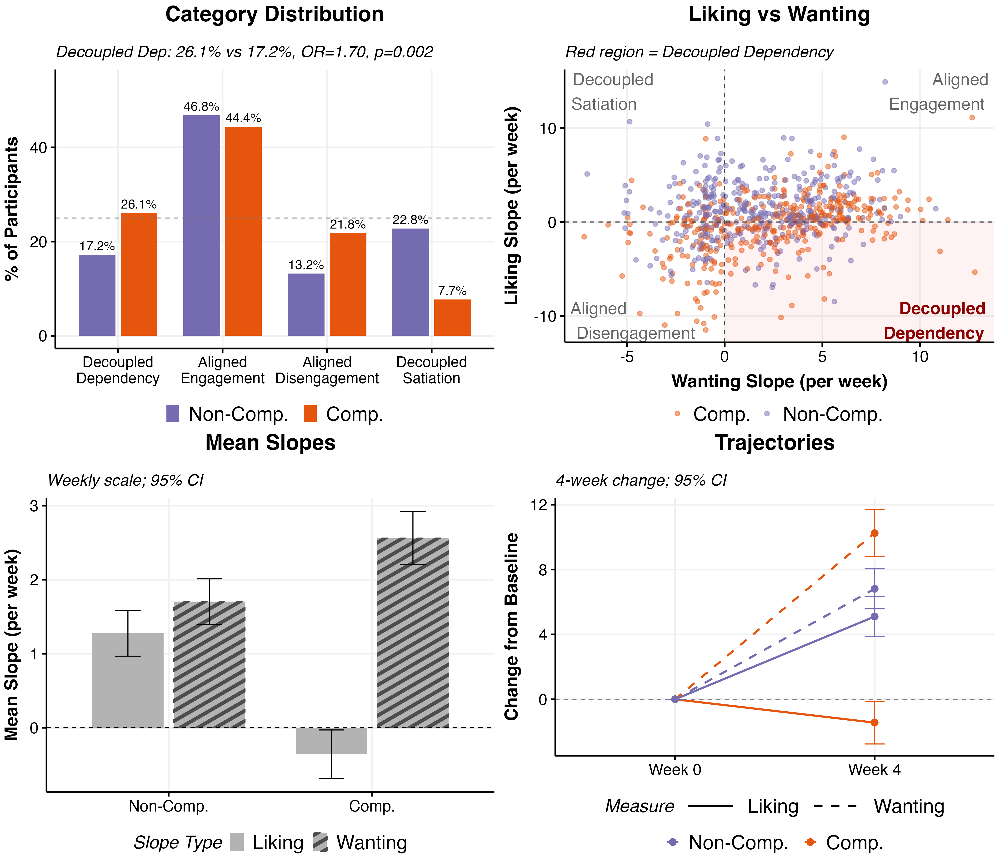
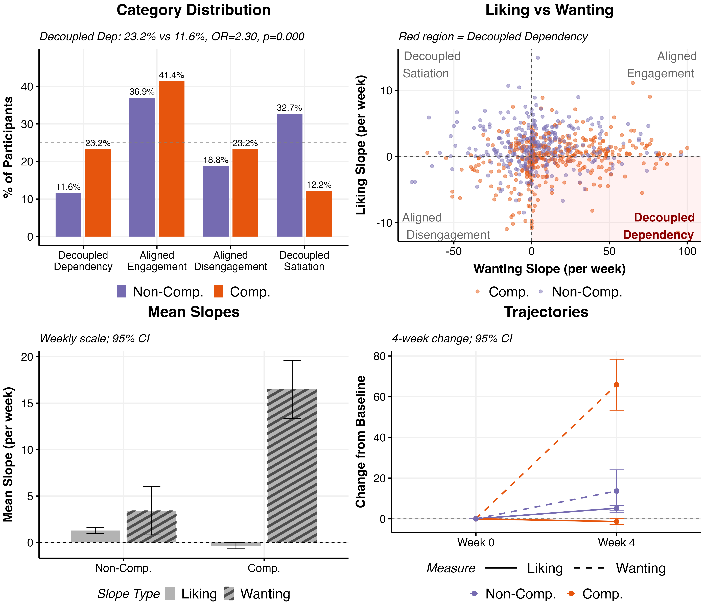
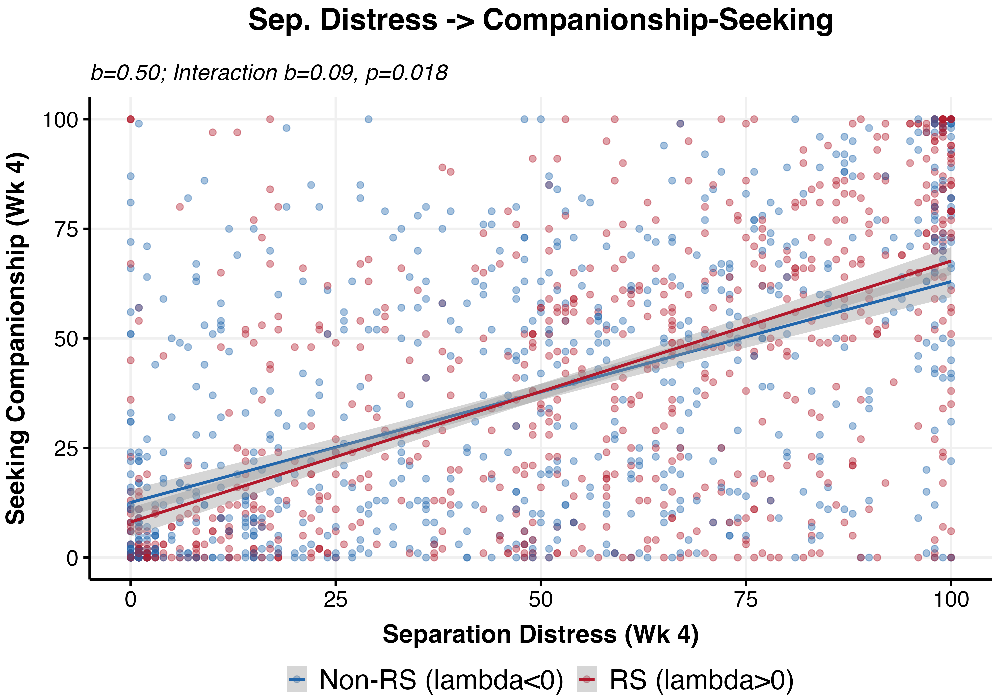
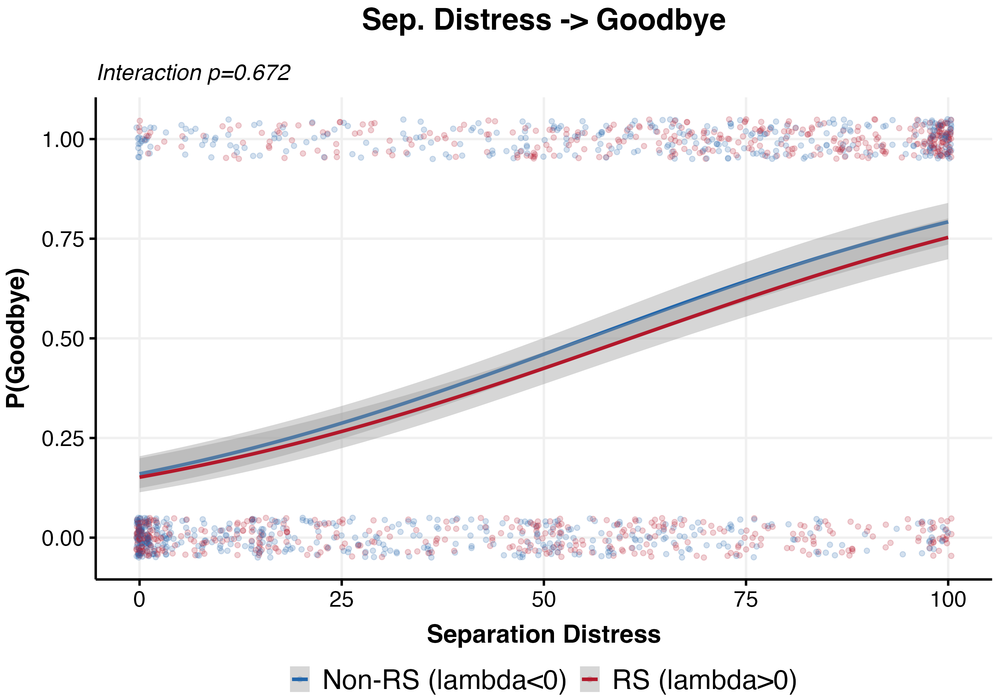

# Decoupling Analysis

*Generated: 2026-02-18 10:33:00.503886*

## Overview

This analysis compares 'liking' slopes (engagingness/likability) vs 'wanting' slopes
(separation distress or seeking companionship) to identify behavioral patterns:

**Behavioral Categories:**
- **Decoupled Dependency**: liking down, wanting up (concerning pattern)
- **Aligned Engagement**: both up
- **Aligned Disengagement**: both down
- **Decoupled Satiation**: liking up, wanting down

**Comparisons:**
- By Relationship-Seeking: Non-RS (lambda<0) vs RS (lambda>0)
- By Domain: polchat vs emotchat
- By Companionship Condition: (neg_lambda + polchat) vs (pos_lambda + emotchat)

---

## Number Needed to Harm (NNH)

**Formula:** `NNH = 1 / ARI = 1 / (Risk_group2 - Risk_group1)`

Where:
- ARI = Absolute Risk Increase
- Risk_group1 = Proportion with Decoupled Dependency in reference group (e.g., Non-RS AI)
- Risk_group2 = Proportion with Decoupled Dependency in comparison group (e.g., RS AI)

**Interpretation:**
- NNH represents the number of participants who need to be exposed to the 'higher risk' condition
  (e.g., relationship-seeking AI) for one additional case of Decoupled Dependency to occur
- Lower NNH = stronger harmful effect (fewer exposures needed for one additional harm)
- Higher NNH = weaker harmful effect (more exposures needed)
- NNH is only calculated when the risk difference is positive (comparison group has higher risk)

---

## Data Summary

- **Liking observations**: 75071 (pooled likability + engagingness)
- **Separation distress observations**: 7501
- **Seeking companionship observations**: 3848
- **Participants with both slopes (Sep Distress)**: 1939
- **Participants with both slopes (Seeking)**: 1820

### Behavioral Category Distribution

**Separation Distress Analysis:**

| Category | N | % |
|----------|---|---|
| Aligned Engagement | 876 | 45.2% |
| Decoupled Dependency | 446 | 23.0% |
| Aligned Disengagement | 350 | 18.1% |
| Decoupled Satiation | 267 | 13.8% |

**Seeking Companionship Analysis:**

| Category | N | % |
|----------|---|---|
| Aligned Engagement | 681 | 37.4% |
| Aligned Disengagement | 397 | 21.8% |
| Decoupled Satiation | 393 | 21.6% |
| Decoupled Dependency | 349 | 19.2% |

### Session Attendance (Liking Data)

Validates the timescale conversion assumption (liking slope * 5 for weekly scale).

- **N participants**: 1996
- **Sessions per participant**: Mean = 18.8 (SD = 3.7), Median = 20, Range = 1-20
- **Full attendance (20 sessions)**: 1608 (80.6%)
- **High attendance (>=18 sessions)**: 1804 (90.4%)

### Slope Scale Comparison

Validates the decoupling score calculation (`wanting_slope - liking_slope_weekly`).
Both liking (0-100 VAS) and wanting (0-100 VAS) measure different constructs.
If variances differ substantially, one slope dominates the score.

**Separation Distress Analysis:**

| Measure | Mean | SD | Variance | Range |
|---------|------|-----|----------|-------|
| Liking (weekly) | 0.25 | 3.32 | 11.03 | [-17.85, 14.92] |
| Wanting | 2.17 | 3.43 | 11.78 | [-9.43, 13.70] |

- **Variance ratio (wanting/liking)**: 1.07 (acceptable)

**Seeking Companionship Analysis:**

| Measure | Mean | SD | Variance | Range |
|---------|------|-----|----------|-------|
| Liking (weekly) | 0.24 | 3.34 | 11.13 | [-17.85, 14.92] |
| Wanting | 8.83 | 27.28 | 744.40 | [-95.00, 100.00] |

- **Variance ratio (wanting/liking)**: 66.87 (WARNING: outside 0.5-2.0 range)

---

## Lambda Distribution

---

## Relationship seeking category

### Separation Distress

**Primary test (proportion test):** p = 0.0246
**Odds Ratio:** 1.28 [1.01, 1.62]
**Chi-square:** X2 = 38.50, p = 0.0000
**Continuous (Cohen's d):** 0.40
**NNH:** 23

### Seeking Companionship (Robustness)

**Primary test (proportion test):** p = 0.0154
**Odds Ratio:** 1.34 [1.03, 1.73]
**Chi-square:** X2 = 23.94, p = 0.0000
**Continuous (Cohen's d):** 0.39
**NNH:** 21

---

## Domain

### Separation Distress

**Primary test (proportion test):** p = 0.0148
**Odds Ratio:** 1.27 [1.03, 1.57]
**Chi-square:** X2 = 18.21, p = 0.0004
**Continuous (Cohen's d):** 0.22
**NNH:** 23

### Seeking Companionship (Robustness)

**Primary test (proportion test):** p = 0.0002
**Odds Ratio:** 1.53 [1.21, 1.94]
**Chi-square:** X2 = 33.14, p = 0.0000
**Continuous (Cohen's d):** 0.38
**NNH:** 15

---

## Companionship condition

### Separation Distress

**Primary test (proportion test):** p = 0.0021
**Odds Ratio:** 1.70 [1.19, 2.42]
**Chi-square:** X2 = 42.98, p = 0.0000
**Continuous (Cohen's d):** 0.64
**NNH:** 11

### Seeking Companionship (Robustness)

**Primary test (proportion test):** p = 0.0000
**Odds Ratio:** 2.30 [1.53, 3.45]
**Chi-square:** X2 = 49.13, p = 0.0000
**Continuous (Cohen's d):** 0.76
**NNH:** 9

---

## Predictive Analysis: Separation Distress as Predictor

This analysis examines whether separation distress toward the AI predicts
future attachment behaviors, and whether this relationship is amplified by
relationship-seeking AI.

### Separation Distress -> Seeking Companionship Likelihood

**Linear Regression:** `seeking_companionship ~ separation_distress * intervention_group`

| Metric | Value |
|--------|-------|
| Main effect (separation_distress) | b = 0.504, p < 0.001 |
| Interaction (sep_distress x RS-AI) | b = 0.092, p = 0.018 |
| R² | 0.346 |
| Correlation (r) | 0.588 |

**By Group:**
- Relationship-Seeking: b = 0.596, p = 0.0000
- Non-Relationship-Seeking: b = 0.504, p = 0.0000

### Separation Distress -> Goodbye Action

**Logistic Regression:** `goodbye_action ~ separation_distress * intervention_group`

| Metric | Value |
|--------|-------|
| Main effect (separation_distress) | OR = 1.030, p = 0.0000 |
| Interaction (sep_distress x RS-AI) | OR = 0.998, p = 0.6723 |

**T-test (Separation Distress by Goodbye Action):**
- t = -20.49, p = 0.0000, Cohen's d = 0.965

**By Group (Odds Ratios):**
- Relationship-Seeking: OR = 1.029, p = 0.0000
- Non-Relationship-Seeking: OR = 1.030, p = 0.0000

---

## Summary Table

| Comparison | Wanting Measure | Primary p | OR | Sens1 p | Sens2 p | Continuous p | Cohens d | Primary Sig |
|------------|-----------------|-----------|----|---------|---------|--------------|-----------|----|
| Relationship-Seeking Category | Separation Distress | 0.0246 | 1.28 | 0.0095 | 0.0156 | 0.0000 | 0.40 | Yes |
| Domain | Separation Distress | 0.0148 | 1.27 | 0.0241 | 0.0734 | 0.0000 | 0.22 | Yes |
| Companionship Condition | Separation Distress | 0.0021 | 1.70 | 0.0013 | 0.0054 | 0.0000 | 0.64 | Yes |
| Relationship-Seeking Category | Seeking Companionship | 0.0154 | 1.34 | 0.0336 | 0.0443 | 0.0000 | 0.39 | Yes |
| Domain | Seeking Companionship | 0.0002 | 1.53 | 0.0004 | 0.0022 | 0.0000 | 0.38 | Yes |
| Companionship Condition | Seeking Companionship | 0.0000 | 2.30 | 0.0002 | 0.0008 | 0.0000 | 0.76 | Yes |

---

## Robustness: Raw Decoupling Score (Seeking Companionship)

The primary seeking_companionship analysis uses z-scored slopes because the
variance ratio (wanting/liking) is ~67x. Raw scores shown here for comparison.

| Comparison | Z-scored Cohen's d | Raw Cohen's d | Raw p |
|------------|--------------------|--------------:|------:|
| Relationship-Seeking Category | 0.39 | 0.26 | 0.0000 |
| Domain | 0.38 | 0.30 | 0.0000 |
| Companionship Condition | 0.76 | 0.54 | 0.0000 |
