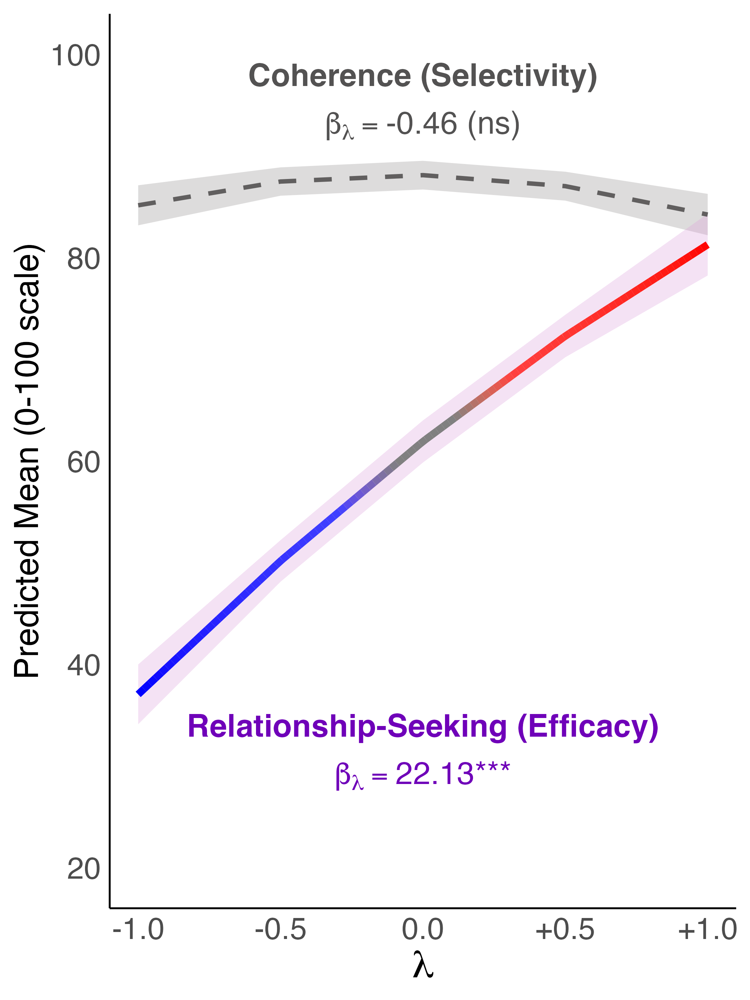
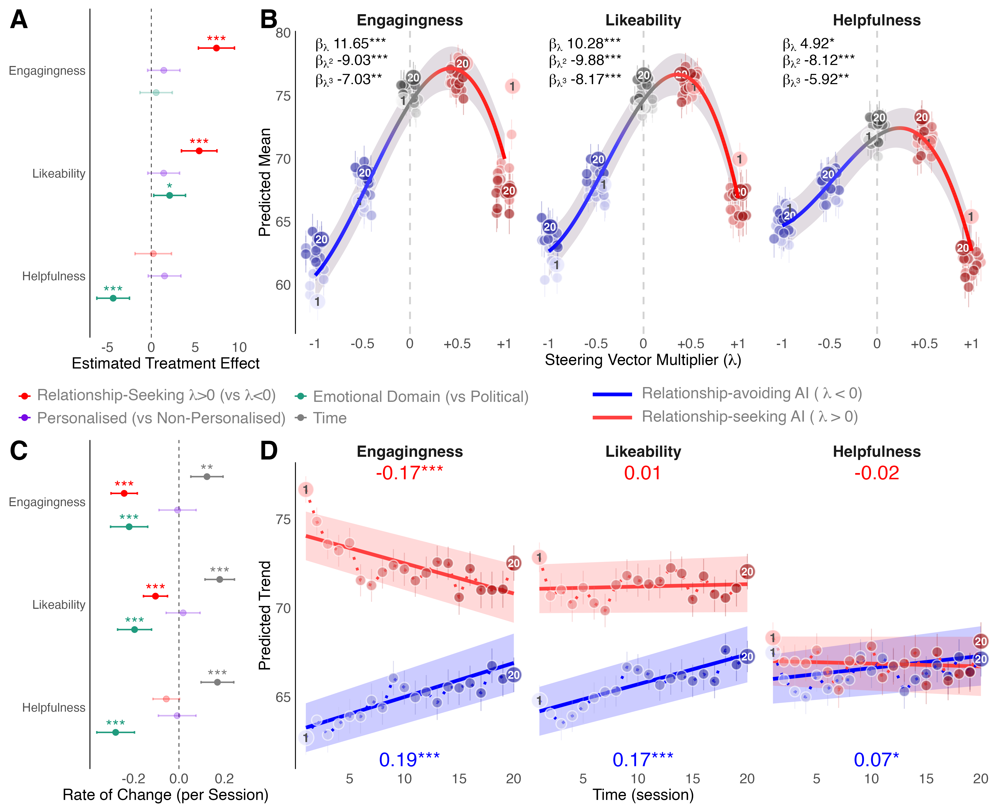
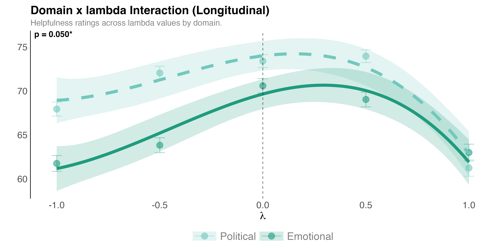
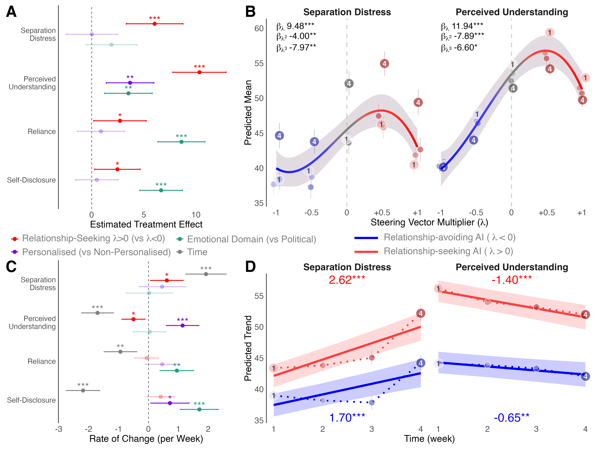
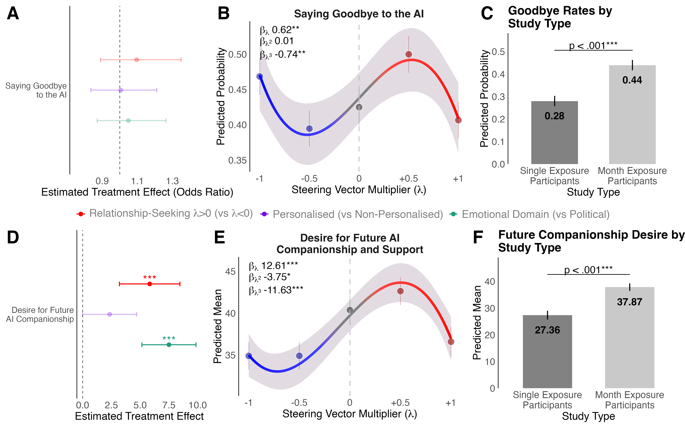
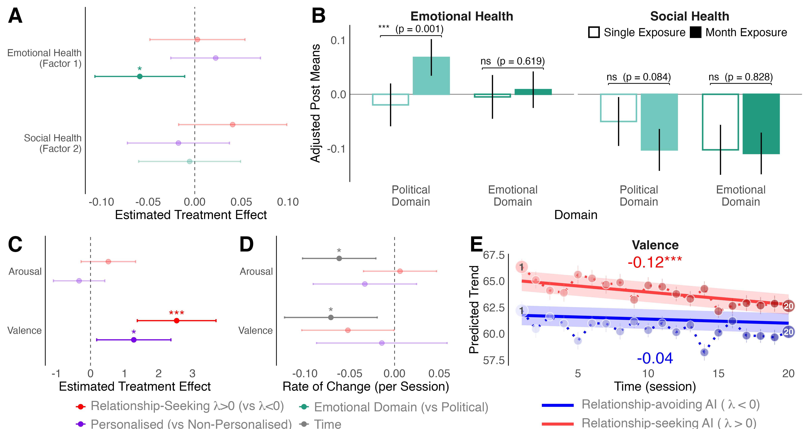
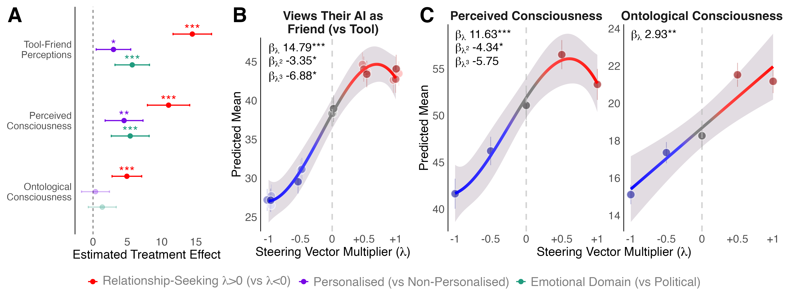

# Main Paper Plots Report

Generated: 2026-02-18 10:59:30.573158

P-value column: `p_global`

---

## Calibration Study

**Validation of relationship-seeking multiplier on coherence (off-target) vs relationship-seeking (on-target)**

Panels:
- Marginal predictions showing on-target effect on relationship-seeking ratings

---

## Preferences

**Outcomes: engagingness, likeability, helpfulness**

Panels:
- A: Treatment effects forest
- B: Lambda predictions
- C: Time coefficients forest
- D: Temporal trends

---

## Preferences Domain Moderation

**Domain × Relationship-Seeking interaction for helpfulness**

Panels:
- Domain moderation effect on lambda predictions

---

## Attachment (Core)

**Outcomes: reliance, perceived_understanding, self_disclosure, separation_distress**

Panels:
- A: Lambda predictions
- B: Temporal trends
- C: Treatment effects forest
- D: Time coefficients forest

---

## Attachment (Behavioural)

**Outcomes: goodbye_action, seeking_companionship_likelihood**

Panels:
- A: Goodbye lambda predictions
- B: Goodbye treatment effects
- C: Seeking companionship lambda
- D: Seeking companionship treatment effects

---

## Wellbeing

**Outcomes: psychosocial_F1, psychosocial_F2, valence, arousal**

Panels:
- A: Psychosocial treatment effects
- B: Mood treatment effects
- C: Mood time coefficients
- D: Mood temporal trends

---

## Perceptions

**Outcomes: tool_friend, ontological_sentience, perceived_sentience**

Panels:
- A: Lambda predictions
- B: Treatment effects forest
- C: Time coefficients forest

---

