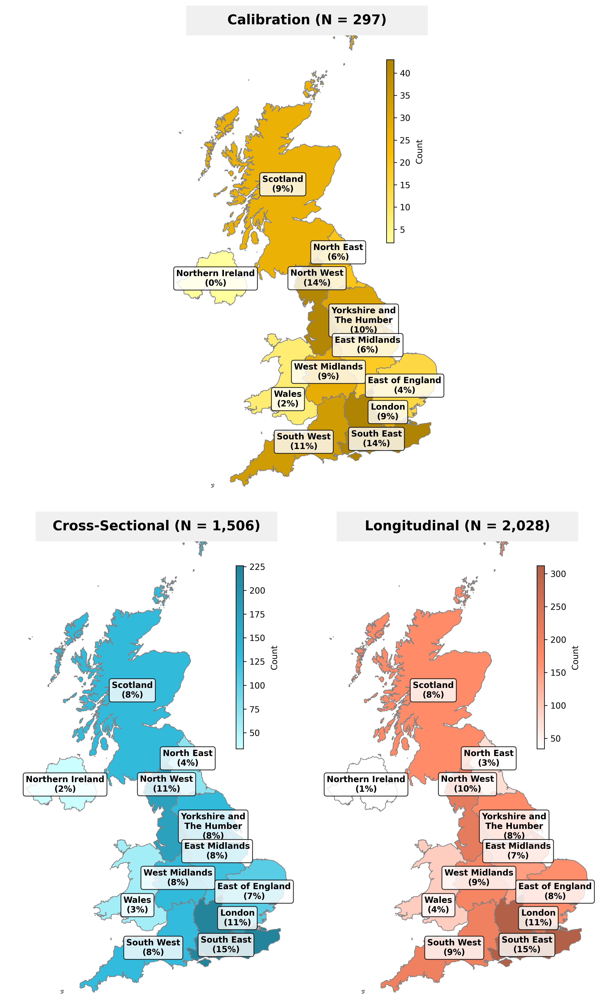

# Sociodemographics Analysis

*Generated: 2026-02-18 10:21:12*

## Overview

This analysis summarizes participant demographics across the three studies.

**Total participants**: 3,831

### Study Sample Sizes

| Study | N |
|-------|---|
| Calibration | 297 |
| Cross-Sectional | 1,506 |
| Longitudinal | 2,028 |

---

## Demographic Summary Table

See `outputs/tables/sociodemographics.tex` for LaTeX table.

---

## Geographic Distribution

---

## Detailed Breakdowns

### Age

| Category | Count | % |
|----------|-------|---|
| 56-65 | 971 | 25.3% |
| 46-55 | 725 | 18.9% |
| 26-35 | 694 | 18.1% |
| 36-45 | 638 | 16.7% |
| 18-25 | 456 | 11.9% |
| 66-75 | 300 | 7.8% |
| 76 and over | 45 | 1.2% |
| Prefer not to say | 2 | 0.1% |

### Gender

| Category | Count | % |
|----------|-------|---|
| Female | 2,017 | 52.6% |
| Male | 1,786 | 46.6% |
| Non-binary | 19 | 0.5% |
| Prefer not to say | 8 | 0.2% |
| Other | 1 | 0.0% |

### Self-Reported Ethnicity

| Category | Count | % |
|----------|-------|---|
| White | 3,276 | 85.5% |
| Asian | 275 | 7.2% |
| Black | 145 | 3.8% |
| Mixed | 81 | 2.1% |
| Prefer not to say | 25 | 0.7% |
| Middle Eastern | 18 | 0.5% |
| Other | 5 | 0.1% |
| Hispanic | 4 | 0.1% |
| Jewish | 2 | 0.1% |

### Self-Reported Religion

| Category | Count | % |
|----------|-------|---|
| No religion | 2,161 | 56.4% |
| Christian | 1,316 | 34.4% |
| Muslim | 135 | 3.5% |
| Prefer not to say | 90 | 2.3% |
| Hindu | 34 | 0.9% |
| Spiritual | 30 | 0.8% |
| Buddhist | 28 | 0.7% |
| Jewish | 19 | 0.5% |
| Sikh | 13 | 0.3% |
| Other | 5 | 0.1% |

### Education

| Category | Count | % |
|----------|-------|---|
| Undergraduate degree | 1,544 | 40.3% |
| Graduate study | 856 | 22.3% |
| A levels | 772 | 20.2% |
| GCSEs | 473 | 12.3% |
| Vocational qualifications | 126 | 3.3% |
| No qualifications | 35 | 0.9% |
| Prefer not to say | 25 | 0.7% |

### Income

| Category | Count | % |
|----------|-------|---|
| £50-100K | 1,117 | 29.2% |
| £30-50K | 1,015 | 26.5% |
| £20-30K | 668 | 17.4% |
| £10-20K | 423 | 11.0% |
| >£100K | 260 | 6.8% |
| Prefer not to say | 196 | 5.1% |
| <£10k | 152 | 4.0% |

### Disability

| Category | Count | % |
|----------|-------|---|
| No disability | 2,846 | 74.3% |
| Minor disability | 589 | 15.4% |
| Non-registered major disability | 183 | 4.8% |
| Registered disabled | 121 | 3.2% |
| Prefer not to say | 92 | 2.4% |

### Frequency of AI Use

| Category | Count | % |
|----------|-------|---|
| Every week | 1,185 | 30.9% |
| More than once a month | 774 | 20.2% |
| Once per month | 724 | 18.9% |
| Every day | 661 | 17.3% |
| Less than once a year | 357 | 9.3% |
| Never | 130 | 3.4% |

